# github仓库搭建

## 1. 注册 Google 邮箱
国外很多网站都可以通过谷歌邮箱登录
```url
https://accounts.google.com
```

## 2. 通过谷歌邮箱注册 Github
```url
https://github.com/signup
```


## 3. 进入 Github 主页创建仓库
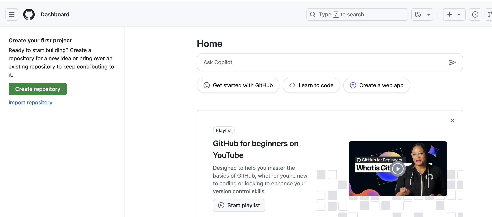
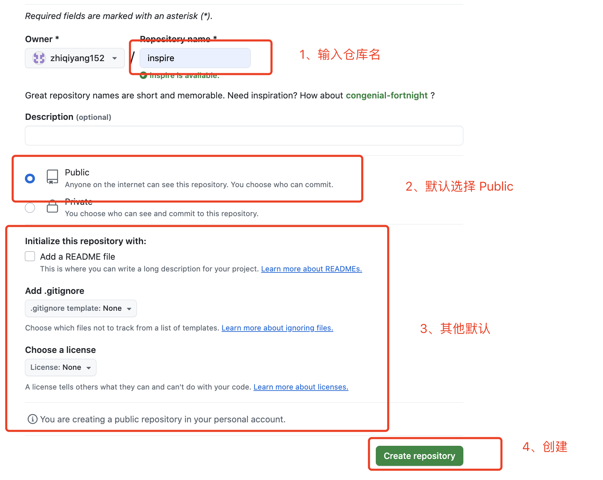

## 4. 创建成功
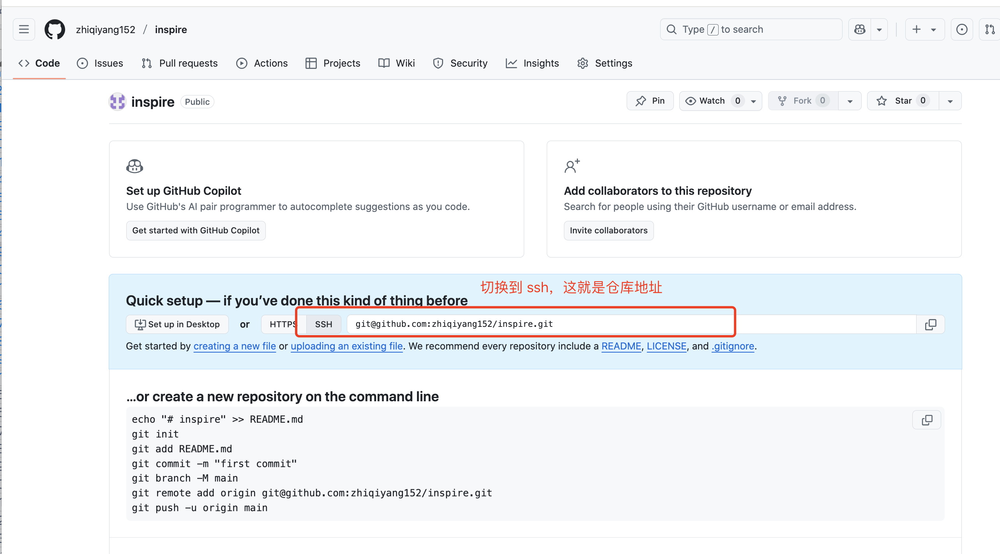

# vscode本地项目搭建
## 1. 新建 inspire 本地空项目
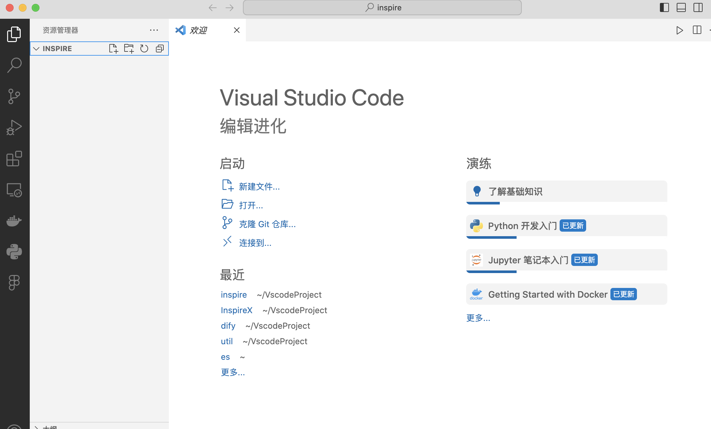

## 2. 新建 src 源代码目录，并创建 index.js 
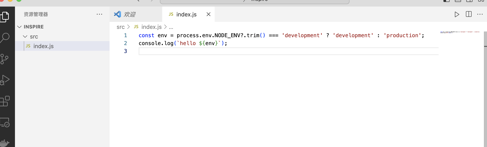

- **process:** 了解 process 是什么

- **? :**  了解 ? ​​可选链操作符语法
```code
process.env.NODE_ENV?.trim()
```

- **​模板字符串语法:** 了解 JavaScript/TypeScript 中的 ​​模板字符串语法
```code
`hello ${env}`
```

## 3. 项目根目录下新建 package.json 
package.json 是 nodejs 核心配置文件
```json
{
  "name": "inspire",
  "version": "1.0.0",
  "description": "",
  "main": "index.js",
  "scripts": {
    "start": "node src/index.js",
    "dev": "cross-env NODE_ENV=development node src/index.js",
    "test": "echo \"Error: no test specified\" && exit 1"
  },
  "author": "",
  "license": "ISC",
  "devDependencies": {
    "cross-env": "^7.0.3"
  },
  "dependencies": {

  }
}
```
- **了解 devDependencies 和 dependencies** 

- **了解 scripts，并理解里面的 start、div 和 test 3个脚本命令**

- **了解 npm 怎么运行 package.json 中的 scripts**

- **简单了解 cross-env 库**

- **了解 npm 怎么调用 cross-env 可执行文件的**

## 4. 安装项目依赖
- **vscode - 终端 可快速在项目根目录下打开终端**
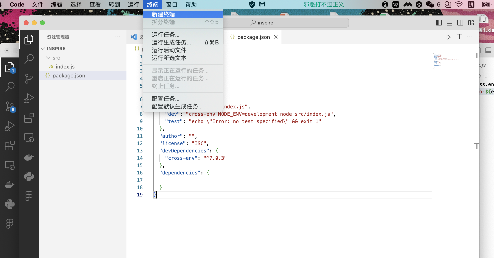

- **在终端中输入 npm install 安装项目依赖**
```
npm install
```
可以看到项目根目录下多了 node_modules 文件夹和 package-lock.json
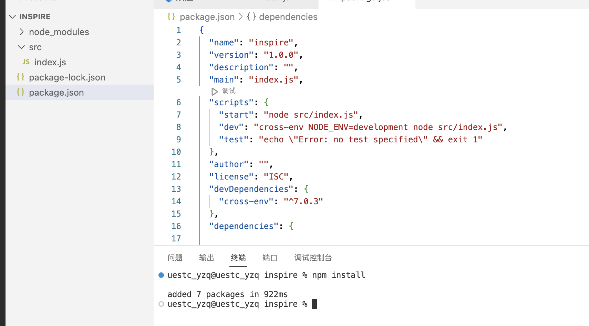

- **了解 npm 的包管理机制**

- **在终端中尝试运行并理解 3 个脚本**
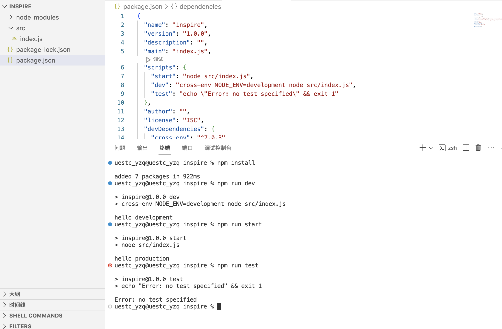


# 初始化本地 git 仓库并关联远程仓库

## 1. 在项目根目录下新建终端并运行 git init 命令初始化本地仓库
```
git init
```
通过 ls -al 命令可以看到项目根目录下多了 .git 隐藏文件夹，这就是 git 本地仓库的配置文件夹
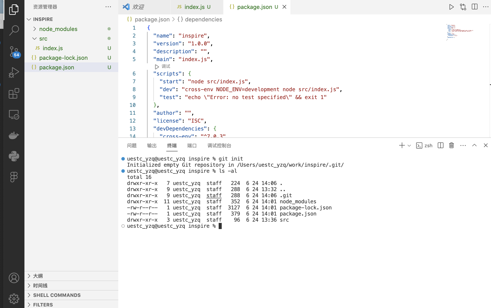

## 2. 添加 .gitignore 文件
项目中有些本地配置文件不应该上传到 git 远程仓库，比如这里的 node_modules 文件夹，可以通过 .gitignore 文件排除
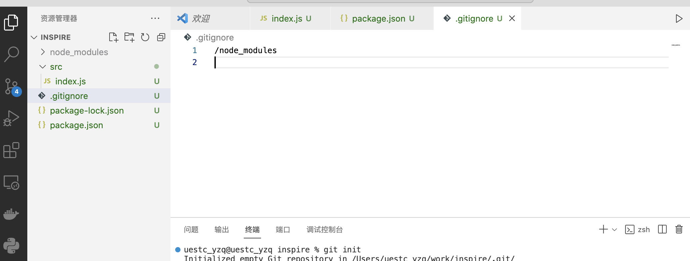
成功后可以看到 node_modules 文件夹变暗

## 3. 通过 git 命令提交并 push 到远程仓库

- **将全部文件添加到暂存区**
```
git add .
```

- **将暂存区文件提交到本地仓库**
```
git commit -m "feat: 初始化 nodejs 和 git 配置"
```


- **配置 github 认证**
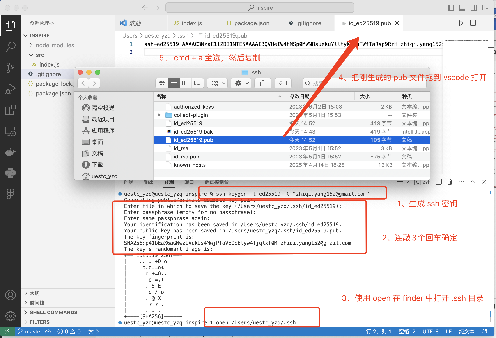

#### 生成本地ssh密钥对
生成ssh密钥 (替换邮箱)
```
ssh-keygen -t ed25519 -C "xxxxx@gmail.com"
```

- ***复制生成的ssh公钥***


- ***在github上上传ssh公钥***
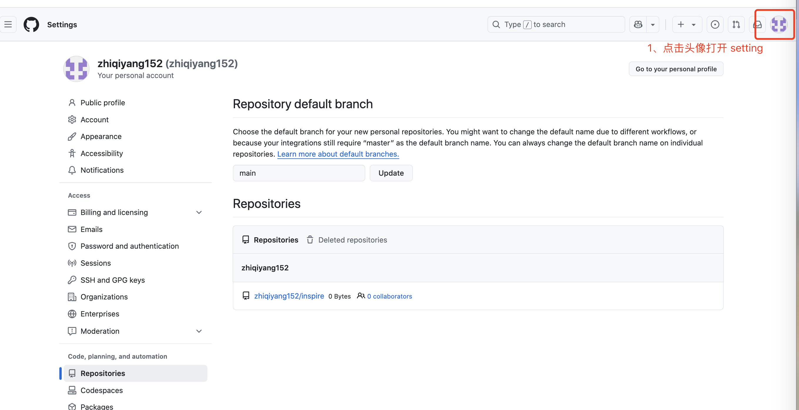

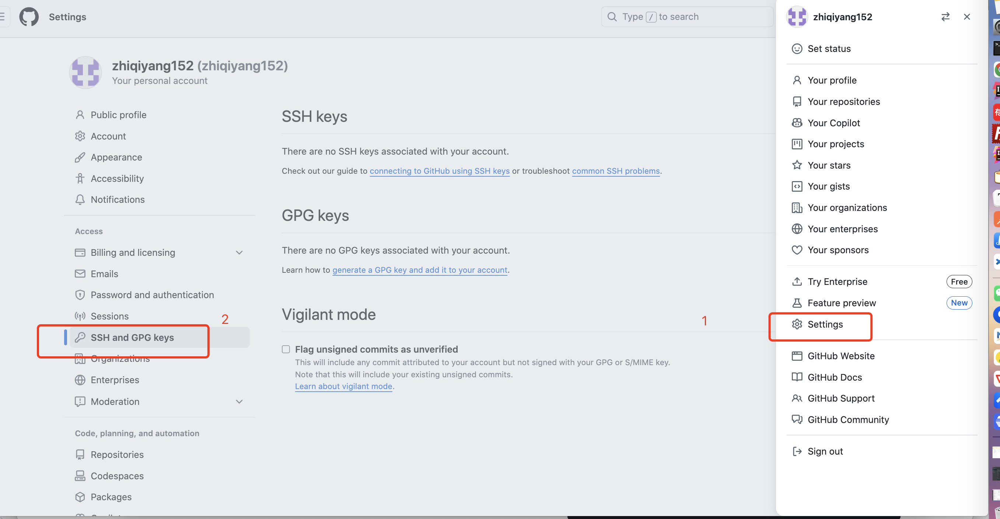


- **本地仓库关联远程仓库**
关联一次即可，后续提交不需要再关联
git remote add 远程仓库名称 远程仓库地址
```
git remote add origin git@github.com:zhiqiyang152/inspire.git
```
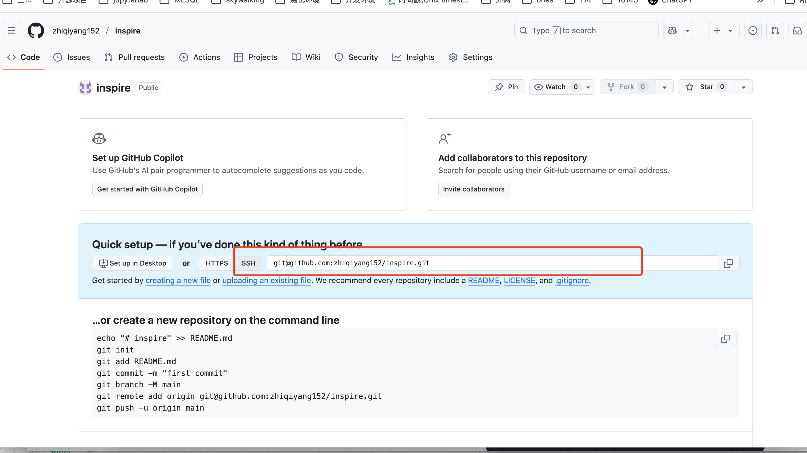

- **查看本地仓库默认分支名称**
git老版本默认分支名 master，新版本默认分支名 main
```
git branch
```


- **将本地仓库的最新变更推送到远程仓库**
git push -u 远程仓库名称 远程分支名称（一般和本地分支名保持一致）
```
git push -u origin master
```
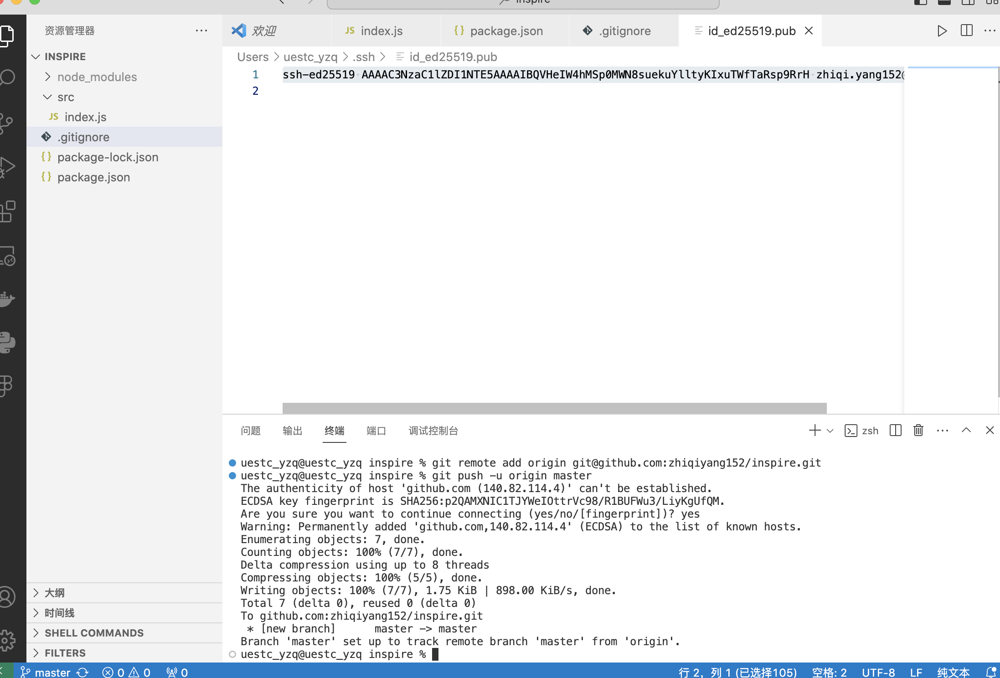

- **刷新仓库主页，可以看到推送代码成功**
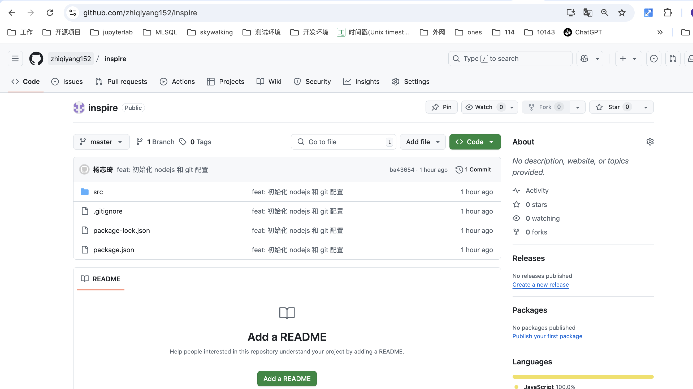

- **简单了解 ssh 认证机制（比较难，能简单了解就行）**
