# 初步集成 TypeScript

## 1. 使用 npm 全局安装 typescript
```shell
npm install -g typescript
```
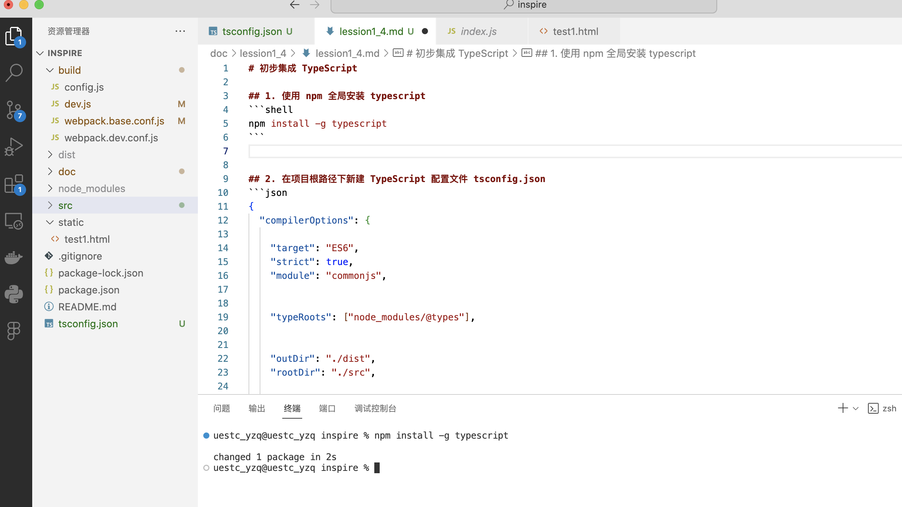


## 2. 在项目根路径下新建 TypeScript 配置文件 tsconfig.json
```json
{
  "compilerOptions": {

    "target": "ES6",
    "strict": true,
    "module": "esnext",


    "typeRoots": ["node_modules/@types"],


    "outDir": "./dist",
    "rootDir": "./src",


    "esModuleInterop": true,
    "skipLibCheck": true,
    "forceConsistentCasingInFileNames": true,


    "baseUrl": "."

  },
  "include": ["src/**/*"],
  "exclude": ["node_modules"]
}
```

### `"target": "ES6"`

**作用**：指定编译生成的 JavaScript 代码遵循 ES6 (ES2015) 标准。

**特点**：
- 保留 ES6+ 语法特性（如箭头函数、类、模板字符串等）
- 不会将现代语法转译为 ES5
- 适合运行在现代浏览器或 Node.js 8+ 环境

**示例对比**：
新建 src/test/test_es.ts 文件夹
```typescript
const greet = (name: string) => `Hello ${name}`;
```
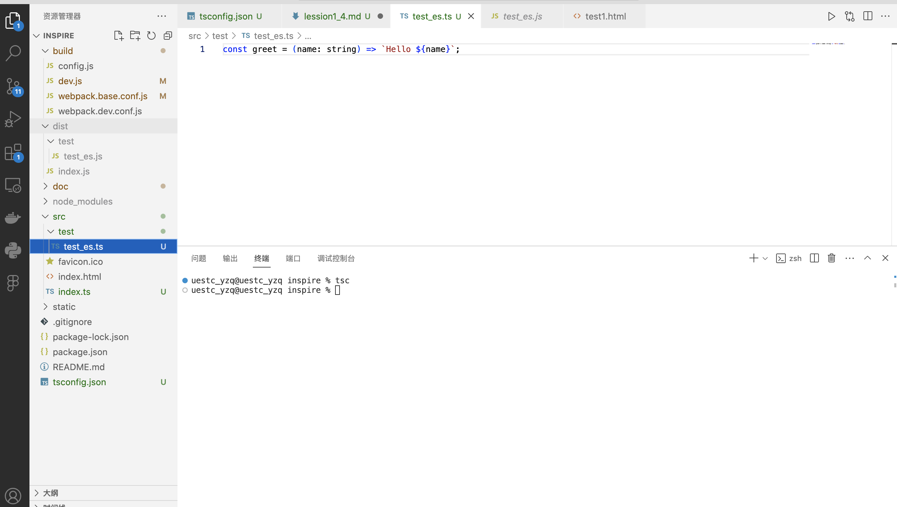

使用 tsc 命令编译为ES6标准，为了方便观看，编译前可以先删除 dist 整个文件夹
```code
tsc 
```
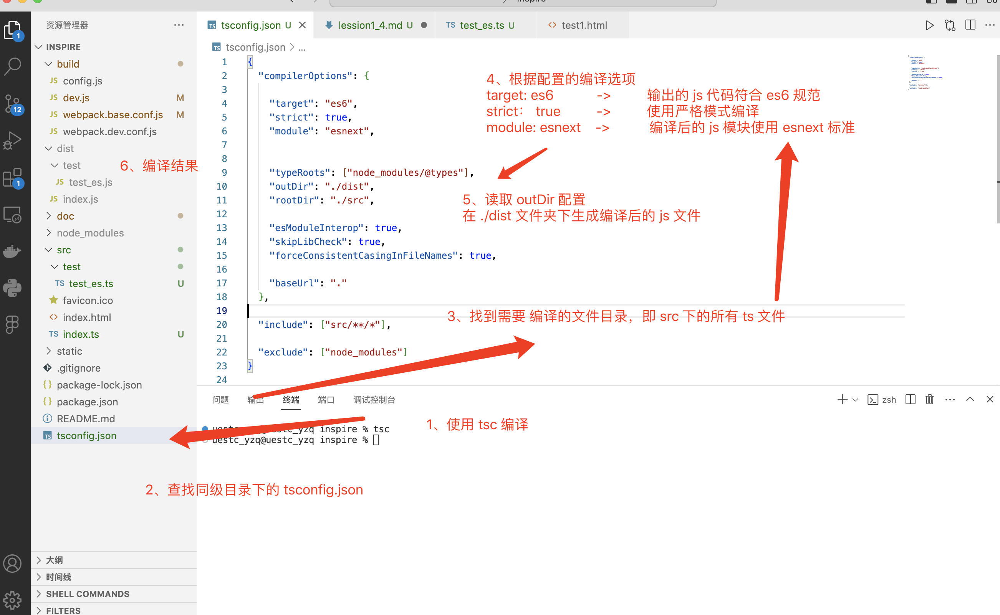

可以看到编译好的 js 代码保留了 es6 的箭头函数
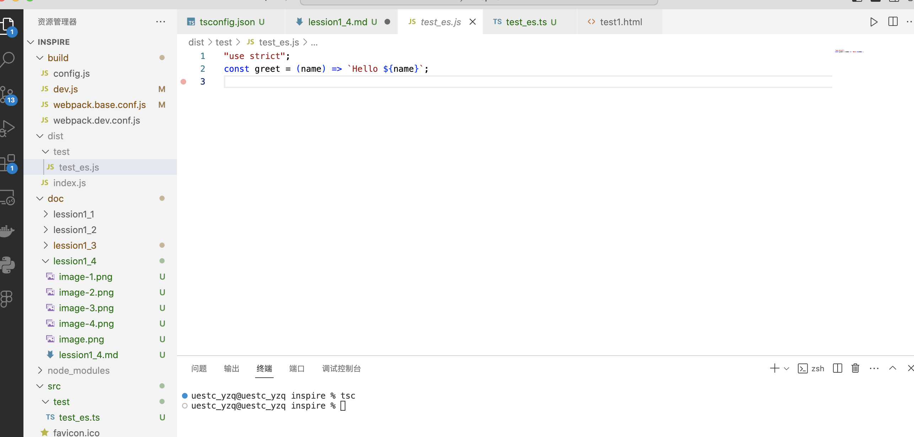

修改 target 选项为ES5，保存
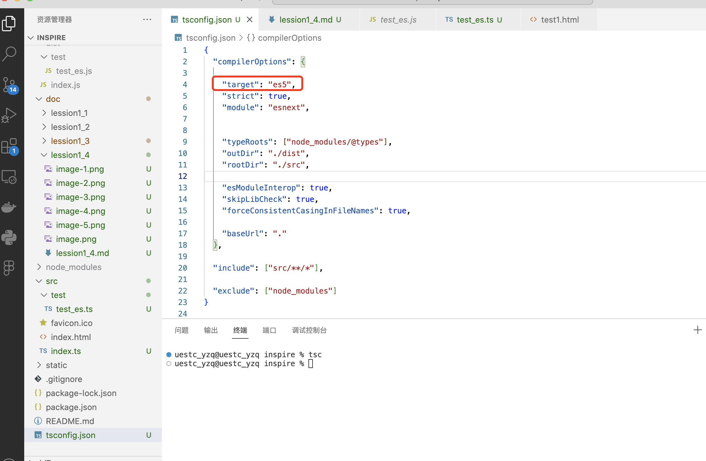

再次编译
```code
tsc 
```
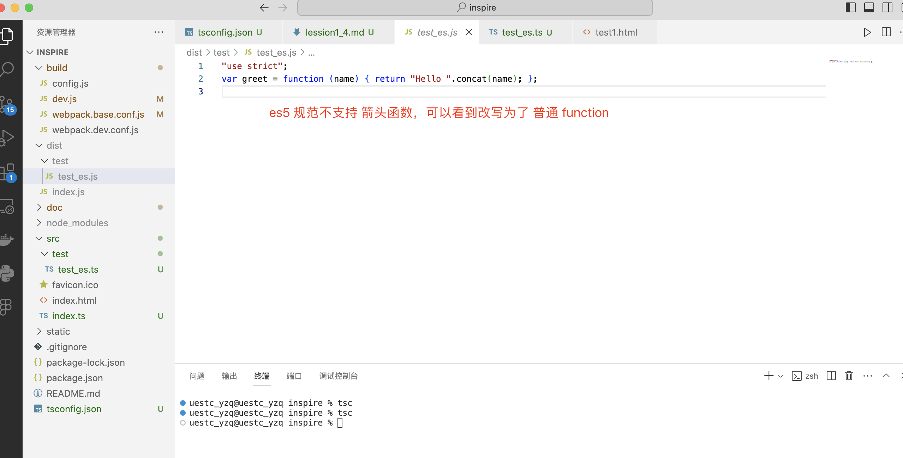

**结合这个例子初步理解 tsconfig.ts 中的配置选项**：


## 3. webpack 中集成 ts-loader TypeScript编译器
在 package.json 中引入 ts-loader
```code
    "ts-loader": "^9.5.2"
```
使用 npm 重新安装依赖
```code
    npm install
```


## 4. 使用 typescript 改写 src/index.js 为 src/index.ts
```typescript
const env : 'development' | 'production' = 
  process.env.NODE_ENV?.trim() === 'development' ? 'development' : 'production';

const rootElement : HTMLElement | null = document.getElementById('root');
const newDiv : HTMLDivElement = document.createElement('div');
newDiv.textContent = `hello new ${env}`;
rootElement?.appendChild(newDiv);
```
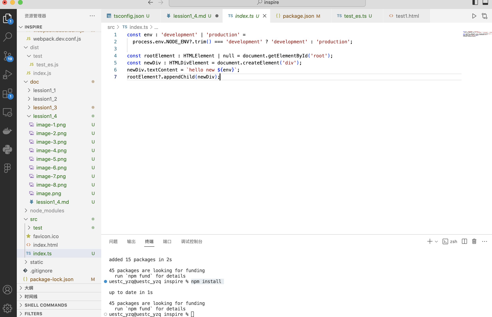

## 5. 修改 webpack 的入口为 index.ts
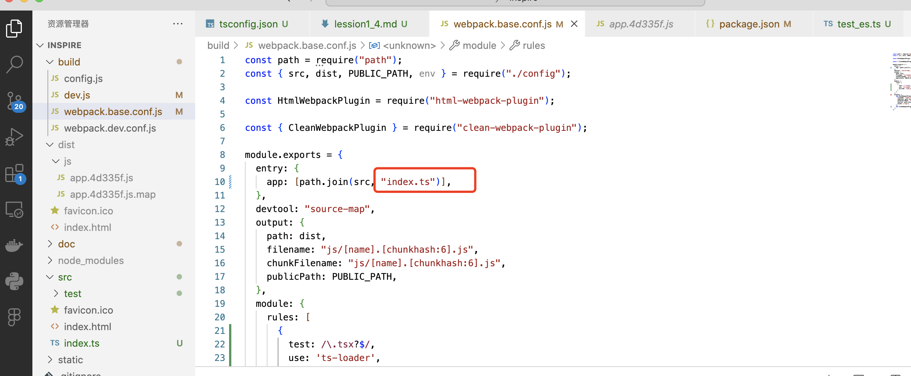

## 6. 在 rule 中添加 ts-loader
```
      {
        test: /\.tsx?$/,
        use: 'ts-loader',
        exclude: /node_modules/
      }
```
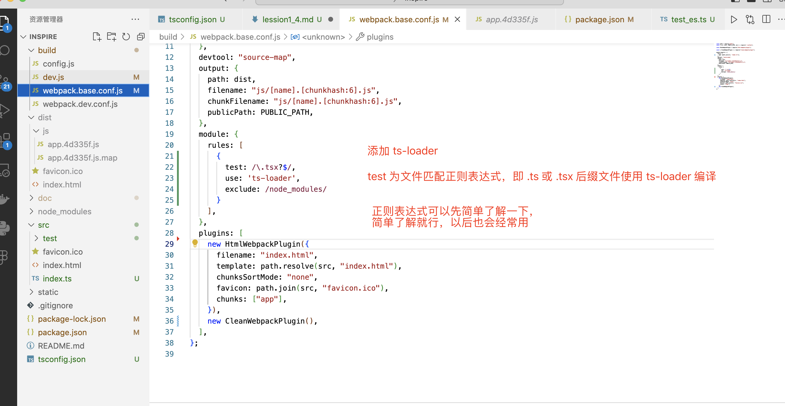

## 5.再次执行 webpack 打包命令
```code
npx webpack --config build/webpack.dev.conf.js
```
可以看到 webpack 调用 ts-loader 编译 index.ts 并生成了 app.[hash].js 文件
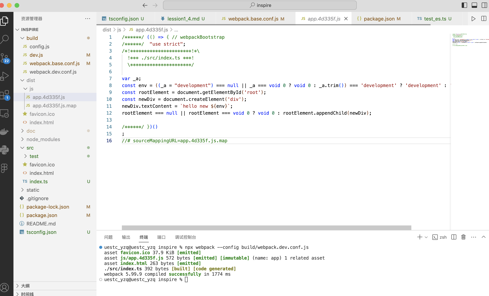

## 6. 运行dev脚本（运行前别忘记保存修改过的文件）
```code
    npm run dev
```
可以看到页面正常访问
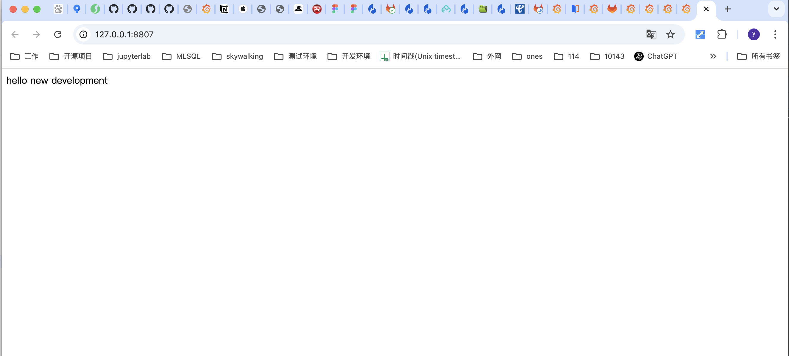