# 开发第一个 React 响应式组件

## 1. 新建 src/component/Counter.tsx
```tsx
import React, { useState } from 'react';

const Counter: React.FC = function Counter() {
  const [count, setCount] = useState(0);

  const increment = () => {
    setCount(count + 1);
  };

  return (
    <div>
      <div>
        {count}
      </div>
      
      <button 
        onClick={increment}
      >
        增加
      </button>
    </div>
  );
}

export default Counter;
```


## 2. 可以瞥一眼 React useState 源码（高阶知识，看一眼有个概念就行）
按住 commond, 点击 useState 函数可以跳到 react 源码函数定义
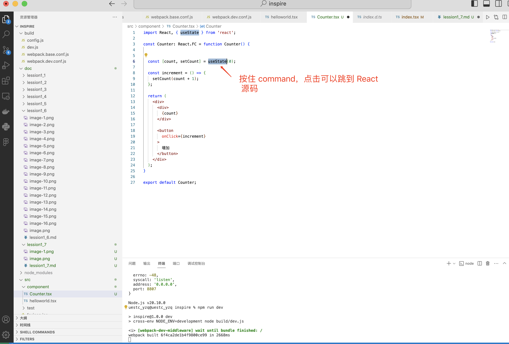
```tsx
  function useState<S>(initialState: S | (() => S)): [S, Dispatch<SetStateAction<S>>];
```

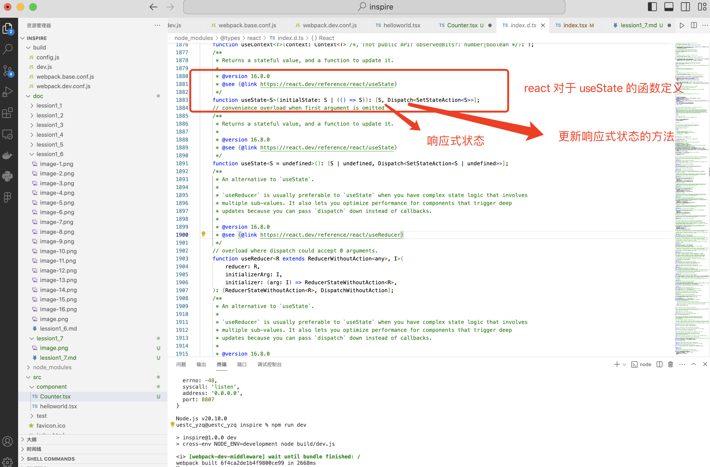

## 3. 修改 index.tsx，引入 Counter 组件渲染页面
```tsx
import React from "react";
import { createRoot } from "react-dom/client";

import Counter from "@/component/Counter";

const rootElement = createRoot(document.getElementById("root")!);
rootElement.render(<Counter/>);
```

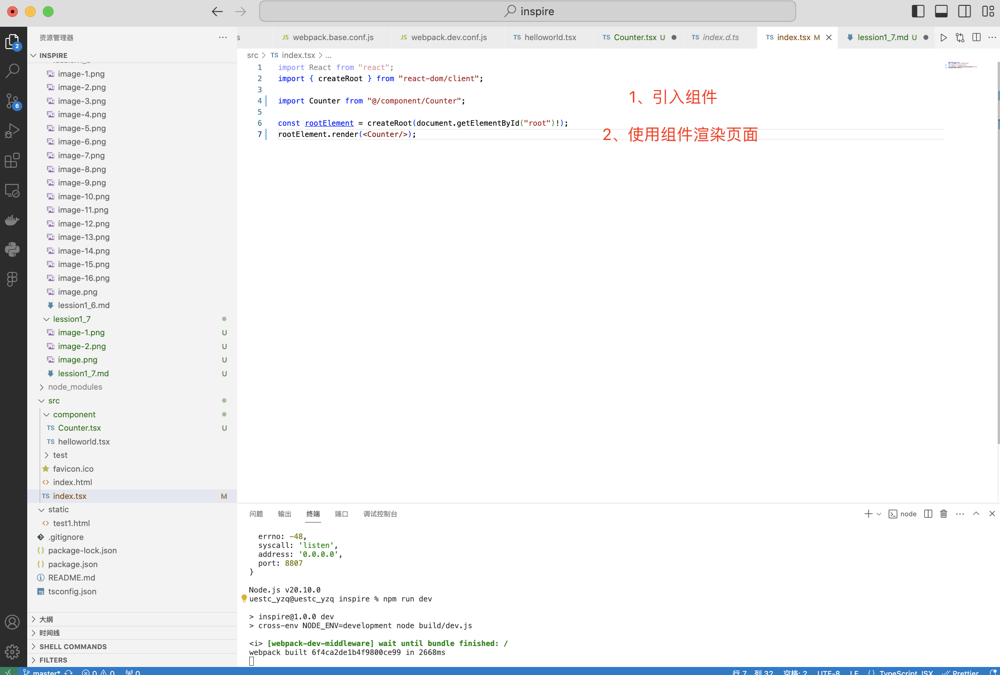

## 4. 启动 dev 环境脚本
```shell
npm run dev
```

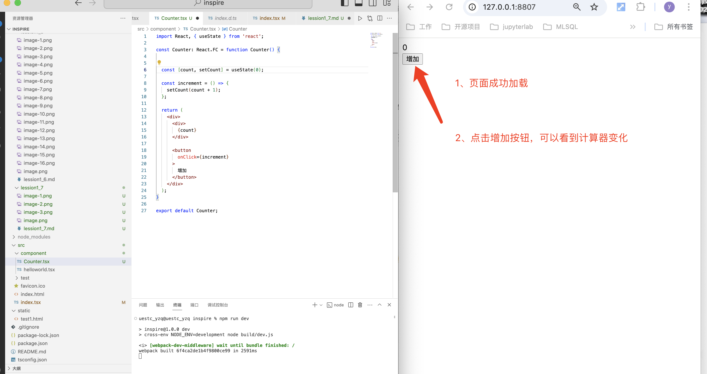


# 从0手写一个类似React的响应式组件

## 1. 新建 src/core/types.ts 和 src/MyReact.ts 文件
types.ts 用于定义 MyReact 的接口和数据类型

## 2. 仿写 React createRoot，定义显示响应式状态的画布
在 types.ts 中添加 createRoot 接口定义
```ts
export interface RootType {
  render: (element: MyFC) => void;
}

export type MyFC = () => MyJSX;


export type MyJSX = () => HTMLElement
```

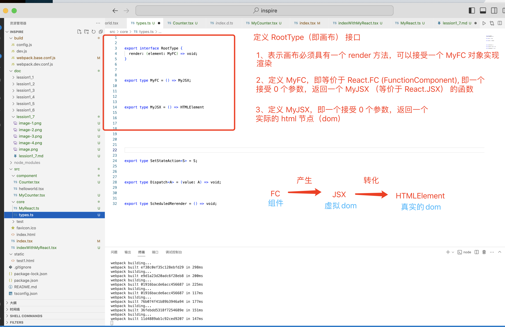

## 3. 在 types.ts 中添加 useState 涉及到的关键接口和数据类型定义
```ts
export type Dispatch<SSA> = (value: SSA) => void;

export type SetStateAction<S> = S;


export type ScheduledRerender = () => void;
```

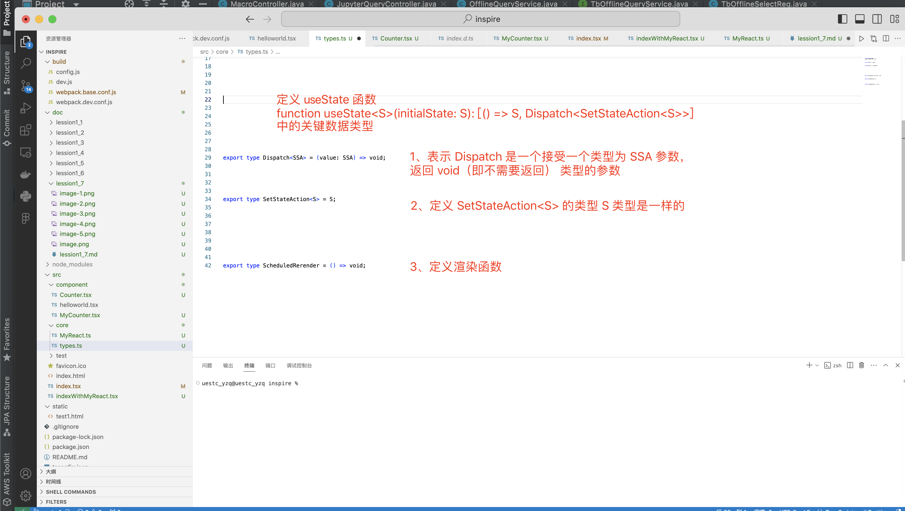

完整的 types.ts 

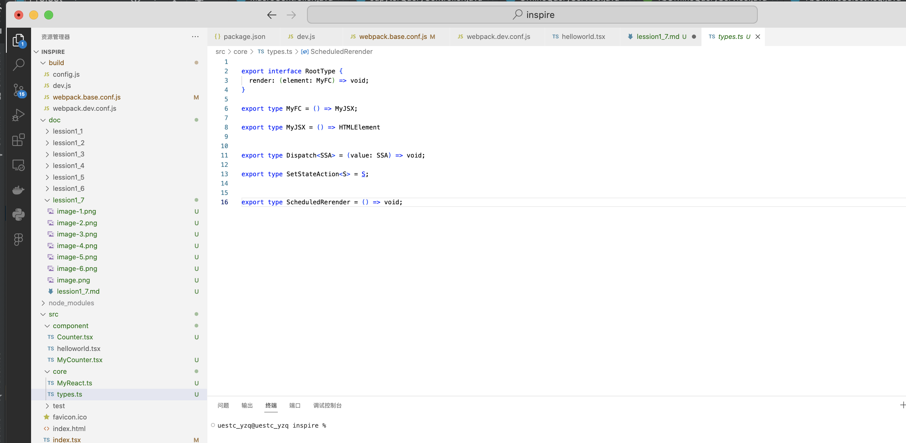


## 4. 根据接口定义，在 MyReact.ts 中编写实现 createRoot 具体实现
```ts
import { 
  MyFC, 
  RootType, 
  MyJSX,

  SetStateAction, 
  Dispatch, 
  ScheduledRerender, 
} from './types';


const MyReactBuilder = function() {


  function createRoot(container: HTMLElement): RootType {
    let currentElement: MyJSX | null = null;

    function performRender(container: HTMLElement, jsx: MyJSX | null) {
      console.log('--- 开始渲染 ---');
      if (jsx) {
        container.innerHTML = '';
        container.appendChild(jsx());
      }
  }
    
    return {
      render: (element: MyFC) => {
        currentElement = element();
        addScheduleRerender(() => {
          performRender(container, currentElement);
        });
        performRender(container, currentElement);
      }
    };

  }

  function addScheduleRerender(func: ScheduledRerender) {
    // ... 先占位，后面再实现
  }

  return {
    createRoot
  };
}

const MyReact = MyReactBuilder();

export const { createRoot } = MyReactBuilder();

export type { MyFC }; 

export default MyReact;
```

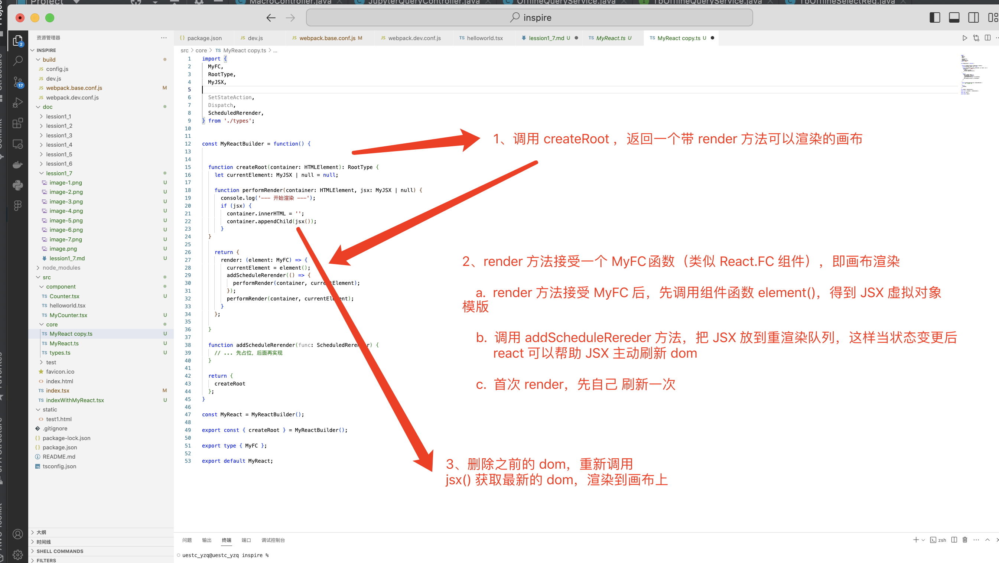


## 5. 定义 states 队列，用于存放响应式状态列表，定义 renderQueue 队列，用于存放需要重新渲染的任务
```ts
import { 
  MyFC, 
  RootType, 
  MyJSX,

  SetStateAction, 
  Dispatch, 
  ScheduledRerender, 
} from './types';


const MyReactBuilder = function() {


  function createRoot(container: HTMLElement): RootType {
    let currentElement: MyJSX | null = null;

    function performRender(container: HTMLElement, jsx: MyJSX | null) {
      console.log('--- 开始渲染 ---');
      if (jsx) {
        container.innerHTML = '';
        container.appendChild(jsx());
      }
  }
    
    return {
      render: (element: MyFC) => {
        currentElement = element();
        addScheduleRerender(() => {
          performRender(container, currentElement);
        });
        performRender(container, currentElement);
      }
    };

  }
  

  let states: any[] = [];
  let stateIndex: number = 0;
  let isInitialRender: boolean = true;
  let renderQueue: ScheduledRerender[] = [];

  function addScheduleRerender(func: ScheduledRerender) {
    renderQueue.push(func);
  }


  function flushRenderQueue() {
    const queue = [...renderQueue];
    queue.forEach(func => func());
  }


  return {
    createRoot
  };
}

const MyReact = MyReactBuilder();

export const { createRoot } = MyReactBuilder();

export type { MyFC }; 

export default MyReact;
```

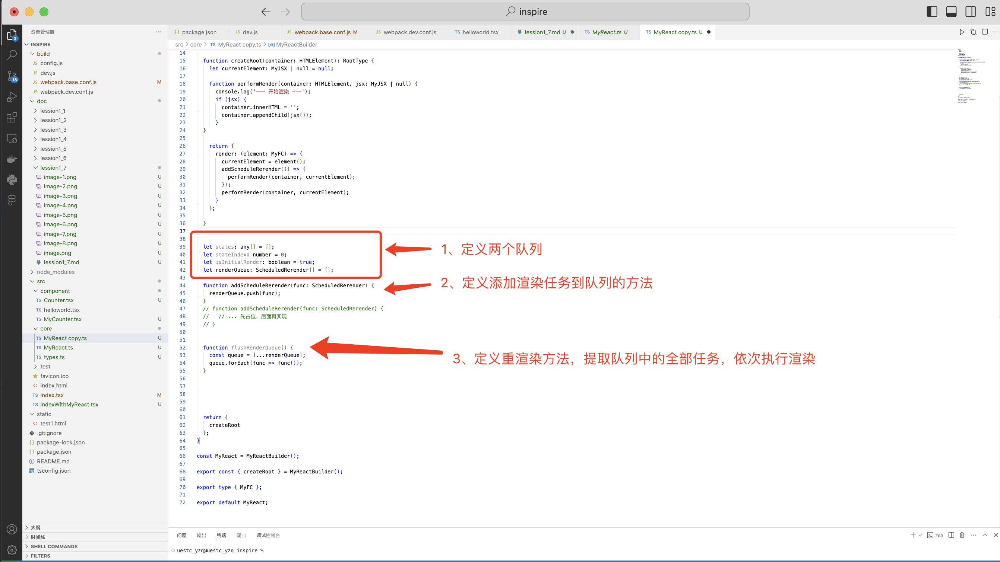


## 6. 定义 useState 方法，可以用 useState 添加响应式状态
```ts
import { 
  MyFC, 
  RootType, 
  MyJSX,

  SetStateAction, 
  Dispatch, 
  ScheduledRerender, 
} from './types';


const MyReactBuilder = function() {


  function createRoot(container: HTMLElement): RootType {
    let currentElement: MyJSX | null = null;

    function performRender(container: HTMLElement, jsx: MyJSX | null) {
      console.log('--- 开始渲染 ---');
      if (jsx) {
        container.innerHTML = '';
        container.appendChild(jsx());
      }
  }
    
    return {
      render: (element: MyFC) => {
        currentElement = element();
        addScheduleRerender(() => {
          performRender(container, currentElement);
        });
        performRender(container, currentElement);
      }
    };

  }


  let states: any[] = [];
  let stateIndex: number = 0;
  let isInitialRender: boolean = true;
  let renderQueue: ScheduledRerender[] = [];

  function addScheduleRerender(func: ScheduledRerender) {
    renderQueue.push(func);
  }
  // function addScheduleRerender(func: ScheduledRerender) {
  //   // ... 先占位，后面再实现
  // }


  function flushRenderQueue() {
    const queue = [...renderQueue];
    queue.forEach(func => func());
  }


  function useState<S>(initialState: S): [() => S, Dispatch<SetStateAction<S>>] {
    const currentIndex = stateIndex;
    
    if (isInitialRender) {
      states[currentIndex] = initialState;
    }


    const setState: Dispatch<SetStateAction<S>> = ((newValue: SetStateAction<S>) => {
      const newStateValue = newValue;
      states[currentIndex] = newStateValue;
      stateIndex = 0;
      isInitialRender = false;
      flushRenderQueue();
    });

    stateIndex++;
    return [(() => states[currentIndex] as S), setState];
  }


  return {
    useState,
    createRoot
  };

  
}

const MyReact = MyReactBuilder();

export const { createRoot, useState } = MyReactBuilder();

export type { MyFC }; 

export default MyReact;
```

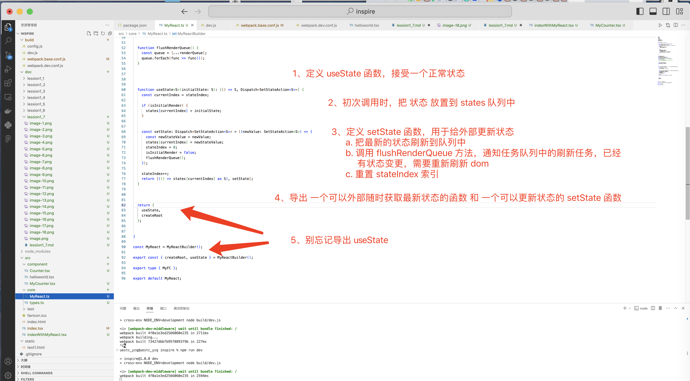


## 7. 新建 src/component/MyCounter.tsx组件
```tsx
import { useState, MyFC } from '@/core/MyReact';

const Counter: MyFC = () => {

  
  const [count, setCount] = useState(0);

  const increment = () => {
    setCount(count() + 1);
  };

  return () => {
    const outerDiv = document.createElement('div');
    const countDiv = document.createElement('div');
    const button = document.createElement('button');
    countDiv.innerHTML = `${count()}`;
    button.textContent = '增加（通过自编写的类React源码实现）';
    button.addEventListener('click', increment);
  
    outerDiv.appendChild(countDiv);
    outerDiv.appendChild(button);
    return outerDiv;
  }
}

export default Counter;
```

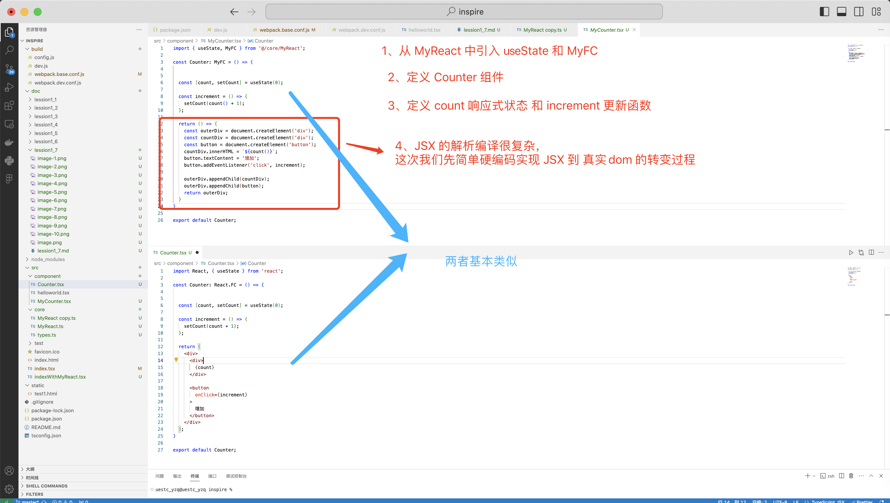


## 8. 新建 src/indexWithMyReact.tsx 文件
```tsx
import { createRoot } from "@/core/MyReact"

import MyCounter from "@/component/MyCounter";

const rootElement = createRoot(document.getElementById("root")!);
rootElement.render(MyCounter);
```

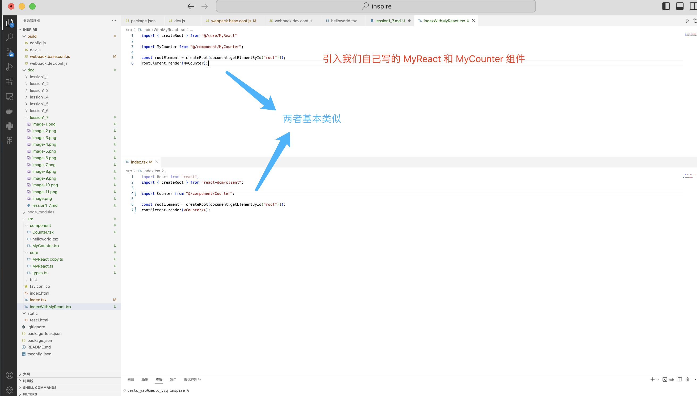


## 9. 修改 webpack.base.conf.js 中的 entry.app 入口，指向 src/indexWithMyReact.tsx 文件
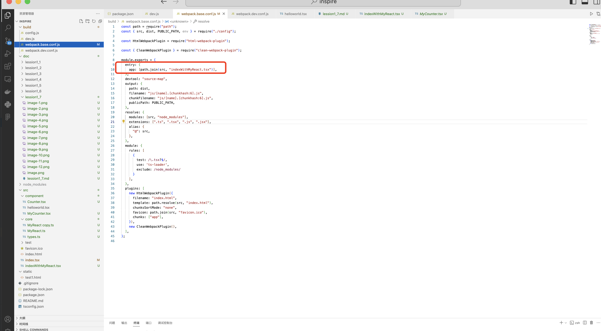

## 10. 保存所有修改过的文件，重运行开发环境脚本
```shell
npm run dev
```
点击按钮，可以看到我们也实现了 react 的响应式组件

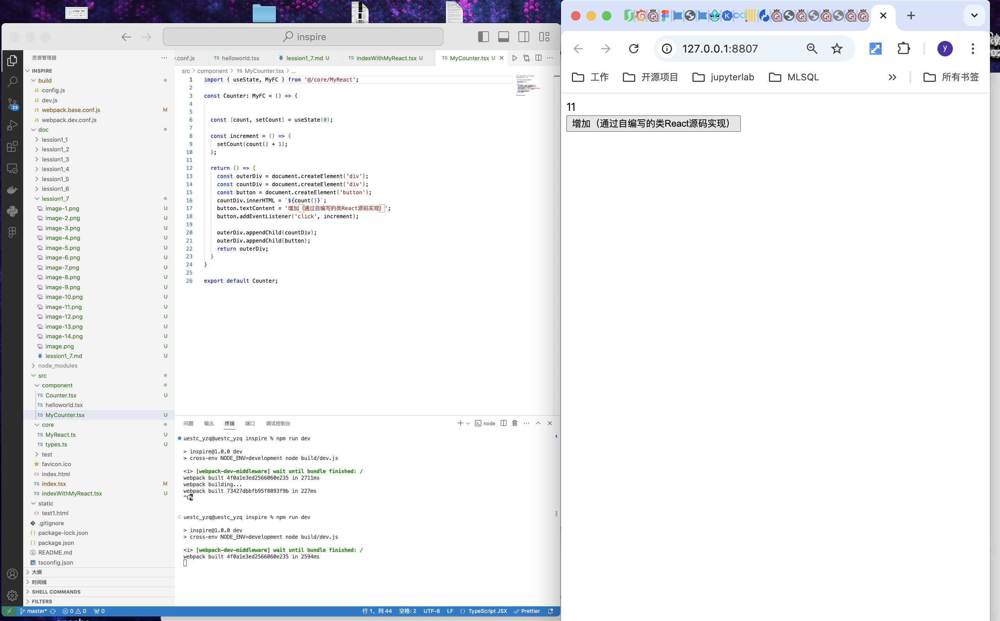

## 11. 别忘记把入口文件修改回来
