# 集成 sass/scss 预编译器

## 1. 什么是 sass/scss 预编译器
***Sass*** (Syntactically Awesome Style Sheets) 是一种**CSS预处理器**，通过添加变量、嵌套、混合等编程特性来增强CSS功能。
***Scss***（Sassy CSS）是 ​​Sass（Syntactically Awesome Style Sheets）​​ 的一种语法格式，它扩展了 CSS 的功能，使样式表更易维护、更具编程特性。


## 2. 在 package.json 中引入依赖
别忘记在开头加上 , 保证 json 格式正确
```
    "sass": "^1.89.0",
    "sass-loader": "^16.0.5",
    "style-loader": "^2.0.0",
    "css-loader": "^5.2.6",
    "postcss-less": "^4.0.1",
    "postcss-loader": "^6.1.0"
```
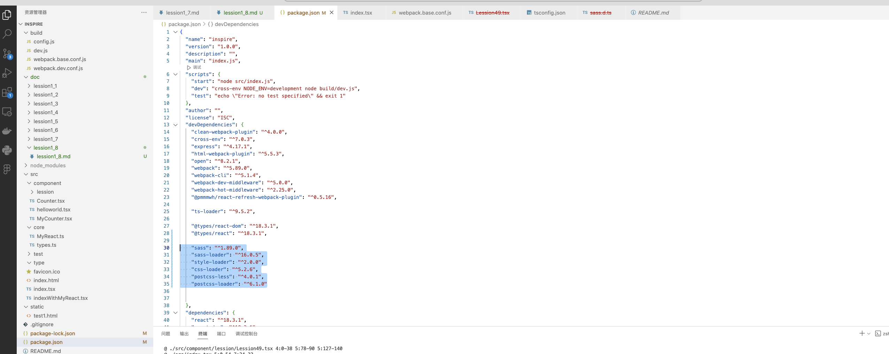

## 3. 运行安装命令
```
npm install
```
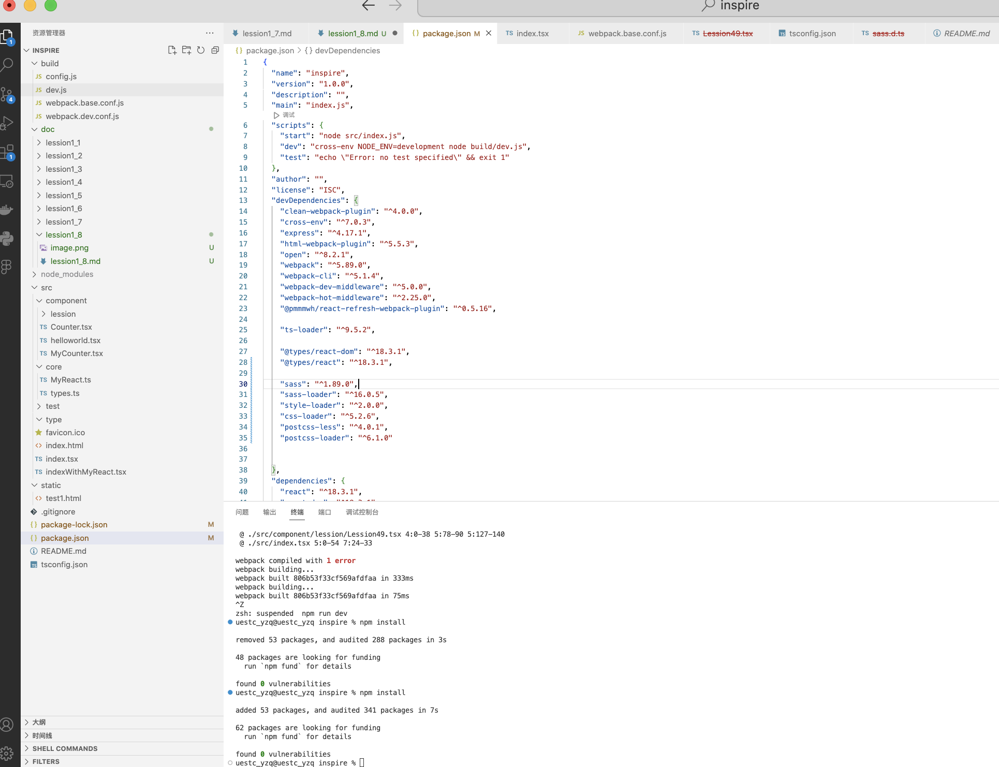

## 4. 在 webpack 配置文件 build/webpack.base.conf.js 中配置 scss/sass 预编译规则
**有个印象就行，不需要一定完全理解**
```
      {
        test: /\.s[ac]ss$/i,
        include: [/src/],
        use: [
          { loader: "style-loader" },
          {
            loader: "css-loader",
            options: {
              modules: {
                localIdentName: "[name]_[local]_[hash:base64:10]",
              },
            },
          },
          { loader: "postcss-loader" },
          { loader: "sass-loader" },
        ],
      },
```

别忘记在前面加上 , 号保证格式正确

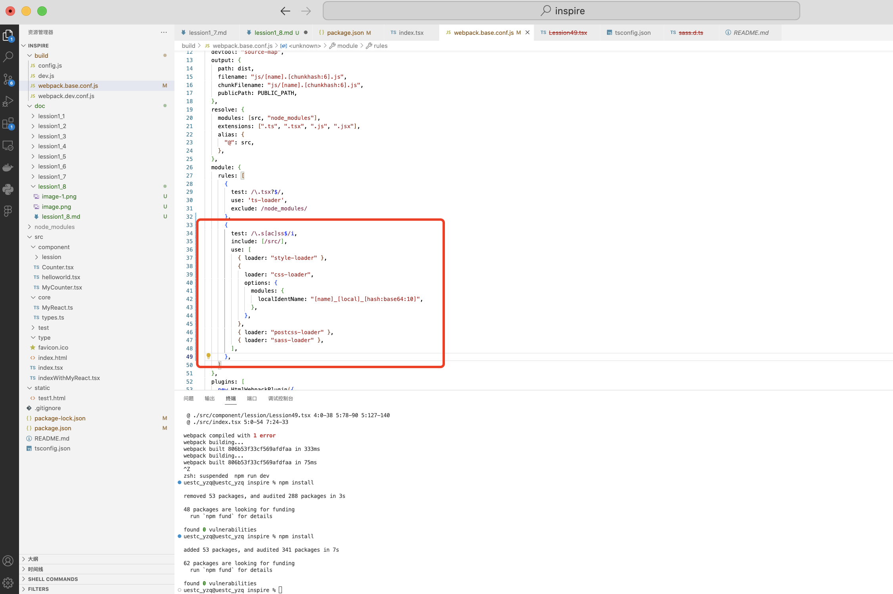

**文件匹配正则**
```
    test: /\.s[ac]ss$/i
```
- 作用：匹配以下扩展名的文件
  - `.scss` (Sassy CSS)
  - `.sass` (缩进语法)
- 标志：`i` 表示不区分大小写

**处理范围限定**
```
 include: [/src/]
```
- 效果：仅处理src目录下的文件
- 优势：
  - 避免处理node_modules中的样式
  - 提升构建性能


**加载器执行链（逆序执行）**
### 1、sass-loader
```
  { loader: "sass-loader" }
```
- 功能：将Sass/SCSS编译为标准CSS
- 输入：`.sass/.scss`文件
- 输出：纯CSS


### 2、postcss-loader
```
  { loader: "postcss-loader" }
```
- 功能：通过 PostCSS 工具对 CSS 进行转换和优化，自动添加浏览器前缀，转换现代 CSS 特性等

**自动添加浏览器前缀**
```
/* 输入 */
.box {
  display: flex;
}

/* 输出 */
.box {
  display: -webkit-box;
  display: -ms-flexbox;
  display: flex;
}
```

**​​转换现代 CSS 特性**
```
/* 输入（CSS Nesting） */
.parent {
  & .child { color: red }
}

/* 输出 */
.parent .child { color: red }
```

### 3、css-loader
```
    { 
      loader: "css-loader",
      options: {
        modules: {
          localIdentName: "[name]_[local]_[hash:base64:10]",
        },
      },
    },
```
- **核心功能**：
  - 启用CSS Modules
  - 解析`@import`和`url()`
  - ​​将 CSS 转换为 JavaScript 模块​​（Webpack 默认只能处理 JS，CSS 需要转换成 JS 才能被识别）

- **localIdentName**
localIdentName定义生成的 CSS 类名格式
  ```
  [name]_[local]_[hash:base64:10]
  ```
  例子
  ```
  /* 原始代码（Button.scss） */
  .primary { color: red; }

  /* 编译后 */
  .Button_primary_1a2b3c4d5e { color: red; }
  ```

### 4、style-loader
```
  { loader: "style-loader" }
```
- 功能：将CSS注入DOM
- 特点：
  - 通过`<style>`标签添加样式
  - 支持HMR热更新

## **完整流程**
```
SCSS/Sass → sass-loader → CSS → postcss-loader → 优化后的CSS → css-loader → JS模块 → style-loader → 样式注入DOM
```


## 5. 新建 src/component/lession/Lession49.scss 样式文件
简单写入一个背景样式
```
.bg {
  height: 100px;
  background-color: red;
}
```
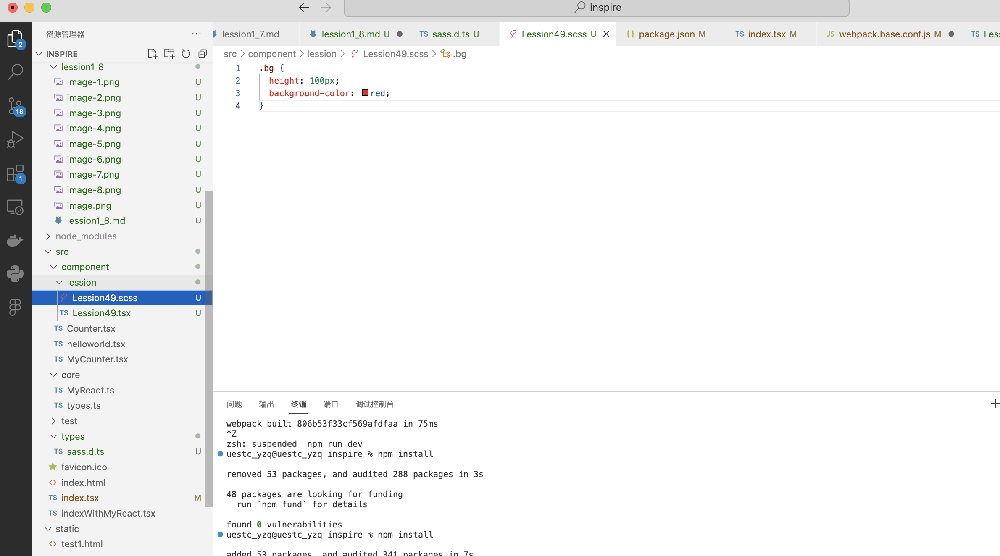

## 6. 新建 src/component/lession/Lession49.tsx 组件，引入 Lession49.scss 
```
import React from "react";

import ss from "./Lession49.scss";

const component: React.FC = () => (
    <div className={ss.bg}>
      1111
    </div>
);
export default component;
```
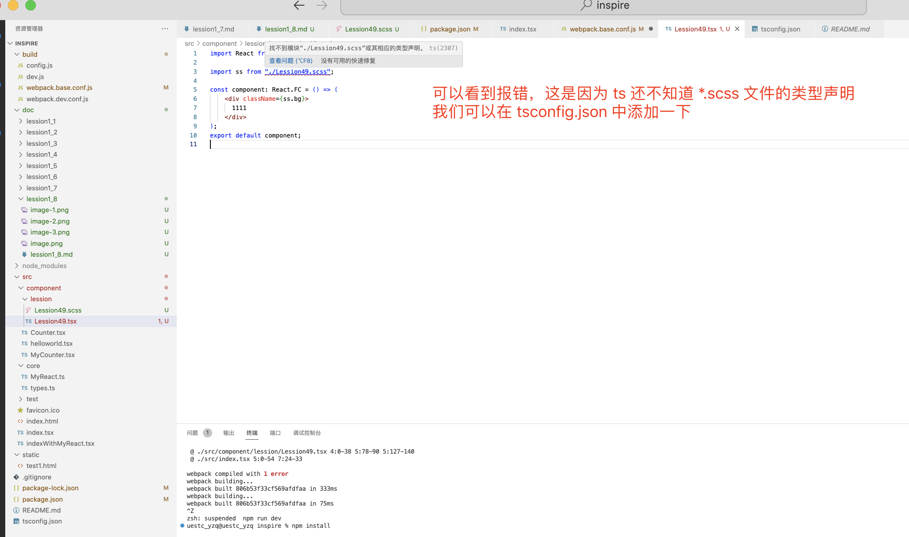

## 7. 新建 src/types/sass.d.ts 类型声明文件
```ts
declare module "*.sass" {
  const content: { [className: string]: string };
  export default content;
}

declare module "*.scss" {
  const content: { [className: string]: string };
  export default content;
}
```
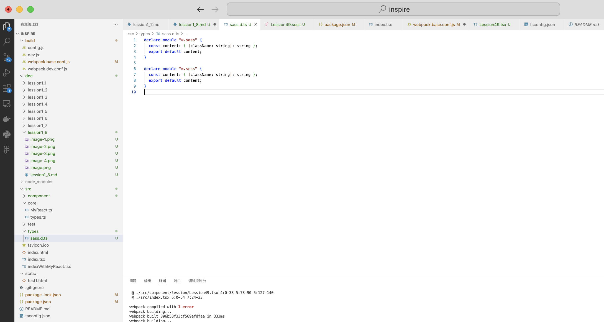

## 8. 在 tsconfig.json 中添加 rootTypes 目录
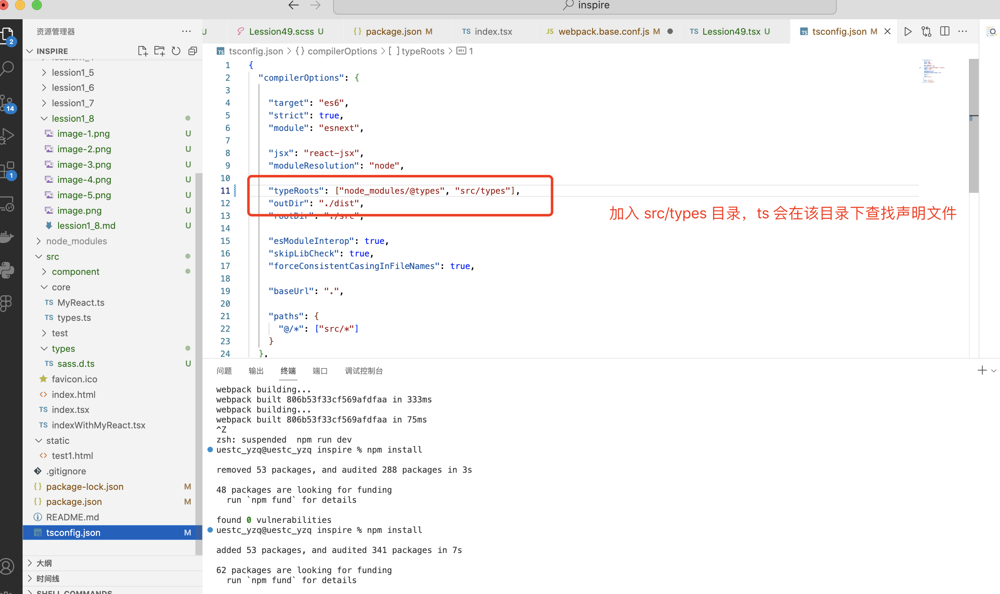

## 9. 保存所有文件，看到 Lession49.tsx 不再报错


## 10. 修改 index.tsx 入口文件，引入 Lession49.tsx 组件
```
import React from "react";
import { createRoot } from "react-dom/client";

import Lession49 from "@/component/lession/Lession49";

const rootElement = createRoot(document.getElementById("root")!);
rootElement.render(<Lession49/>);
```
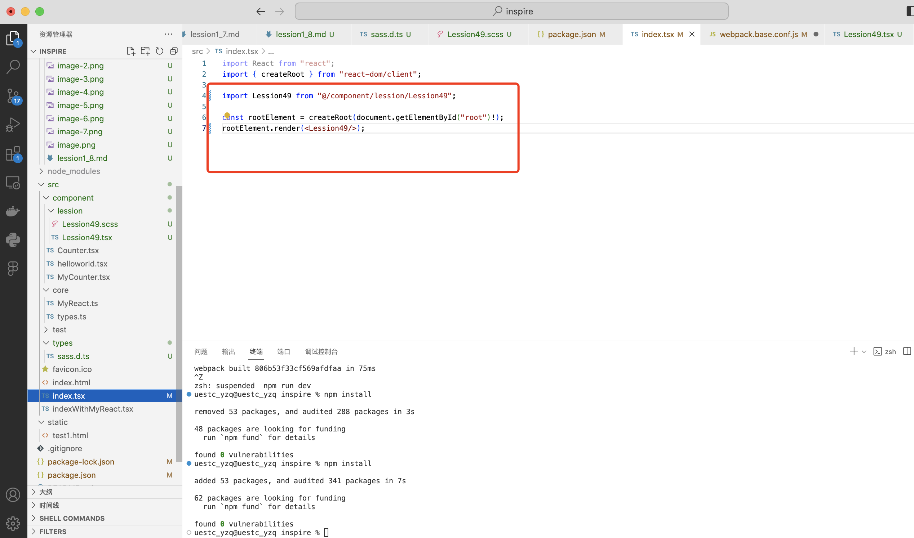

## 11. 保存修改过的文件，运行开发环境脚本
```
npm run dev
```
可以看到 scss 样式生效

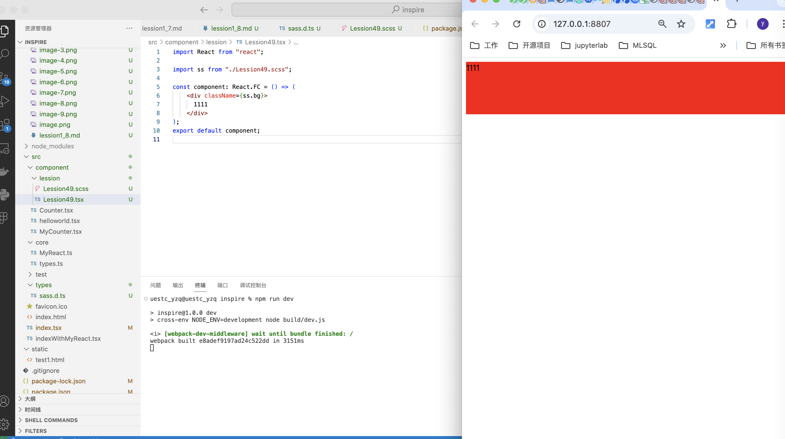


#  CSS动画Lession49

这是效果图

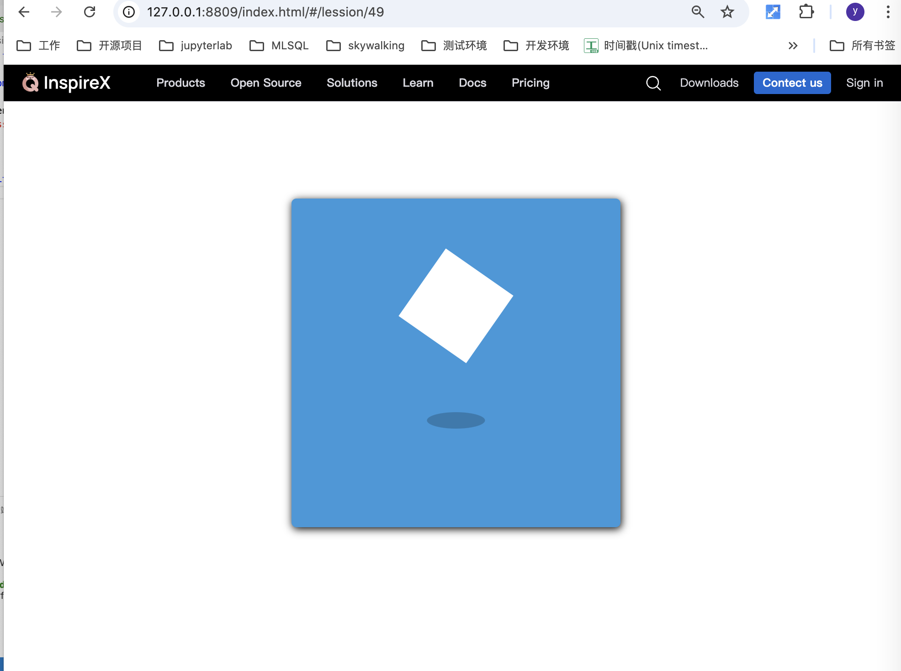

## 1. 画出蓝色背景框

在 Lession49.scss 中添加 .frame 类型样式，定义 div 宽高和背景颜色
```
.frame {
  width: 400px;
  height: 400px;
  background-color: #3498db;
}
```
**tips**: div 是块级别元素，即 display: block

- div 是标准的 ​​块级元素​​，默认 display: block，具有以下特性
  - ​独占一行​​，前后自动换行
  - ​​可设置宽高​​（width/height）
  - ​​默认宽度 100%​​（撑满父容器）

在 Lession49.tsx 中添加方块 div
```
import React from "react";

import ss from "./Lession49.scss";

const component: React.FC = () => (
    <div className={ss.frame}>
    </div>
);
export default component;
```

保存，看效果

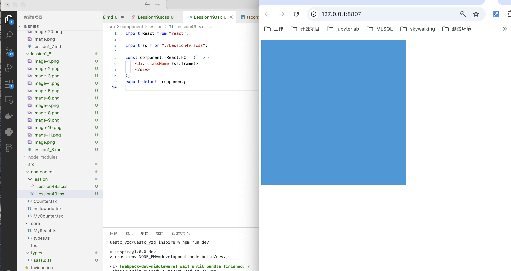

完美！！

## 2. 把蓝色方块居中

在 Lession49.scss 中添加 .frame 类型样式，
定义 div 的 position 为 absolution 绝对定位，这样可以使用 top/left 等调整位置
```
.frame {
  width: 400px;
  height: 400px;
  background-color: #3498db;

  position: absolute;
  left: 50%;
  top: 50%;

}
```

保存，看效果

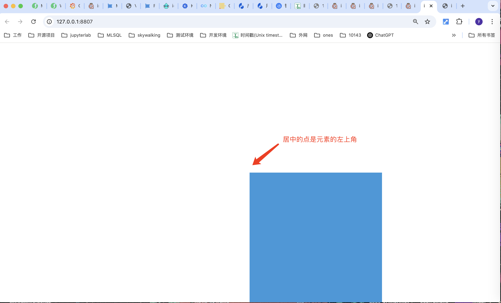

## 3. 调整为视觉居中

```
  transform: translate(-50%, -50%);
```
通过 transform 属性中的 translate 把方块分别 往 X 轴负方向（左向）移动自身宽度的 50%，往 Y 轴负方向（向上）移动自身高度的 50%，达到视觉居中
```
.frame {
  width: 400px;
  height: 400px;
  background-color: #3498db;

  position: absolute;
  left: 50%;
  top: 50%;

  transform: translate(-50%, -50%);
}
```

保存，看效果

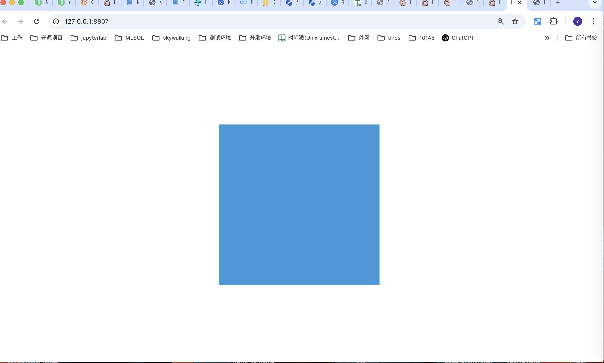

完美！！

## 3. 为方块添加圆角和阴影，看起来更有层次感

```
  box-shadow: 1px 2px 10px 0px rgb(0, 0, 0, 0.3);
  border-radius: 6px;
```

整体代码

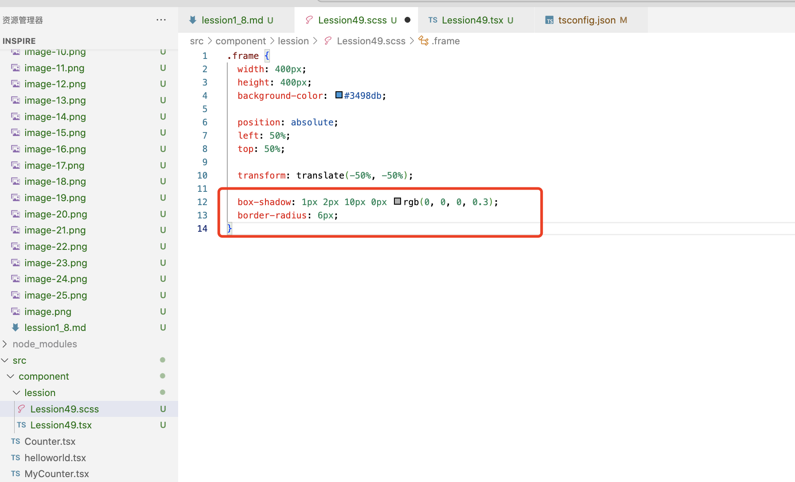


保存，看效果

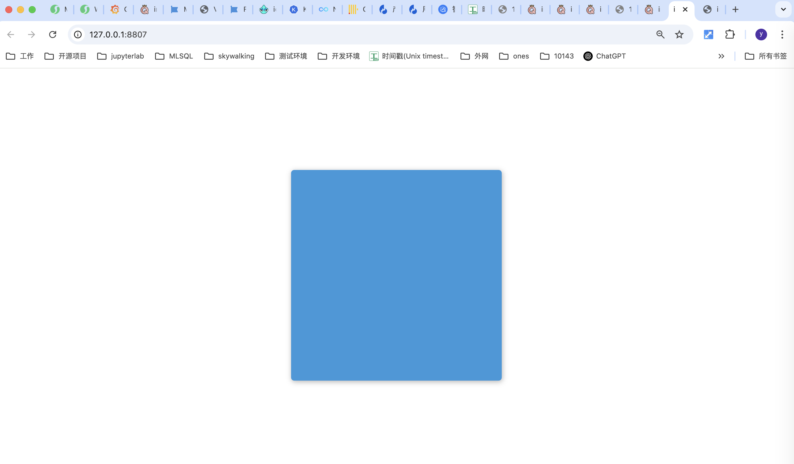


## 4. 添加内部白色方块和背景容器div

在 Lession49.scss 中添加 .square 类型样式，定义 容器div 宽高，为了方便调试看效果，可以先给它一个边框
```
.square {
  width: 220px;
  height: 160px;
  border: 1px solid red;
}
```
完整代码

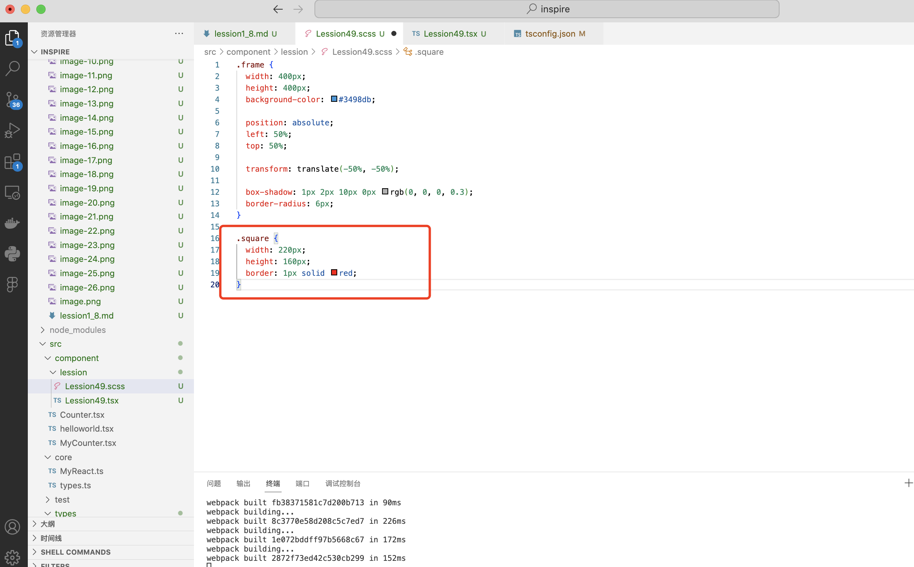


在 Lession49.tsx 中添加容器 div
```
import React from "react";

import ss from "./Lession49.scss";

const component: React.FC = () => (
    <div className={ss.frame}>
      <div className={ss.square}></div>
    </div>
);
export default component;

```

保存，看效果

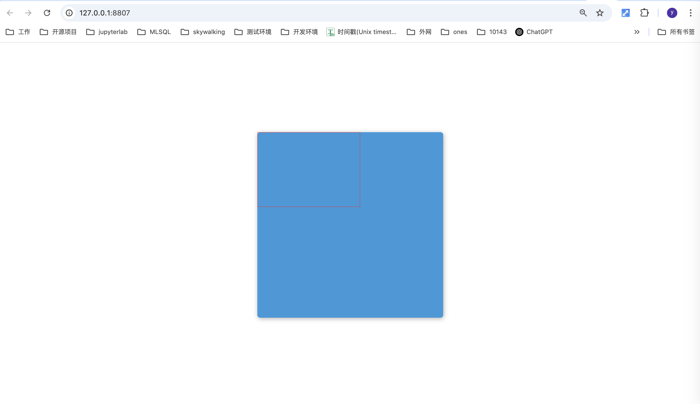

## 5. 把红色边框容器居中
这次我们利用 grid 网格布局来简单实现居中

把 .frame 父容器设置为网格布局, 并且设置元素水平和垂直都居中
```
  display: grid;
  justify-items: center;
  align-items: center;
```

完整代码
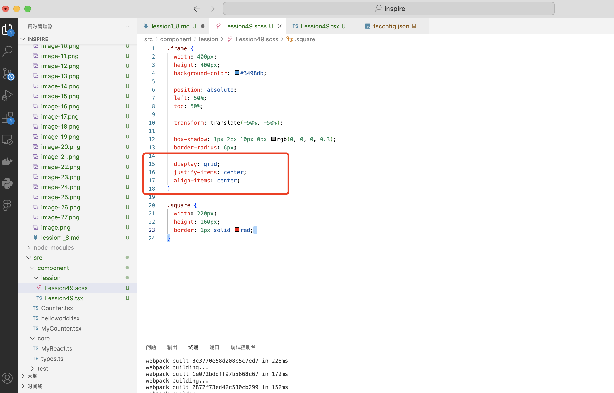

保存，看效果

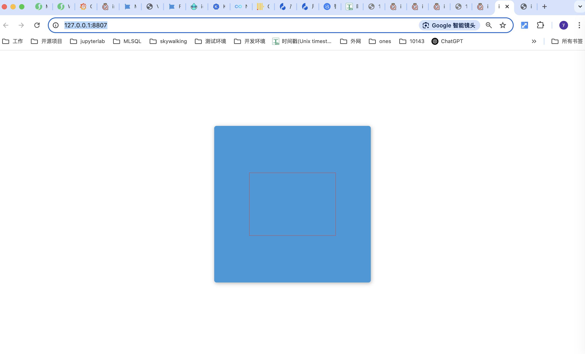

完美，继续！！

## 5. 利用伪元素来实现容器内的白色方块

**&** 
表示父元素，即外层的 .square

**::after** 
表示在元素内容后生成一个伪元素

连起来就是 
**.square::after**
表示所有 class 为 .square 的元素，在内容之后都生成一个伪元素

**content** 
伪元素必须包含 content, 但可以为空字符串

**position** 
伪元素默认为行内元素，跟其他元素共享一行，不可设置宽高，而是根据内容自适应，我们可以设置 position: absolute 来允许设置 宽高 和 调整 位置

```
  &::after {
    content: "";    
    position: absolute;
    background: #fff;
    width: 100px;
    height: 100px;
  }
```
完整代码

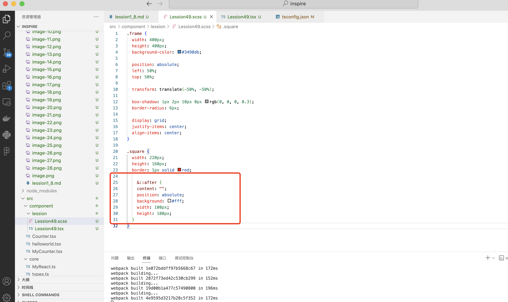

保存，看效果

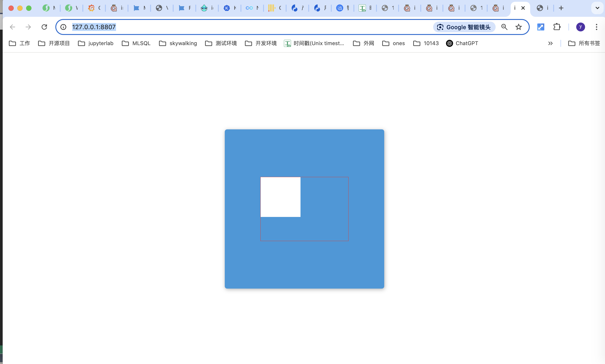

继续！！


## 6. 调整方块居中，添加落地时重力挤压效果


```
  top: 80%;
  left: 50%;
  transform: translate(-50%, -50%) scale(1.8, 0.4) rotate(0);
```
**translate(-50%, -50%)** 
向 X 轴右方向 和 Y轴上方向各自平移自身宽高的 50%

**scale(1.8, 0.4)** 
宽度拉伸到 1.8 倍
高度压缩到 0.4 倍

**rotate(0)** 
旋转0度

完整代码
```
  &::after {
    content: "";    
    position: absolute;
    background: #fff;
    width: 100px;
    height: 100px;

    top: 80%;
    left: 50%;
    transform: translate(-50%, -50%) scale(1.8, 0.4) rotate(0);
  }

```


保存，看效果

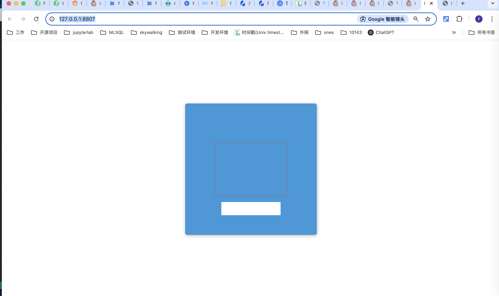

发现白色方块的位置不对，是在 .frame 容器的 80% 处
```
position: absolute 绝对定位原理是根据最近一个 position: absolute/relative 的父节点来定位的
```
因为 .square 是默认的 position: static，从而向上递延到了 .frame

## 7. 调整 .square 为 relative 定位

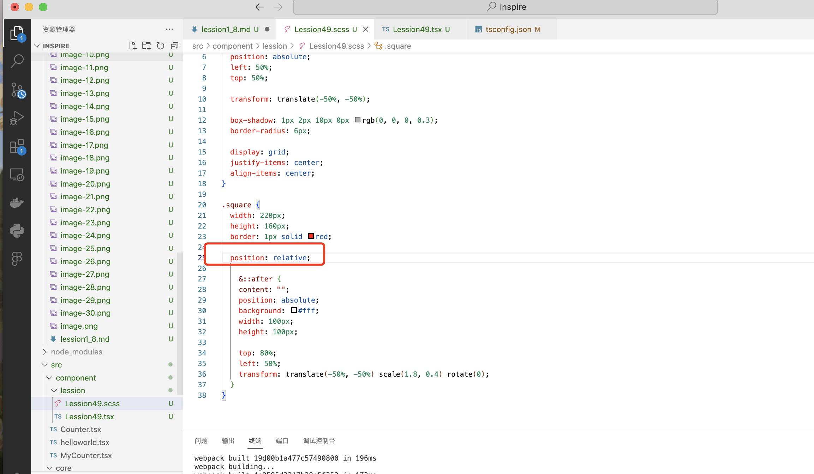

保存，看效果

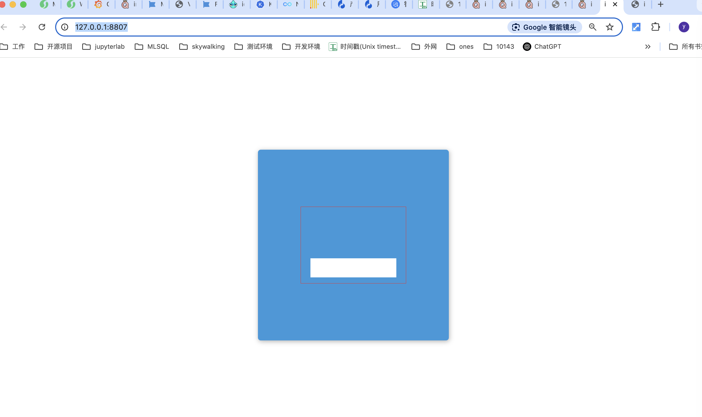

完美，继续！


## 8. 利用伪元素来实现容器白色方块阴影

在 .square 中添加 ::before 伪元素

```
  &::before {
    content: "";
    background: #2a7aaf;
    position: absolute;
    width: 100%;
    height: 20px;
  }

```

完整代码
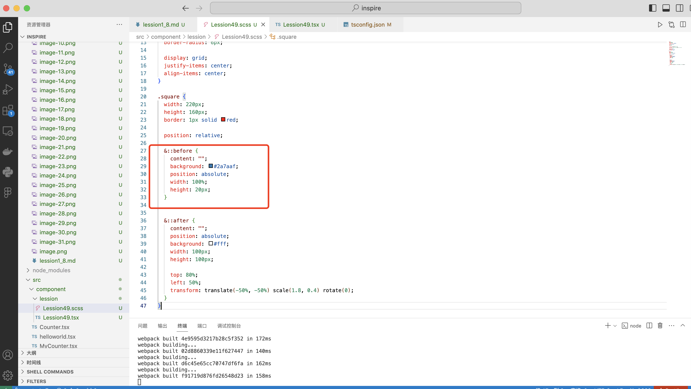

保存，看效果

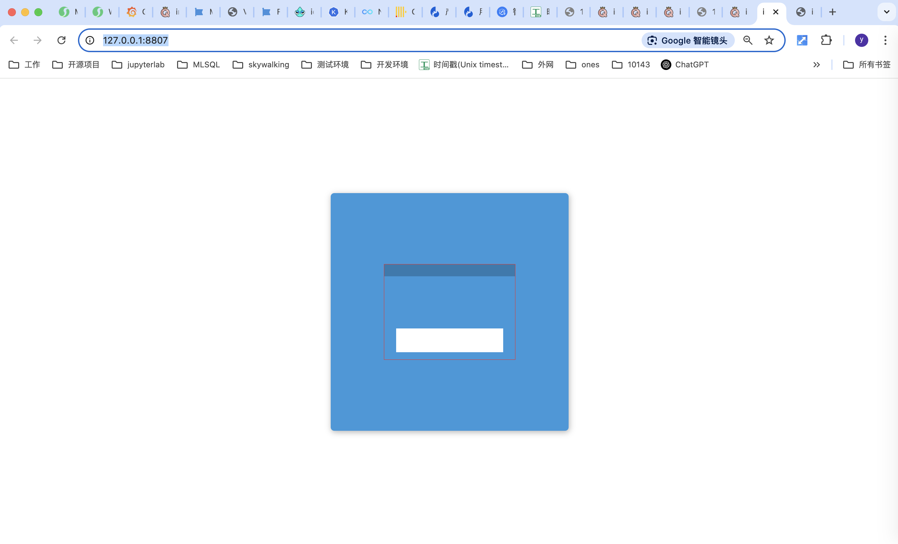

完美，继续！

## 9. 调整阴影位置到底部，水平居中，并增加圆角

```
    bottom: 0;

    left: 50%;
    transform: translateX(-50%);

    border-radius: 50%;

```

完整代码

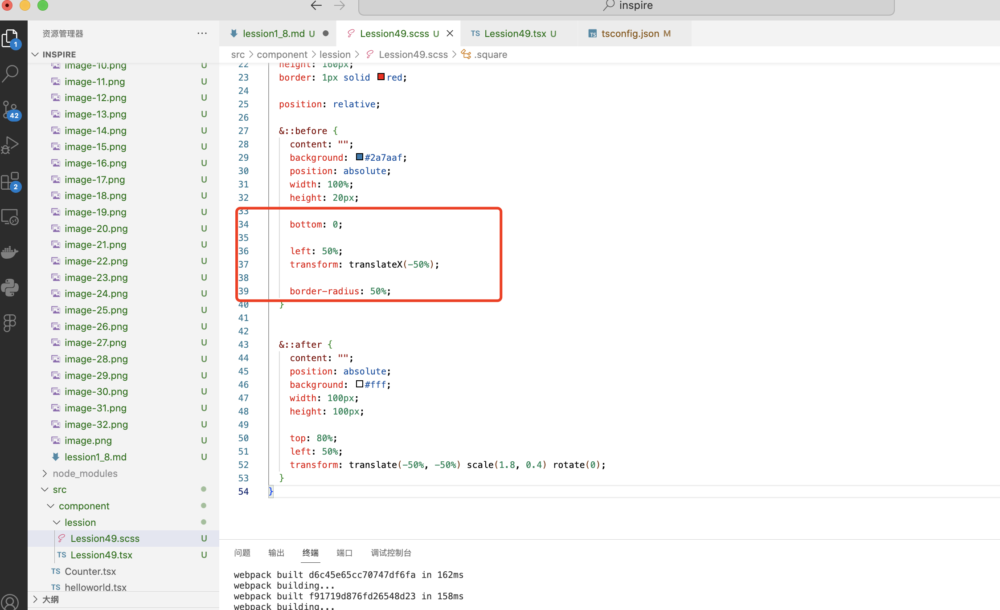

保存，看效果

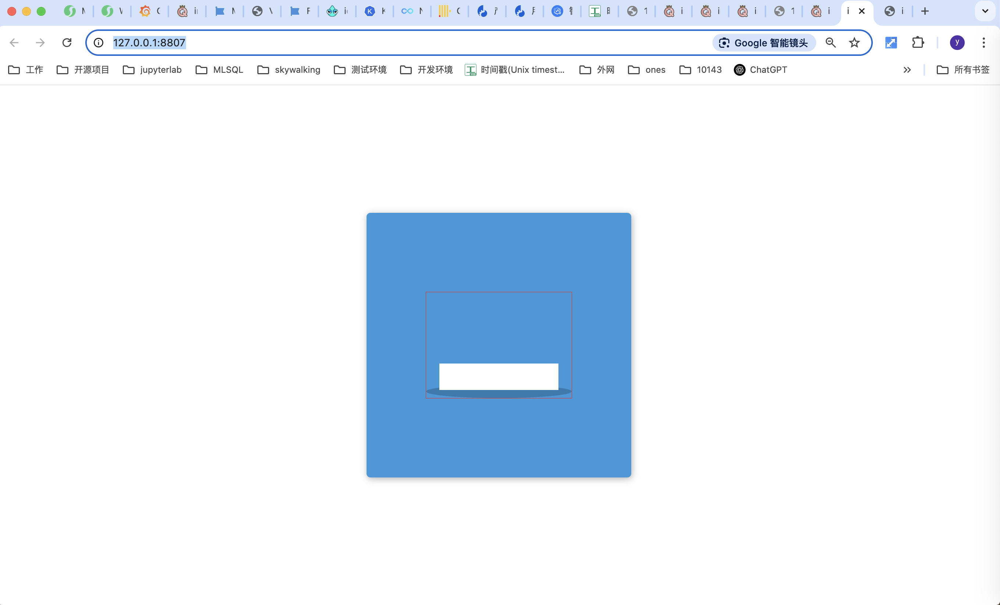

完美，继续！！

## 10. 增加白色方块动画


```
  &::after {
    content: "";
    position: absolute;
    background: #fff;
    width: 100px;
    height: 100px;

    top: 80%;
    left: 50%;
    transform: translate(-50%, -50%) scale(1.8, 0.4) rotate(0);
    animation: square 1.6s linear infinite;
  }
```

**square：**  给动画起的名称

**1.6s：**  动画持续 1.6s

**linear：**  动画以线性速度播放

**infinite：** 动画无限循环

定义动画帧
在不同的百分比帧调整高度（top），缩放形状（scale），旋转（rotate）
```
@keyframes square {
  from {
    top: 80%;
    transform: translate(-50%, -50%) scale(1.8, 0.4) rotate(0);
  }
  30% {
    top: 62%;
    transform: translate(-50%, -50%) scale(1, 1) rotate(0);
  }
  50% {
    top: 0%;
    transform: translate(-50%, -50%) scale(1, 1) rotate(0.3turn);
  }
  70% {
    top: 62%;
    transform: translate(-50%, -50%) scale(1, 1) rotate(0.75turn);
  }
  to {
    top: 80%;
    transform: translate(-50%, -50%) scale(1.8, 0.4) rotate(0.75turn);
  }
}
```

完整代码

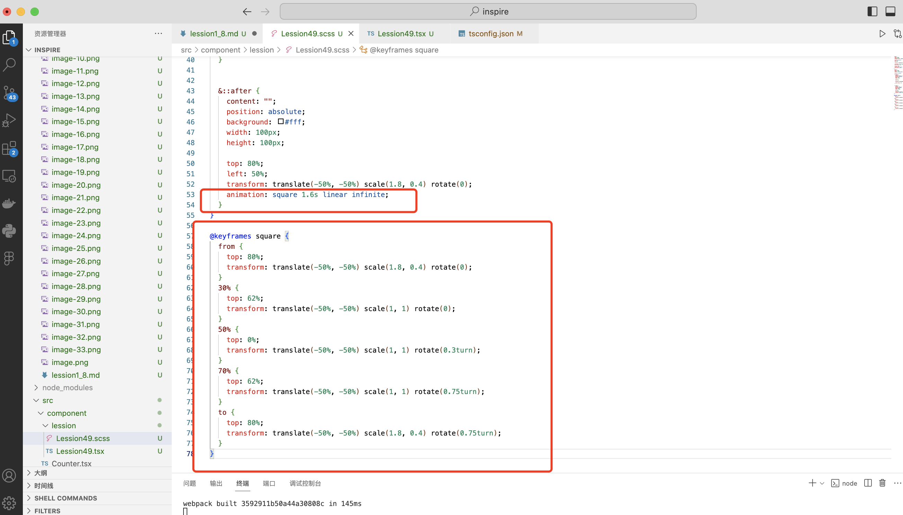

保存，看效果

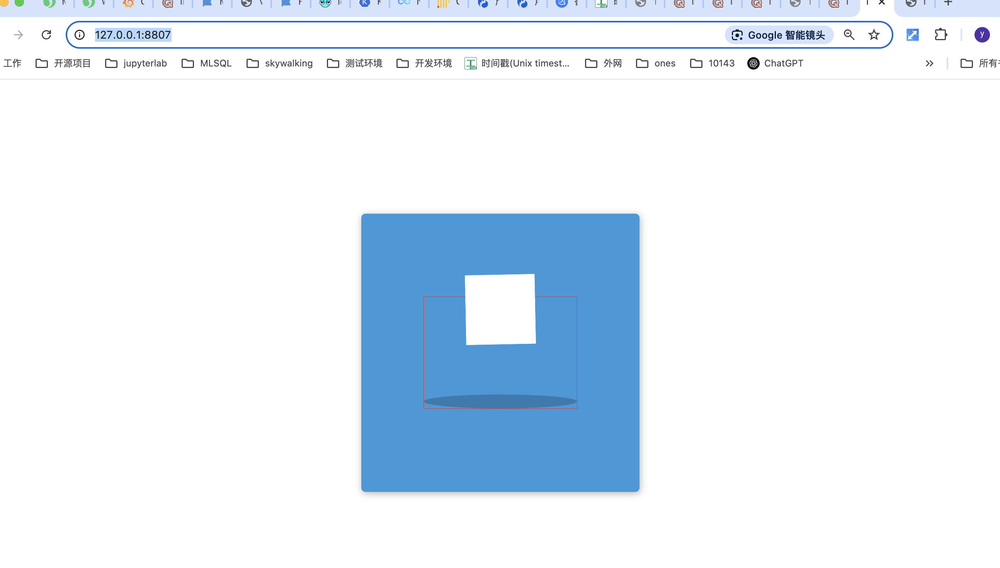

可以看到方块已经动了起来，完美，继续！！

## 11. 增加阴影动画

```
  &::before {
    content: "";
    background: #2a7aaf;
    position: absolute;
    width: 100%;
    height: 20px;

    bottom: 0;

    left: 50%;
    transform: translateX(-50%);

    border-radius: 50%;

    animation: shadow 0.8s linear infinite alternate;
  }
```

**alternate：** 动画方向（正向+反向交替）

添加 shadow 的动画帧

```
@keyframes shadow {
  from {
    width: 100%;
  }
  60% {
    width: 50%;
  }
  to {
    width: 30%;
  }
}
```

完整代码
```
.frame {
  width: 400px;
  height: 400px;
  background-color: #3498db;

  position: absolute;
  left: 50%;
  top: 50%;

  transform: translate(-50%, -50%);

  box-shadow: 1px 2px 10px 0px rgb(0, 0, 0, 0.3);
  border-radius: 6px;

  display: grid;
  justify-items: center;
  align-items: center;
}

.square {
  width: 220px;
  height: 160px;
  border: 1px solid red;

  position: relative;

  &::before {
    content: "";
    background: #2a7aaf;
    position: absolute;
    width: 100%;
    height: 20px;

    bottom: 0;

    left: 50%;
    transform: translateX(-50%);

    border-radius: 50%;

    animation: shadow 0.8s linear infinite alternate;
  }


  &::after {
    content: "";
    position: absolute;
    background: #fff;
    width: 100px;
    height: 100px;

    top: 80%;
    left: 50%;
    transform: translate(-50%, -50%) scale(1.8, 0.4) rotate(0);
    animation: square 1.6s linear infinite;
  }
}

@keyframes square {
  from {
    top: 80%;
    transform: translate(-50%, -50%) scale(1.8, 0.4) rotate(0);
  }
  30% {
    top: 62%;
    transform: translate(-50%, -50%) scale(1, 1) rotate(0);
  }
  50% {
    top: 0%;
    transform: translate(-50%, -50%) scale(1, 1) rotate(0.3turn);
  }
  70% {
    top: 62%;
    transform: translate(-50%, -50%) scale(1, 1) rotate(0.75turn);
  }
  to {
    top: 80%;
    transform: translate(-50%, -50%) scale(1.8, 0.4) rotate(0.75turn);
  }
}

@keyframes shadow {
  from {
    width: 100%;
  }
  60% {
    width: 50%;
  }
  to {
    width: 30%;
  }
}
```

保存，看效果，为保证两个动画同步，可刷新一下页面

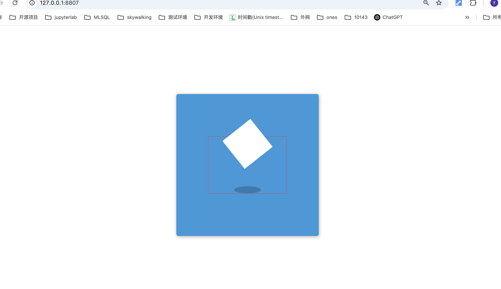

完美！！

## 12. 最后，我们把 .square 的红色边框去掉

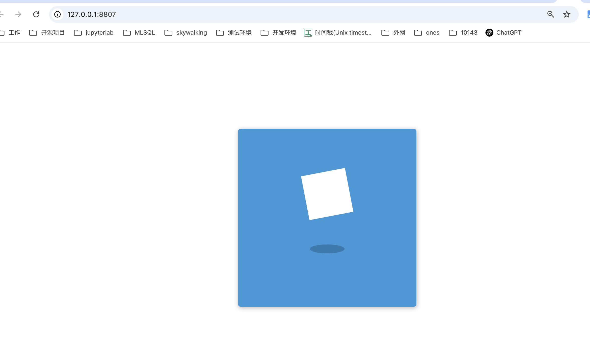

完成！！