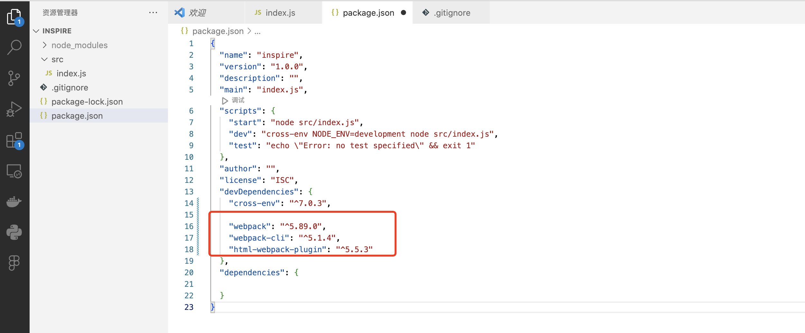
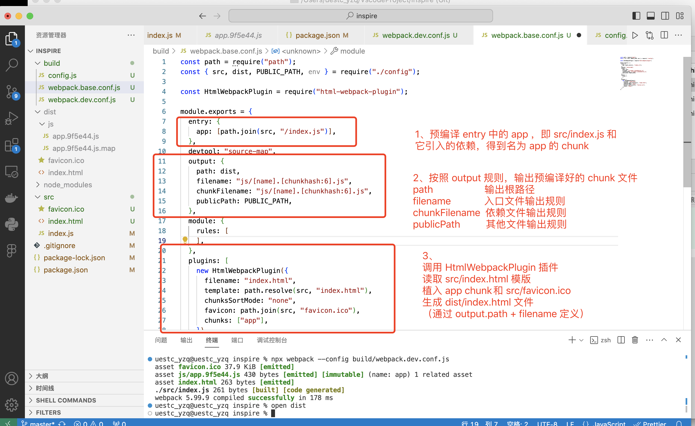
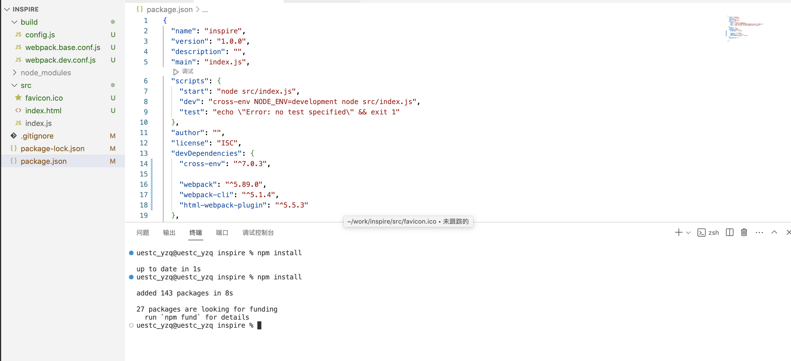
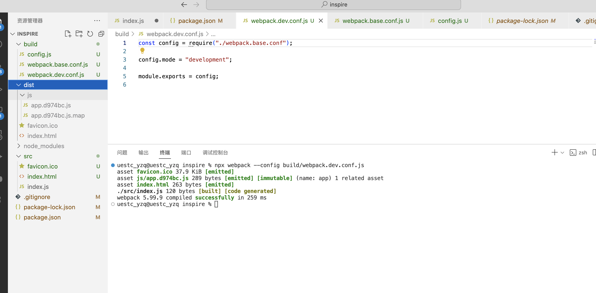
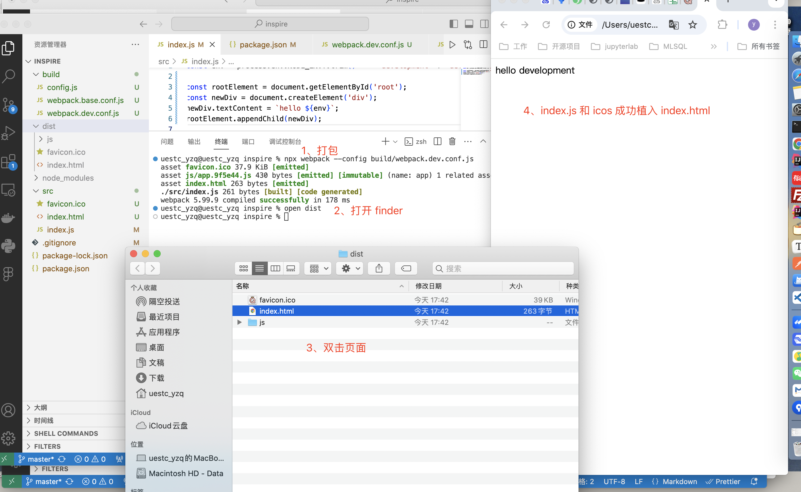
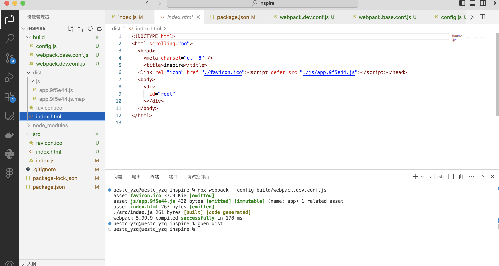
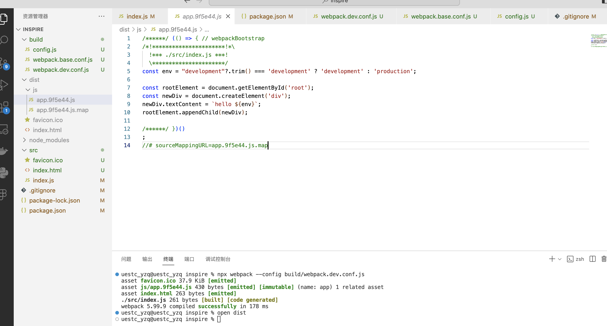
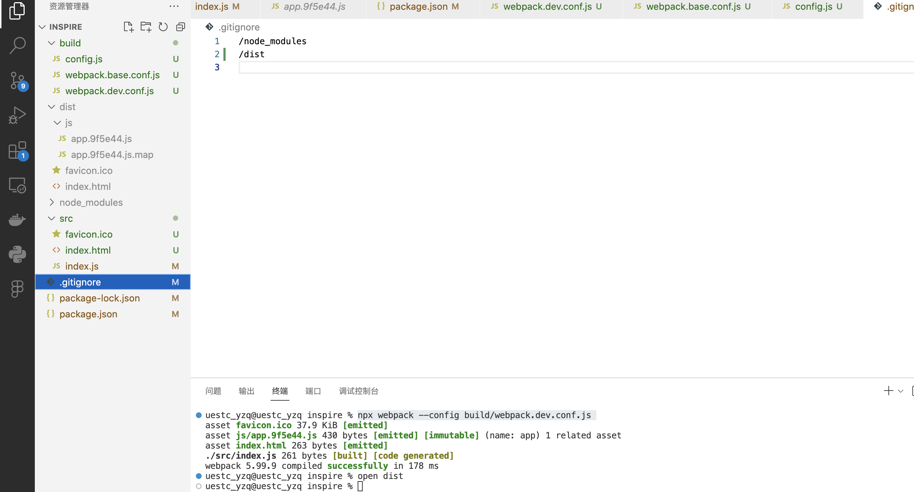

# 初步集成webpack

## 1. package.json 中引入 webpack


```code
    "webpack": "^5.89.0",
    "webpack-cli": "^5.1.4",
    "html-webpack-plugin": "^5.5.3"
```

## 2. 编写项目 src/index.html 、src/index.js 和 网页icon
- **favicon.icon** 放入favicon.icon

- **index.html** React 和 Vue 主流单页面应用 html 模版
```html
<!DOCTYPE html>
<html scrolling="no">
  <head>
    <meta charset="utf-8" />
    <title>inspire</title>
  </head>
  <body>
    <div
      id="root"
    ></div>
  </body>
</html>
```
- **index.js/ts** React 和 Vue 主流单页面应用入口
```js
const env = process.env.NODE_ENV?.trim() === 'development' ? 'development' : 'production';

const rootElement = document.getElementById('root');
const newDiv = document.createElement('div');
newDiv.textContent = `hello ${env}`;
rootElement.appendChild(newDiv);
```

## 3. 编写webpack配置文件
- **1、** 新建 build 文件夹，放置打包相关文件
- **2、** 新建 build/config.js，统一管理通用文件路径
```js
const path = require("path");

/* 
  __dirname: 执行脚本所在的绝对路径，我们一般通过 build 文件夹下的脚步打包
  root: 项目根目录
*/
const root = path.resolve(__dirname, "..");

// 源代码目录
const src = path.join(root, "/src");

// 打包配置文件夹
const build = path.join(root, "/build");

// 打包输出文件夹
const dist = path.join(root, "/dist");

// 静态资源文件夹
const static = path.join(root, "/static");

const env = process.env.NODE_ENV?.trim();
const analyze = process.env.ANALYZE === "true";

const CONTEXT_PATH = "";

module.exports = {
  CONTEXT_PATH,
  PUBLIC_PATH: env === "development" ? "/" : "./",

  root,
  src,
  dist,
  static,
  build,

  env,
  analyze,
};

```

- **3、** 新建 build/webpack.base.conf.js，放置不同环境下的webpack通用配置
```js
const path = require("path");
const { src, dist, PUBLIC_PATH, env } = require("./config");

const HtmlWebpackPlugin = require("html-webpack-plugin");

module.exports = {
  entry: {
    app: [path.join(src, "index.js")],
  },
  devtool: "source-map",
  output: {
    path: dist,
    filename: "js/[name].[chunkhash:6].js",
    chunkFilename: "js/[name].[chunkhash:6].js",
    publicPath: PUBLIC_PATH,
  },
  module: {
    rules: [
    ],
  },
  plugins: [
    new HtmlWebpackPlugin({
      filename: "index.html",
      template: path.resolve(src, "index.html"),
      chunksSortMode: "none",
      favicon: path.join(src, "favicon.ico"),
      chunks: ["app"],
    }),
  ],
};
```
- **理解上面代码中 webpack 的执行过程**

可以拷贝 build/webpack.base.conf.js 全部代码，询问AI解释一下步骤

- **4、** 新建 build/webpack.dev.conf.js，定制开发环境下的webpack
目前跟 base 没有太大区别，后续会陆续加入其他内容
```js
const config = require("./webpack.base.conf");

config.mode = "development";

module.exports = config;
```


## 4. 打包运行
安装依赖
```code
npm install
```


运行打包命令
```code
npx webpack --config build/webpack.dev.conf.js
```
可以看到项目根目录下生成了 dist 文件夹


在浏览器中打开生成的 index.html


查看预编译之后的 index.html，可以看到成功植入了 icon 和 index.js


查看预编译之后的 index.js

- **结合预编译结果，再次理解 webpack 打包过程**


## 5. 提交代码
别忘记在 .gitignore 加入这次新生成的 /dist 文件夹
