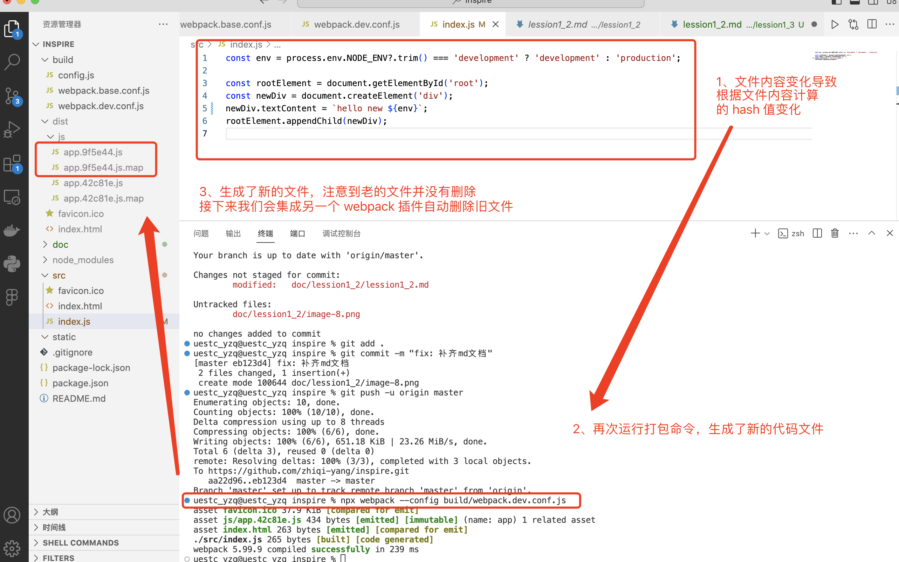

# 集成 webpack clean 插件

## 1. 修改 src/index.js 的内容，保存


## 2. 再次运行打包命令
```code
npx webpack --config build/webpack.dev.conf.js
```
可以看到 dist 文件夹里多了一份编译好的代码文件

- **重点：初步理解什么是 Hash 算法** 有个初步的认识就可以，计算机的世界到处都有 Hash 算法的应用

## 3. 集成  webpack clean 插件
packjson 中引入依赖，前后注意添加逗号
```code
"clean-webpack-plugin": "^4.0.0"
```


webpack.base.conf.js 中引入插件


保存修改的文件，安装 package.json 中新引入的依赖
```code
npm install
```


再次执行打包命令
```code
npx webpack --config build/webpack.dev.conf.js
```
可以看到旧文件已经被清除


# 使用 express 来搭建开发 web 服务器

## 1. package.json 中引入依赖
```code
    "express": "^4.17.1", 
    "open": "^8.2.1"
```
安装
```code
    npm install
```


## 2. 编写 build/dev.js 启动脚本
```js
const express = require("express");
const open = require("open");
const { env, static, CONTEXT_PATH, dist } = require("./config");

const app = express();

app.use(express.static(static));
app.use(express.static(dist));

app.use((req, res) => {
  res.status(404).send('Not found');
});

app.listen(8807, "0.0.0.0", function (err) {
  err && console.log(err);
});

open("http://127.0.0.1:8807");
```


## 2. 修改 package.json 中的dev脚本
入口文件改为 build/dev.js


## 3. 运行dev脚本（运行前别忘记保存修改过的文件）
```code
    npm run dev
```
可以看到 open 自动打开浏览器访问了 127.0.0.1:8807 地址
在缺省访问路径的情况下， web 服务器默认会填充 /index.html
所以 127.0.0.1:8807 相当于 127.0.0.1:8807/index.html


## 4. 在 static 文件下新建 test1.html 测试文件


## 5. 在浏览器中访问 127.0.0.1:8807/test1.html
