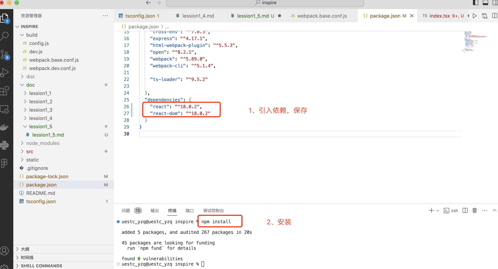
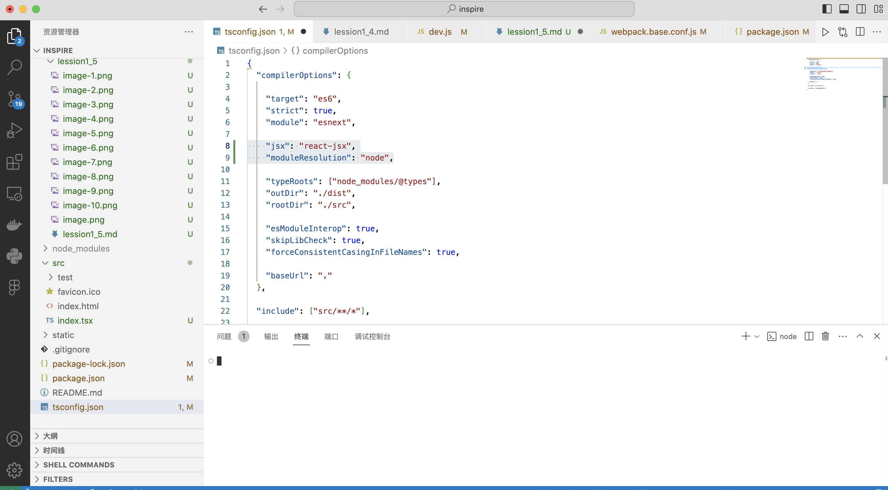
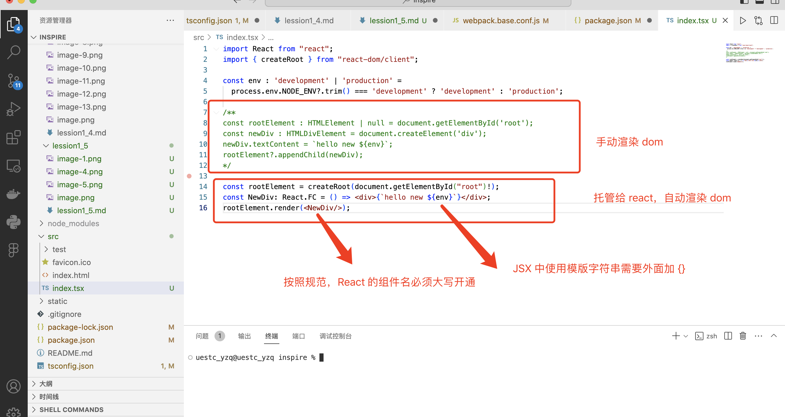
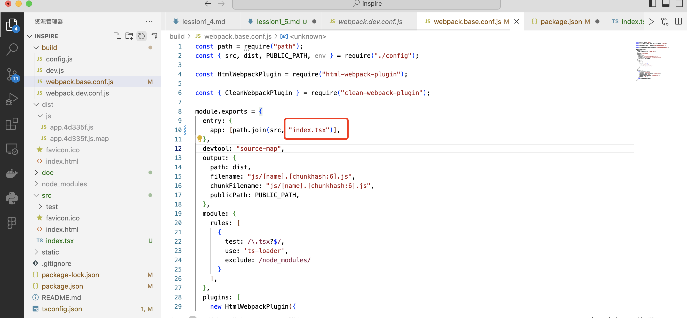
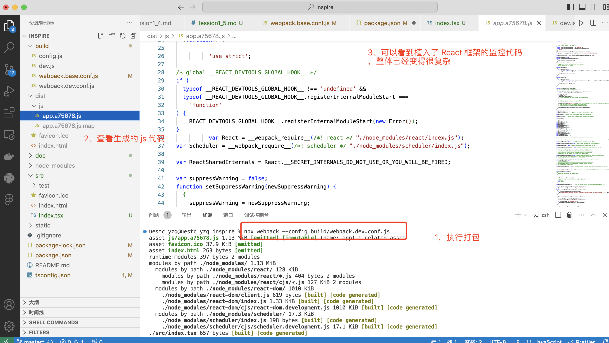
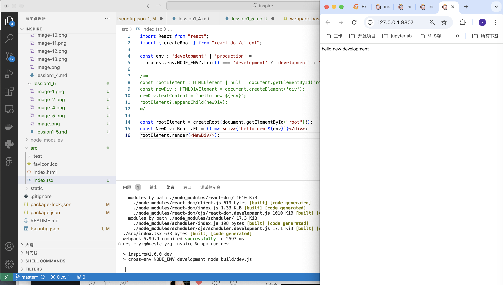
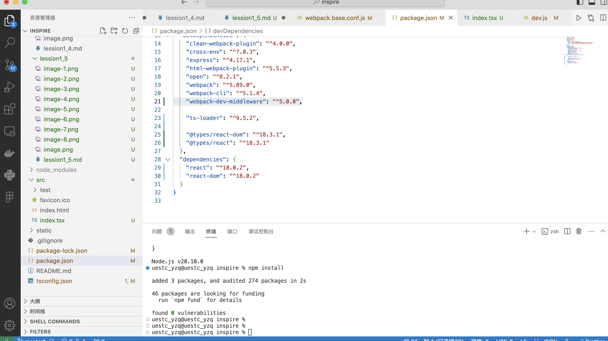
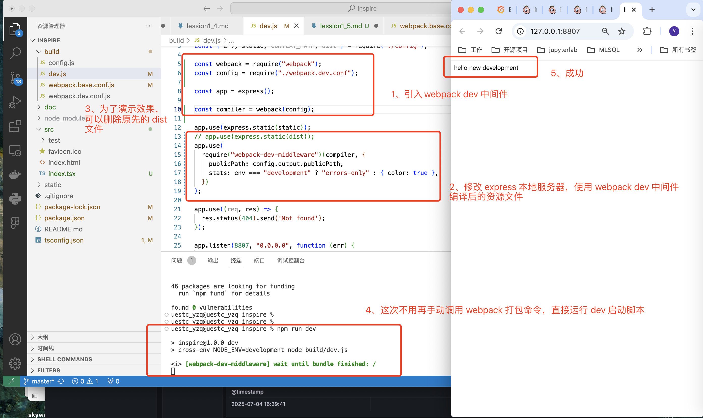

# 初步集成 React

## 1. 在 package.json 中引入 react 依赖，保存
```code
    "react": "^18.0.2",
    "react-dom": "^18.0.2"
```
安装
```shell
npm install
```



## 2. 修改入口 index.ts 文件，正式使用 react 来帮我们托管渲染 dom（document）

### 1. 修改文件后缀，index.ts 为 index.tsx
ts 和 tsx 文件最大的区别，在于 tsx 文件支持 JSX 语法而 ts 不支持

### 2. 什么是 JSX 语法
JSX (JavaScript XML) 是一种 JavaScript 的语法扩展，它允许你在 JavaScript 代码中编写类似 HTML 的结构。
它是 React 框架的核心特性之一，但也可以在其他库或框架中使用。
```tsx
const element = <div>{`hello new ${env}`}</div>; // 这在 .tsx 中有效，在 .ts 中非法
```
上面的 JSX 被编译为 js 后
```
const element = React.createElement('div', null, `hello new ${env}`);
```

### 3. 在 tsconfig.json 中添加 jsx 选项，允许 ts 使用 JSX
```
    "jsx": "react-jsx",
    "moduleResolution": "node",   // 让 TypeScript 会模拟 Node.js 的模块解析机制，保证模块加载正确
```


### 4. 修改 index.tsx 文件内容
```typescript
import React from "react";
import { createRoot } from "react-dom/client";

const env : 'development' | 'production' = 
  process.env.NODE_ENV?.trim() === 'development' ? 'development' : 'production';

/**
const rootElement : HTMLElement | null = document.getElementById('root');
const newDiv : HTMLDivElement = document.createElement('div');
newDiv.textContent = `hello new ${env}`;
rootElement?.appendChild(newDiv);
*/

const rootElement = createRoot(document.getElementById("root")!);
const NewDiv: React.FC = () => <div>{`hello new ${env}`}</div>;
rootElement.render(<NewDiv/>);
```


### 5.再次执行 webpack 打包命令
别忘记修改最新的入口文件

```code
npx webpack --config build/webpack.dev.conf.js
```
可以看到 webpack 调用 ts-loader 编译 index.tsx 并生成了 app.[hash].js 文件


### 6. 运行dev脚本（运行前别忘记保存修改过的文件）
```code
    npm run dev
```



## 3. 修改开发环境启动脚本 build/dev.js，自动调用 webpack 编译
ctrl + c 取消先去运行的 dev.js 开发环境启动脚本
### 1. 在 package.json 中添加 webpack dev 中间件依赖， 保存
```code
    "webpack-dev-middleware": "^5.0.0",
```
### 2. 安装


### 3. 修改  build/dev.js 内容
```js
const express = require("express");
const open = require("open");
const { env, static, CONTEXT_PATH, dist } = require("./config");

const webpack = require("webpack");
const config = require("./webpack.dev.conf");

const app = express();

const compiler = webpack(config);

app.use(express.static(static));
// app.use(express.static(dist));
app.use(
  require("webpack-dev-middleware")(compiler, {
    publicPath: config.output.publicPath,
    stats: env === "development" ? "errors-only" : { color: true },
  })
);

app.use((req, res) => {
  res.status(404).send('Not found');
});

app.listen(8807, "0.0.0.0", function (err) {
  err && console.log(err);
});

open("http://127.0.0.1:8807");

```
