# 开发第一个 React 组件

## 1. 新建 src/component/helloworld.tsx，提取 src/index.tsx 的 NewDiv 作为单独组件
```tsx
import React from "react";

const env : 'development' | 'production' = 
  process.env.NODE_ENV?.trim() === 'development' ? 'development' : 'production';

const NewDiv: React.FC = () => <div>{`hello my first component ${env}`}</div>;

export default NewDiv;
```
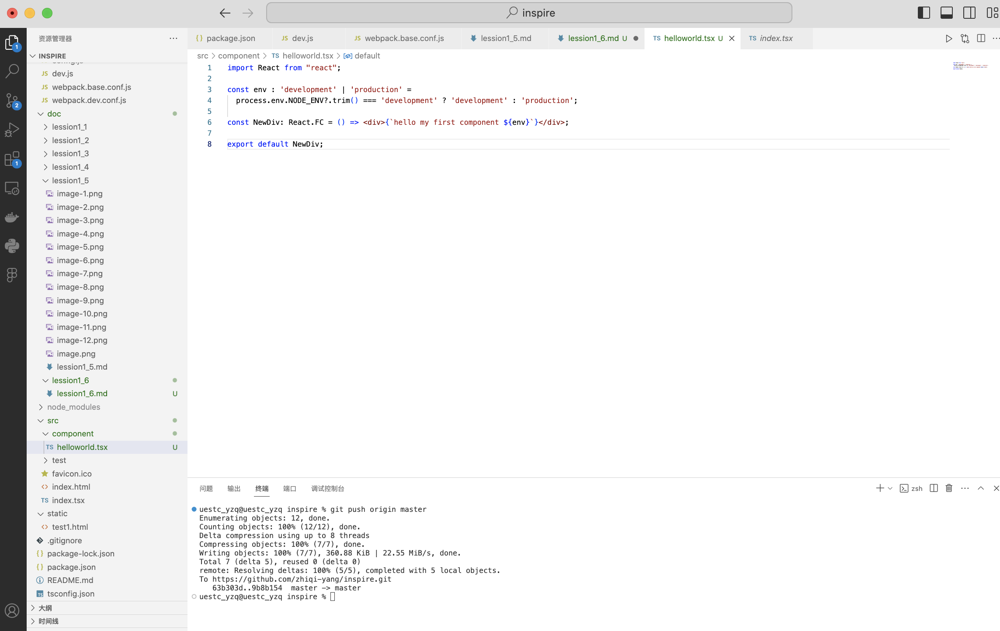

## 2. 修改 build/webpack.base.conf.js, 添加 webpack 模块（组件）解析规则
```tsx
  resolve: {
    modules: [src, "node_modules"],
    extensions: [".ts", ".tsx", ".js", ".jsx"],
    alias: {
      "@": src,
    },
  },
```
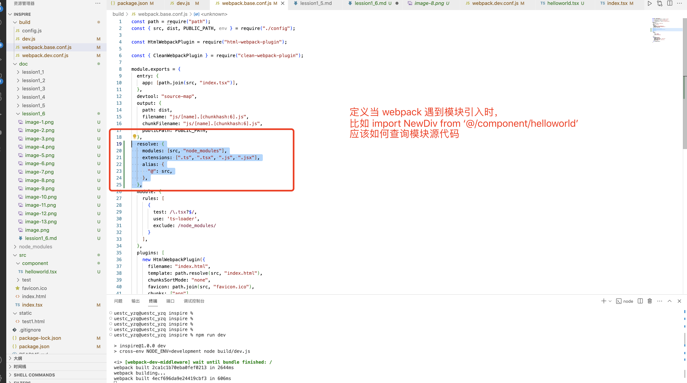

### 1. modules: [src, "node_modules"]

 指定 Webpack 查找模块的根目录。默认情况下，Webpack 只从 `node_modules` 查找模块
```code
  import NewDiv from "@/component/helloworld";
// 1. 优先查找 `src/component/helloworld`
// 2. 找不到时再查 `node_modules//component/helloworld`
```


### 2. extensions: [".ts", ".tsx", ".js", ".jsx"]
自动补全文件扩展名，允许导入时省略后缀。
```code
  import NewDiv from "@/component/helloworld";
  //  依次查找 `src/component/helloworld.ts`, `src/component/helloworld.tsx`, `src/component/helloworld.js`, `src/component/helloworld.jsx`
```

### 3. alias: { "@": src }
设置路径别名，当组件路径很深时，可以很方便的将长路径替换为短别名。
```code
  // 未配置时：
  import Button from '../../../components/Button';

  // 配置后：
  import Button from '@/components/Button'; // `@` 指向 `src` 目录
```


## 3. 修改 tsconfig.json, 添加路径别名
别忘记在前面添加 , 保证 json 格式正确
```
    "paths": {
      "@/*": ["src/*"]
    }
```
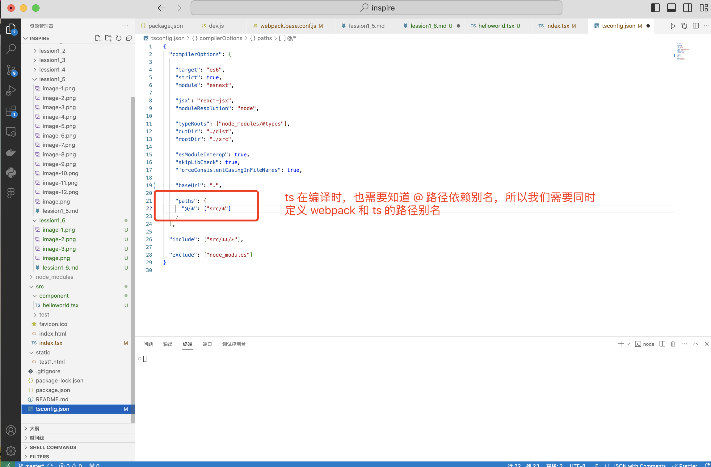


## 4. 修改 src/index.tsx，通过注入的方式引入刚才定义的 src/component/helloworld.tsx 组件
```tsx
import React from "react";
import { createRoot } from "react-dom/client";

import NewDiv from "@/component/helloworld";

const rootElement = createRoot(document.getElementById("root")!);
rootElement.render(<NewDiv/>);
```
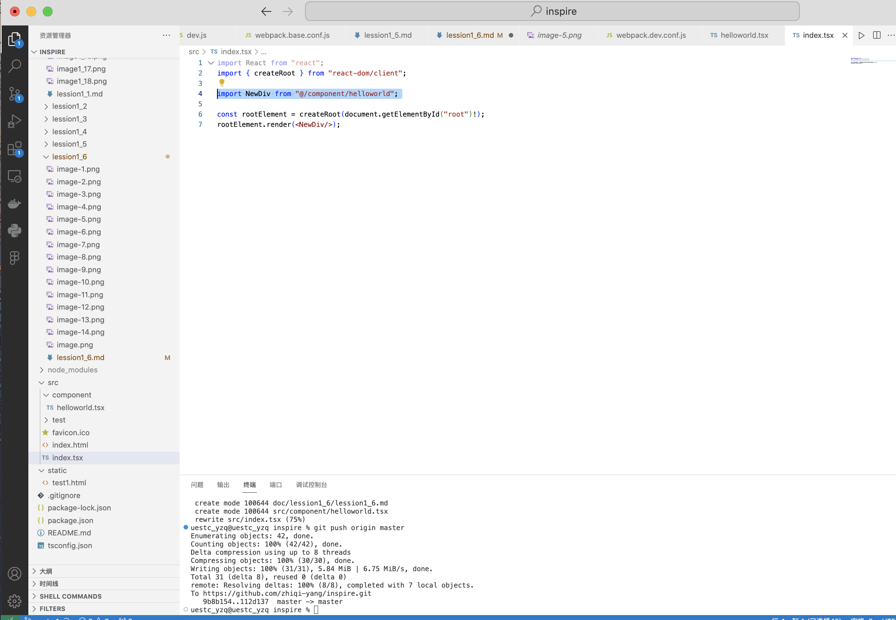

## 5. 保存，运行开发环境脚本
```
npm run dev
```
可以看到组件已经被正确加载显示

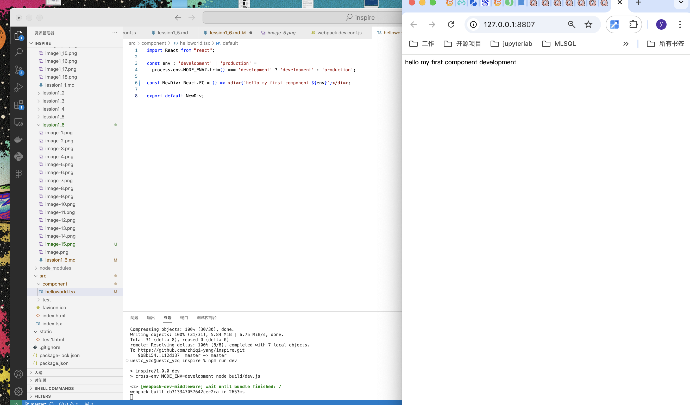

## 6. 修改 src/component/helloworld.tsx 组件，把 first 改为 second，模拟日常开发过程中的版本迭代
```tsx
import React from "react";

const env : 'development' | 'production' = 
  process.env.NODE_ENV?.trim() === 'development' ? 'development' : 'production';

const NewDiv: React.FC = () => <div>{`hello my sceond component ${env}`}</div>;

export default NewDiv;
```
保存，发现浏览器并没有更新最新内容

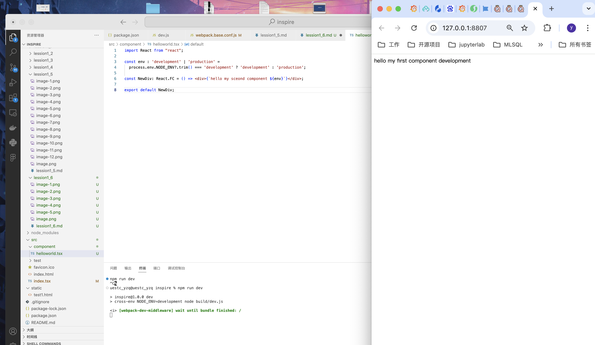

需要刷新页面

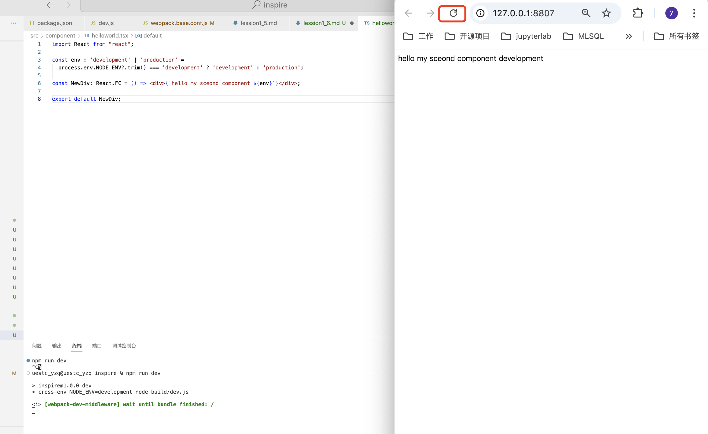

不方便我们日常开发工作，可以引入 webpack 热更新插件，自动在保存时编译更新最新内容

## 7. 在 package.json 文件中引入热更新依赖，ctrl + c 停止先前启动的 express 服务器，保存并安装
```
    "webpack-hot-middleware": "^2.25.0",
    "@pmmmwh/react-refresh-webpack-plugin": "^0.5.16",
```
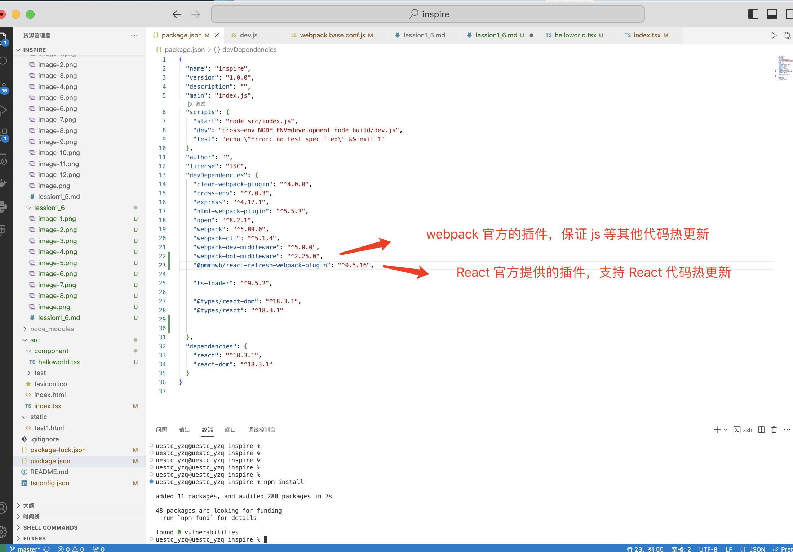


## 8. 在 build/webpack.dev.conf.js 中引入热更新插件
```
const config = require("./webpack.base.conf");
const webpack = require("webpack");
const ReactRefreshWebpackPlugin = require("@pmmmwh/react-refresh-webpack-plugin");

config.mode = "development";

config.entry.app = [
  ...config.entry.app,
  "webpack-hot-middleware/client?reload=true",
];

config.plugins.push(
  new webpack.HotModuleReplacementPlugin(),
  new ReactRefreshWebpackPlugin()
);

module.exports = config;
```
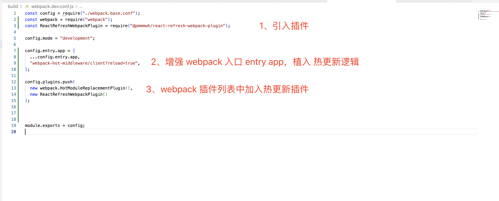


## 9. 修改 build/dev.js 开发环境启动脚本，在服务器资源路径中加入热更新内容
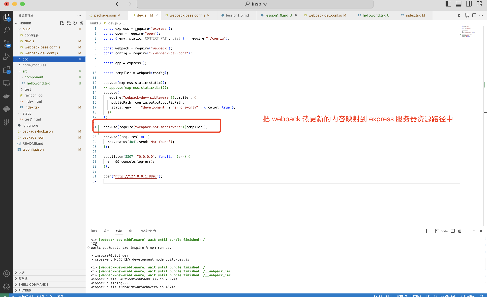


## 10. 重新运行开发环境启动脚本
```
npm run dev
```
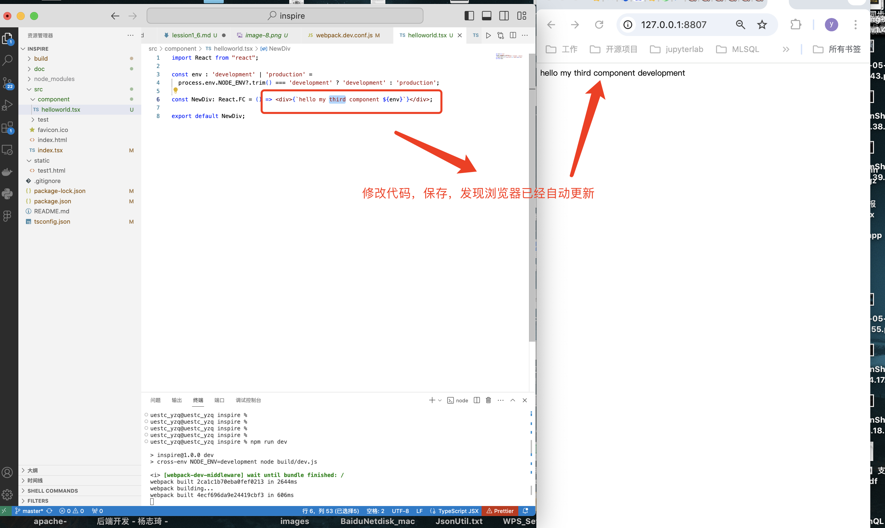