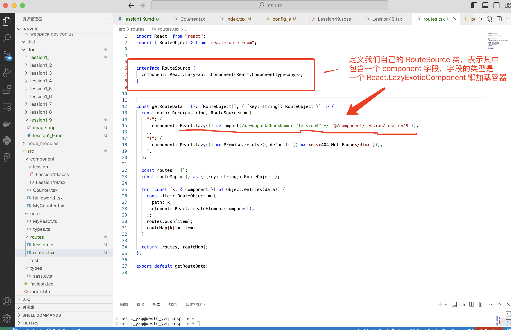
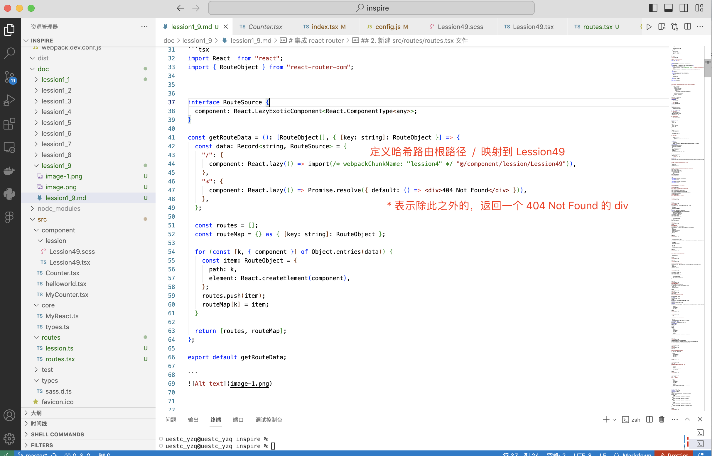
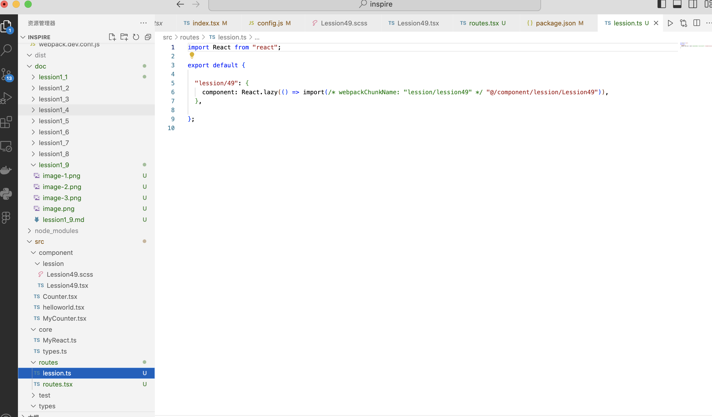

# 集成 react router


## 1. 在 package.json 中引入依赖，并安装
别忘记在开头加上 , 保证 json 格式正确
```
  "devDependencies": {

    // 省略...

    "@types/react-router-dom": "^6.30.1",
    "@types/react-is": "^19.0.0",

    // 省略...
  },
  "dependencies": {
    "react": "^18.3.1",
    "react-dom": "^18.3.1",

    "react-is": "^19.1.0",
    "react-router-dom": "^6.30.1"
  }
```
```
npm install
```


## 2. 新建 src/routes/routes.tsx 文件
```tsx
import React  from "react";
import { RouteObject } from "react-router-dom";


interface RouteSource {
  component: React.LazyExoticComponent<React.ComponentType<any>>;
}

const getRouteData = (): [RouteObject[], { [key: string]: RouteObject }] => {
  const data: Record<string, RouteSource> = {
    "/": {
      component: React.lazy(() => import(/* webpackChunkName: "lession4" */ "@/component/lession/Lession49")),
    },
    "*": {
      component: React.lazy(() => Promise.resolve({ default: () => <div>404 Not Found</div> })),
    },
  };

  const routes = [];
  const routeMap = {} as { [key: string]: RouteObject };

  for (const [k, { component }] of Object.entries(data)) {
    const item: RouteObject = {
      path: k,
      element: React.createElement(component),
    };
    routes.push(item);
    routeMap[k] = item;
  }

  return [routes, routeMap];
};

export default getRouteData;

```


哈希（#）是 URL 中的一个特殊符号，用于标识页面内的某个片段（Fragment）。以下是它的核心作用和工作原理

```url
https://example.com/path#section1
```
- #section1就是哈希部分（也称为 ​​片段标识符​​）
- 它永远位于 URL 末尾，​​不会发送到服务器​​（浏览器本地处理）
- React 的哈希路由使用 #xxx 来做不同组件的映射




## 3. 单独新建 src/routes/lession.ts，分类存放以后我们所有的 css 100天调整训练课
```tsx
import React from "react";

export default {

  "lession/49": {
    component: React.lazy(() => import(/* webpackChunkName: "lession/lession49" */ "@/component/lession/Lession49")),
  },

};

```


可以注意到组件导入的时候，都使用了 import("xxx") 动态导入


## 4. 在 src/routes/routes.tsx 中引入 src/routes/lession.tsx 列表


## 5. 在 src/index.tsx 中引入 react 路由
```tsx
import React, { Suspense } from "react";
import { createRoot } from "react-dom/client";

import { HashRouter, useRoutes } from "react-router-dom";

import getRouteData from "./routes/routes";

const [routes] = getRouteData();
const AppRoutes = () => {
  const element = useRoutes(routes);
  return element;
};


const rootElement = createRoot(document.getElementById("root")!);
rootElement.render(      
  <HashRouter>
    <Suspense fallback={<div>App Loading...</div>}>
      <AppRoutes />
    </Suspense>
  </HashRouter>
);
```


## 6. 保存所有修改过的文件，运行开发环境脚本
```
npm run dev
```


手动修改浏览器 url，修改 url Hash 部分
```url
http://127.0.0.1:8807/index.html/#/
```


```url
http://127.0.0.1:8807/index.html/#/lession/49
```


```url
http://127.0.0.1:8807/index.html/#/lession/50
```


## 7. 修改 src/route/routes.tsx, 把我们之前的 helloworld.tsx 添加到路由
```tsx
    "helloworld": {
      component: React.lazy(() => import(/* webpackChunkName: "helloworld" */ "@/component/helloworld")),
    },
```


## 8. 保存，切换路由到 helloworld
```url
http://127.0.0.1:8807/index.html/#/helloworld
```
可以看到添加成功

