# 从0仿造实现Grafana官网首页
lession2系列课程的目标，是从0仿造实现Grafana官网首页！！
```url
https://grafana.com/
```
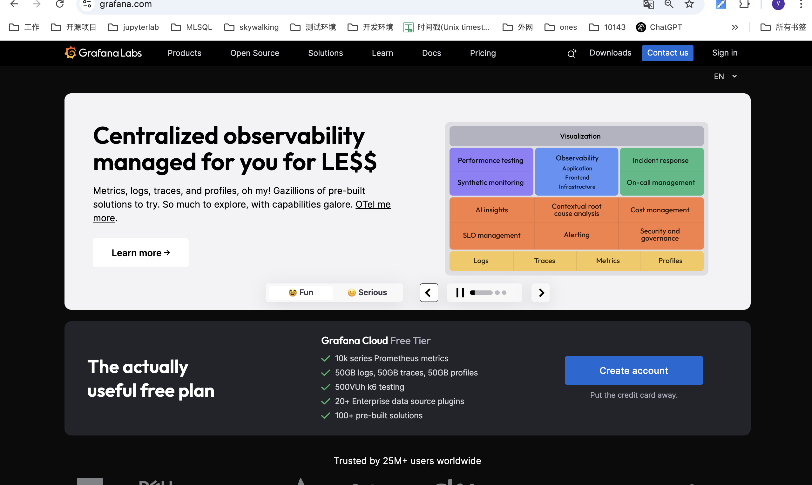


# 初步实现Header页面布局

## 新建 src/component/layout 文件夹，放置页面基本布局组件


新建 **src/component/layout/Header.tsx** 和 **src/component/layout/Header.scss** 文件，编写首页页面导航条

**Header.tsx**
```
import React from "react";
import ss from "./Header.scss";


const Header: React.FC = () => {
  console.log(1);
  return (
    <div className={ss.frame}>
    </div>
  );
};

export default Header;
```

**Header.scss**
```
* {
  box-sizing: border-box;
}

.frame {
  background: #000;
  width: 100%;
  height: 44px;
}
```

### **box-sizing** 详解
```
* {
  box-sizing: border-box;
}
```
这行 CSS 规则会将页面上所有元素的盒模型设置为 **​​边框盒模型**​​，这是现代网页开发中最常用的盒模型设置。


  **标准盒模型 (content-box，默认值)**
  ```css
    .box {
      width: 200px;
      padding: 20px;
      border: 5px solid;
      /* 实际占用宽度 = 200 + 20 * 2 + 5 * 2 = 250px */
    }
  ```

 **边框盒模型 (border-box)**
 ```css
  .box {
    box-sizing: border-box;
    width: 200px;
    padding: 20px;
    border: 5px solid;
    /* 实际占用宽度 = 200px (包含padding和border) */
    /* 内容宽度 = 200 - 20 * 2 - 5 * 2 = 150px */
  }
```

新建 **src/component/layout/Body.tsx** 和 **src/component/layout/Body.scss** 文件，先给内容区占位

**Body.tsx**
```
import React from "react";
import ss from "./Body.scss";


export type BodyProps = {
  children?: React.ReactNode;
};

const Body: React.FC<BodyProps> = ({ children }) => {
  console.log(1);
  return (
    <div className={ss.frame}>
      {children ? children : null}
    </div>
  );
};

export default Body;

```

### **BodyProps** 详解
定义 **Body** 组件接收一个类型 **BodyProps** 的参数，里面可以有一个类型为 React.ReactNode 的 children 的字段。
**children** 用于渲染到 body 内。
后续我们会把以前的路由列表放到 Body 内


**Body.scss**
```
.frame {
  position: relative;
  background-color: #fff;
  width: 100%;
  height: 1000px;
}
```

## 修改 src/index.tsx ，重新组织页面布局

```
import React, { Suspense } from "react";
import { createRoot } from "react-dom/client";

import { HashRouter, useRoutes } from "react-router-dom";

import getRouteData from "./routes/routes";

import Header from "@/component/layout/Header";
import Body from "@/component/layout/Body";

const [routes] = getRouteData();
const AppRoutes = () => {
  const element = useRoutes(routes);
  return element;
};


const rootElement = createRoot(document.getElementById("root")!);
rootElement.render(    
  <>
    <Header />
    <Body>
      <HashRouter>
        <Suspense fallback={<div>App Loading...</div>}>
          <AppRoutes />
        </Suspense>
      </HashRouter>
    </Body>
  </>  

);
```

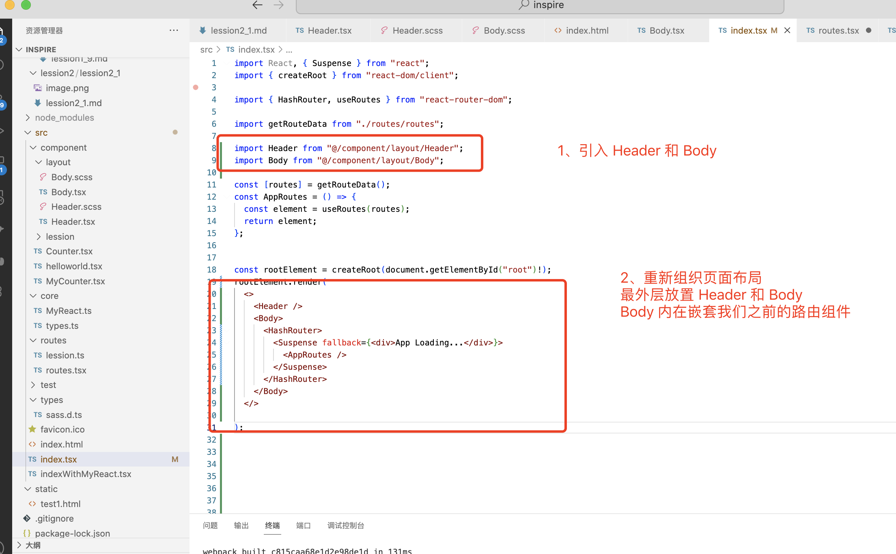

保存，运行开发环境脚本看效果

```
npm run dev
```

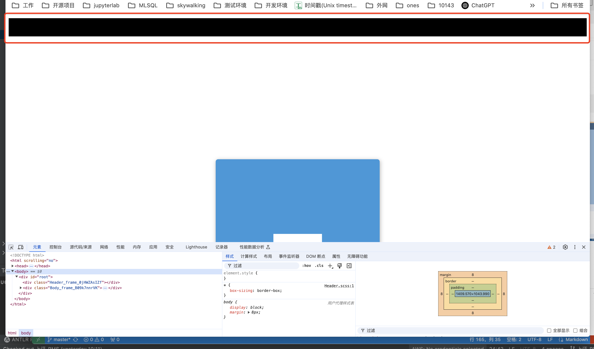

可以看到页面布局变化，Header 和 Body 都显示出来，不过发现多了一层白色外围

**F12** 打开浏览器选项卡，选择元素菜单，定位到 html 的 body 元素

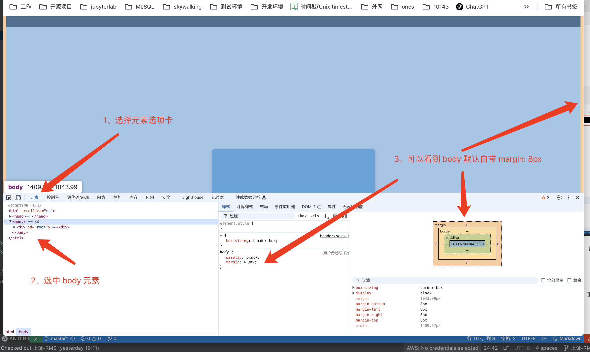

修改 **src/index.html** 模版文件，在 **body** 上添加 **style**

```html
<!DOCTYPE html>
<html scrolling="no">
  <head>
    <meta charset="utf-8" />
    <title>inspire</title>
  </head>
  <body style="margin: 0;">
    <div
      id="root"
    ></div>
  </body>
</html>
```

保存，刷新浏览器页面

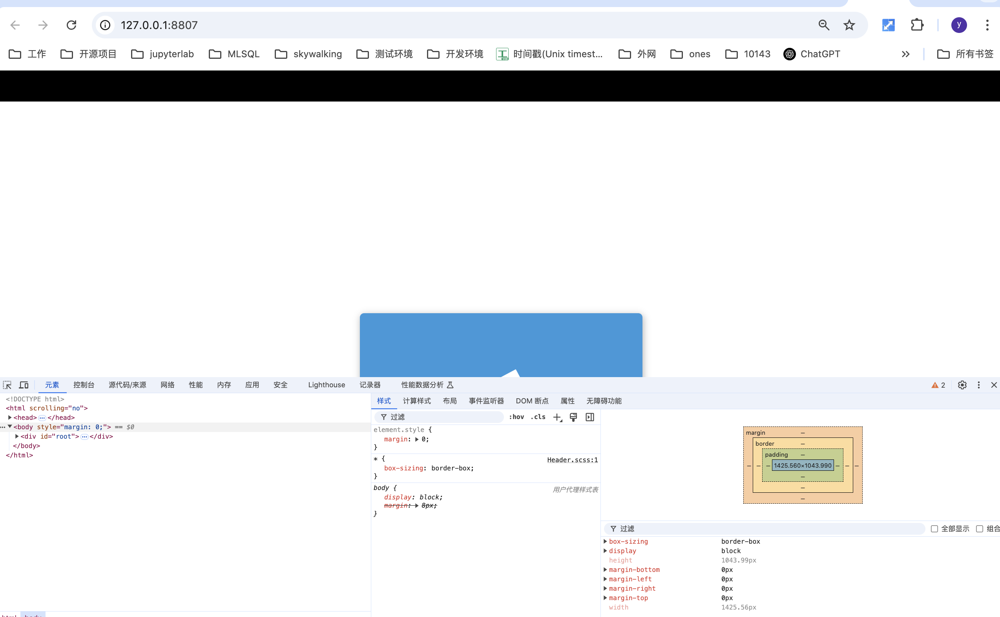

发现最外层边框没了


### 添加 header 内第一层内容区域 - wrap div

仔细观察拆解后，可以看到 **内容区域** （蓝色部分）是嵌套的第一层盒

我们暂时命名为 **wrap div**

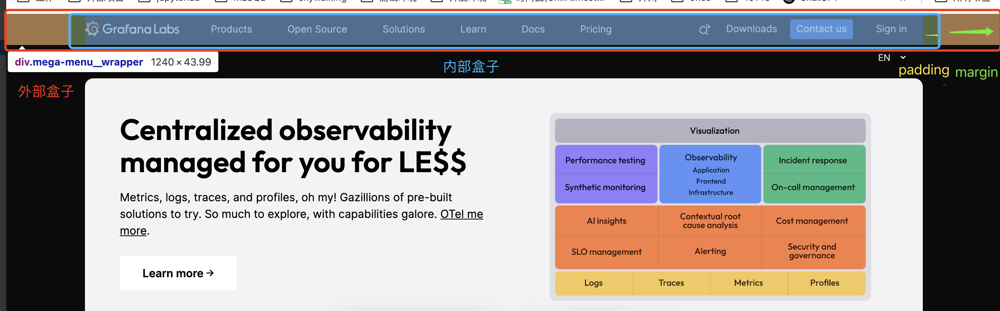

左右拖动改变浏览器宽度，发现 **wrap div** 

**padding** 不变，**margin** 自适应，**宽度** 自适应

随着外层容器宽度的增加，wrap div **宽度** 随着增加，直到到达一定数值之后，wrap div **宽度** 保持不变，改为增加 **margin** 

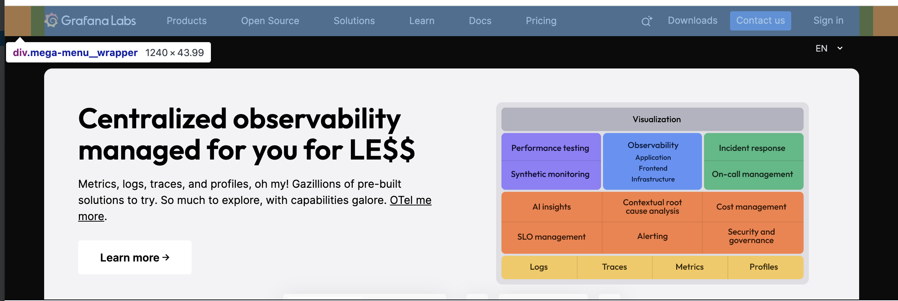

接下来就可以编写 css 样式了

在 **Header.tsx** 中新增 wrap div
```
import React from "react";
import ss from "./Header.scss";


const Header: React.FC = () => {
  console.log(1);
  return (
    <div className={ss.frame}>
      <div className={ss.wrap}>
      </div>
    </div>
  );
};

export default Header;

```

在 **Header.scss** 中新增 .wrap 样式
```
.wrap {
    margin: 0 auto;
    padding: 0 20px;
    max-width: 1240px;
    

  // 临时测试用 css
  height: 10px;
  background-color: red;
}
```

为了方便观察效果，可以临时给一个高度和背景颜色

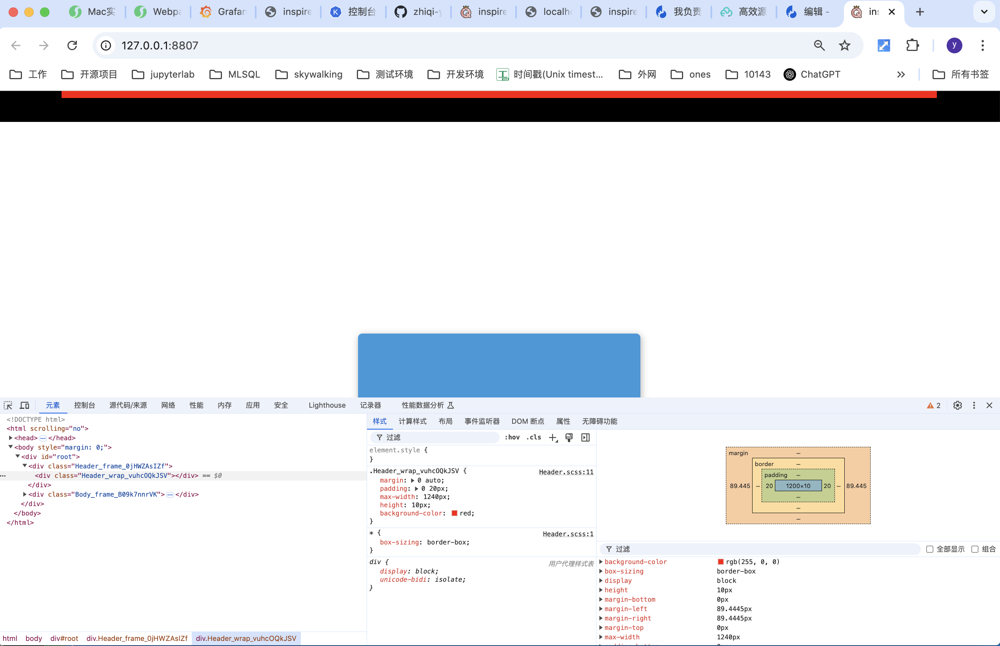

改变页面宽度

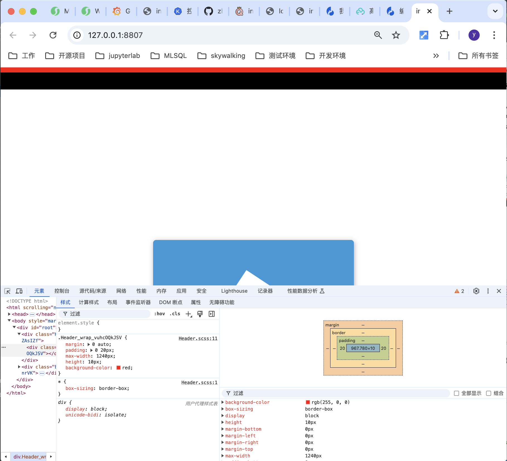

符合要求


## 实现 Header 粘性效果

不断下划 grafana 首页，发现 header 一直保持在最顶部不动

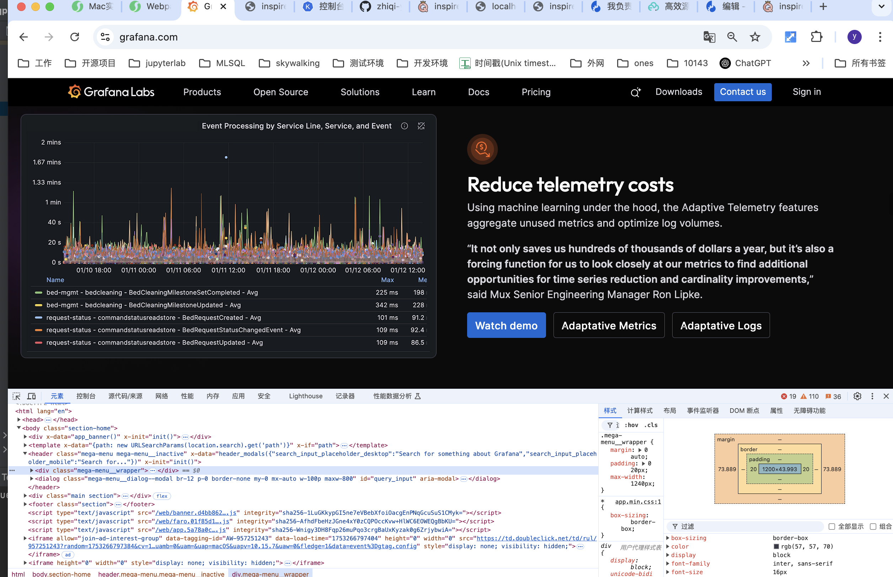

我们可以用 **sticky** 粘性布局来实现这种效果

修改 **Header.scss** ，在 .frame 中添加 position: sticky 和 top：0
```
.frame {
  background: #000;
  width: 100%;
  height: 44px;

  position: sticky;
  top: 0;

}
```

### **position: sticky详解**

position: sticky是 CSS 中的一种特殊定位方式，结合了相对定位(relative)和固定定位(fixed)的特性，常用于实现"粘性"元素效果。

#### **工作原理**
​ **​初始状态**​​：元素在文档流中保持相对定位
​ **​滚动触发​**​：当视口到达指定阈值(如top: 0)时，变为固定定位
​ **​容器边界**​​：元素不会超出其父容器的边界

保存，看效果

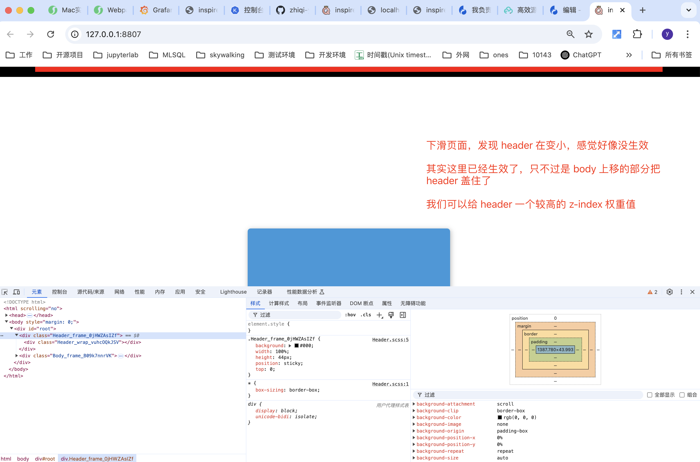

在 **Header.scss**  中添加 .frame **z-index** 权重

```
.frame {
  background: #000;
  width: 100%;
  height: 44px;

  position: sticky;
  top: 0;
  z-index: 400;

}
```

保存，看效果

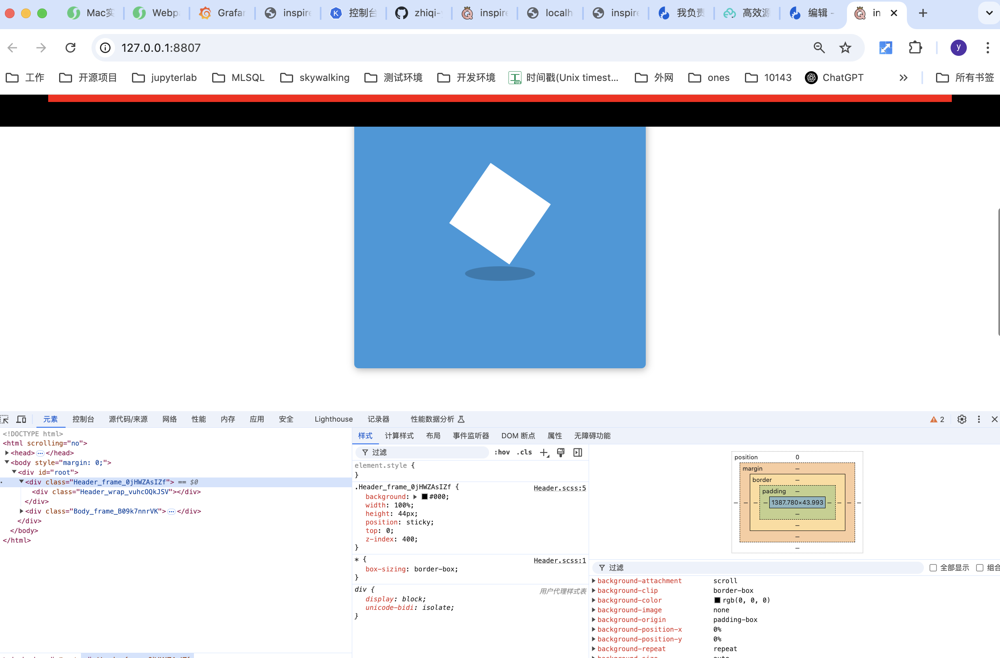

发现达到预期

