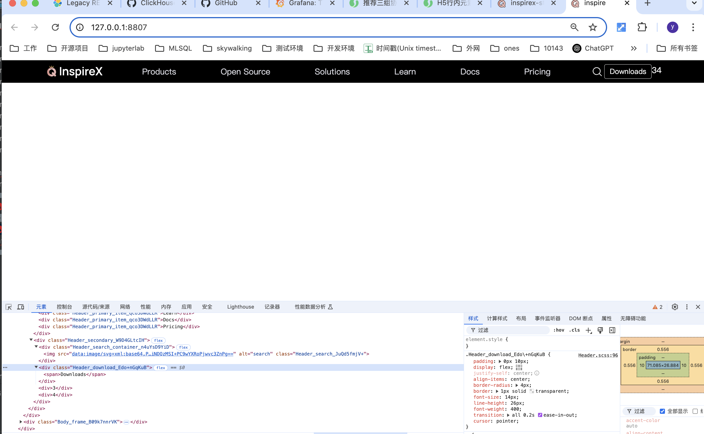

# 导航栏Header

继续上回，我们先运行开发环境脚本，看下目前的效果

```
npm run dev
```


接下来我们完成最外层主体布局

**目标**


在 **src/component/layout/Header.tsx** 添加 3 个 div
```tsx
import React from "react";
import ss from "./Header.scss";


const Header: React.FC = () => {
  console.log(1);
  return (
    <div className={ss.frame}>
      <div className={ss.wrap}>
        <div>1</div>
        <div>2</div>
        <div>3</div>
      </div>
    </div>
  );
};

export default Header;
```

为了方便查看效果，我们设置一下字体颜色，顺便把上次的测试 css 代码去掉

**src/component/layout/Header.scss**
```scss
* {
  box-sizing: border-box;
}

.frame {
  background: #000;
  width: 100%;
  height: 44px;

  position: sticky;
  top: 0;
  z-index: 400;
}

.wrap {
  margin: 0 auto;
  padding: 0 20px;
  max-width: 1240px;


  color: #fff;   // 新增
  
}
```

查看效果


div 默认 dispaly: block 独占一行

修改父容器，改用 flex 布局

**src/component/layout/Header.scss**
```scss
* {
  box-sizing: border-box;
}

.frame {
  background: #000;
  width: 100%;
  height: 44px;

  position: sticky;
  top: 0;
  z-index: 400;
}

.wrap {
  margin: 0 auto;
  padding: 0 20px;
  max-width: 1240px;

  display: flex;  // 新增


  color: #fff;
  
}
```


发现 3 个 div 已经横向布局，高度 和 宽度 都是默认的自适应

设置 wrap 高度100% 并且 flex 在交叉轴方向上居中
**src/component/layout/Header.scss**
```scss
.wrap {
  margin: 0 auto;
  padding: 0 20px;
  max-width: 1240px;
  display: flex;

  height: 100%;         // 新增
  align-items: center;


  color: #fff;
  
}
```


设置 div2 flex-grow 为1，让 div2 占满剩余空间

**src/component/layout/Header.tsx**
```tsx
import React from "react";
import ss from "./Header.scss";


const Header: React.FC = () => {
  console.log(1);
  return (
    <div className={ss.frame}>
      <div className={ss.wrap}>
        <div>1</div>
        <div className={ss.primary}>2</div>
        <div className={ss.secondary}>3</div>
      </div>
    </div>
  );
};

export default Header;

```

**src/component/layout/Header.scss**
```scss
* {
  box-sizing: border-box;
}

.frame {
  background: #000;
  width: 100%;
  height: 44px;

  position: sticky;
  top: 0;
  z-index: 400;
}

.wrap {
  margin: 0 auto;
  padding: 0 20px;
  max-width: 1240px;
  display: flex;

  height: 100%;
  align-items: center;


  color: #fff;
  
}

.primary {
  flex-grow: 1;   // 新增
}
```


新建 **src/assets/svg** 文件夹，拷贝两张 icon（可以在我git项目的相同目录下找到）


在 tsx 中导入两张 svg
**src/component/layout/Header.tsx**
```tsx
import React from "react";
import ss from "./Header.scss";

import logo from "@/assets/svg/iconQ.svg";
import inspireX from "@/assets/svg/inspireX.svg";


const Header: React.FC = () => {
  console.log(1);
  return (
    <div className={ss.frame}>
      <div className={ss.wrap}>
        <div>1</div>
        <div className={ss.primary}>2</div>
        <div className={ss.secondary}>3</div>
      </div>
    </div>
  );
};

export default Header;

```

发现报错，这是因为没有声明 svg 类型文件

新建 **src/types/svg.d.ts**
```
declare module "*.svg" {
  const content: string;
  export default content;
}
```

保存，重启开发服务区
```
npm run dev
```


发现正常


在**src/component/layout/Header.tsx**中引入两张 icon
为了方面点击跳转，我们用 a 标签来包裹两张图片

```
import React from "react";
import ss from "./Header.scss";

import logo from "@/assets/svg/iconQ.svg";
import inspireX from "@/assets/svg/inspireX.svg";


const Header: React.FC = () => {
  console.log(1);
  return (
    <div className={ss.frame}>
      <div className={ss.wrap}>
        <div>
          <a>
            
            
          </a>
        </div>
        <div className={ss.primary}>2</div>
        <div className={ss.secondary}>3</div>
      </div>
    </div>
  );
};

export default Header;

```

保存，发现报错


webpack 报错说没有解析这种文件的解析器

在 webpack.base.conf.js 中添加常用的静态资源解析器
```
      {
        test: /\.(png|jpe?g|gif)$/,
        type: "asset",
        parser: {
          dataUrlCondition: {
            maxSize: 10 * 1024,
          },
        },
      },
      {
        test: /\.(woff2?|eot|ttf|otf)(\?v=[\d\.]+)?$/,
        type: "asset",
        parser: {
          dataUrlCondition: {
            maxSize: 10 * 1024,
          },
        },
      },
      {
        test: /\.(svg)$/,
        type: "asset/inline",
      },
```

重启开发服务器，发现页面正常


给图片添加合适的高度

**src/component/layout/Header.tsx**
```tsx
import React from "react";
import ss from "./Header.scss";

import logo from "@/assets/svg/iconQ.svg";
import inspireX from "@/assets/svg/inspireX.svg";

const Header: React.FC = () => {
  console.log(1);
  return (
    <div className={ss.frame}>
      <div className={ss.wrap}>
        <div >
          <a>
            
            
          </a>
        </div>
        <div className={ss.primary}>2</div>
        <div className={ss.secondary}>3</div>
      </div>
    </div>
  );
};

export default Header;

```

**src/component/layout/Header.scss**
```scss
.inspireX {
  height: 22px;
}

.logo {
  height: 22px;
}
```


设置 a 容器为 flex 布局，调整布局，使两张图片视角居中

**src/component/layout/Header.tsx**
```tsx
const Header: React.FC = () => {
  console.log(1);
  return (
    <div className={ss.frame}>
      <div className={ss.wrap}>
        <div>
          <a className={ss.logo_a}>
            
            
          </a>
        </div>
        <div className={ss.primary}>2</div>
        <div className={ss.secondary}>3</div>
      </div>
    </div>
  );
};

```

**src/component/layout/Header.scss**
```scss
.logo_a {
  display: flex;
  column-gap: 5px;
}

.inspireX {
  height: 22px;
  margin-top: 4px;
}

.logo {
  height: 22px;
  margin-top: 1px;
}
```


添加一级菜单列表

**src/component/layout/Header.tsx**
```tsx
const Header: React.FC = () => {
  console.log(1);
  return (
    <div className={ss.frame}>
      <div className={ss.wrap}>
        <div>
          <a className={ss.logo_a}>
            
            
          </a>
        </div>
        <div className={ss.primary}>
          <div>Products</div>
          <div>Open Source</div>
          <div>Solutions</div>
          <div>Learn</div>
          <div>Docs</div>
          <div>Pricing</div>
        </div>
        <div className={ss.secondary}>3</div>
      </div>
    </div>
  );
};
```

**src/component/layout/Header.scss**
```scss
.primary {
  font-size: 16px;
  line-height: 24px;
  color: #d8d8df;
  font-weight: 400;
}
```


设置 primary容器为 flex 布局

**src/component/layout/Header.scss**
```scss
.primary {
  font-size: 16px;
  line-height: 24px;
  color: #d8d8df;
  font-weight: 400;

  display: flex;
}
```


设置 primary容器为 flex 主轴方向布局方式为 space-evenly，等分空间

**src/component/layout/Header.scss**
```scss
.primary {
  font-size: 16px;
  line-height: 24px;
  color: #d8d8df;
  font-weight: 400;

  display: flex;
  justify-content: space-evenly;
}
```


设置鼠标 hover 图标 和 背景色变色

**src/component/layout/Header.tsx**
```tsx
const Header: React.FC = () => {
  console.log(1);
  return (
    <div className={ss.frame}>
      <div className={ss.wrap}>
        <div>
          <a className={ss.logo_a}>
            
            
          </a>
        </div>
        <div className={ss.primary}>
          <div className={ss.primary_item}>Products</div>
          <div className={ss.primary_item}>Open Source</div>
          <div className={ss.primary_item}>Solutions</div>
          <div className={ss.primary_item}>Learn</div>
          <div className={ss.primary_item}>Docs</div>
          <div className={ss.primary_item}>Pricing</div>
        </div>
        <div className={ss.secondary}>3</div>
      </div>
    </div>
  );
};
```

**src/component/layout/Header.scss**
```scss
.primary_item {

  cursor: pointer;
  
  &:hover {
    background-color: #393946;
  }
}
```


添加 padding 和 圆角，让背景看起来更协调

**src/component/layout/Header.scss**
```scss
.primary_item {

  cursor: pointer;

  padding: 0 10px;
  border-radius: 4px;

  &:hover {
    background-color: #393946;
  }
}
```


填充导航栏右侧
**src/component/layout/Header.tsx**
```tsx
const Header: React.FC = () => {
  console.log(1);
  return (
    <div className={ss.frame}>
      <div className={ss.wrap}>
        <div>
          <a className={ss.logo_a}>
            
            
          </a>
        </div>
        <div className={ss.primary}>
          <div className={ss.primary_item}>Products</div>
          <div className={ss.primary_item}>Open Source</div>
          <div className={ss.primary_item}>Solutions</div>
          <div className={ss.primary_item}>Learn</div>
          <div className={ss.primary_item}>Docs</div>
          <div className={ss.primary_item}>Pricing</div>
        </div>
        <div className={ss.secondary}>
          <div>1</div>
          <div>2</div>
          <div>3</div>
          <div>4</div>
        </div>
      </div>
    </div>
  );
};
```

**src/component/layout/Header.scss**
```scss
.secondary {

  display: flex;
}
```


从inspire项目拷贝 **src/assets/svg/search.svg** 搜索图标到 **src/assets/svg** 下

导入搜索图标
**src/component/layout/Header.tsx**
```tsx
import search from "@/assets/svg/search.svg";

const Header: React.FC = () => {
  console.log(1);
  return (
    <div className={ss.frame}>
      <div className={ss.wrap}>
        <div>
          <a className={ss.logo_a}>
            
            
          </a>
        </div>
        <div className={ss.primary}>
          <div className={ss.primary_item}>Products</div>
          <div className={ss.primary_item}>Open Source</div>
          <div className={ss.primary_item}>Solutions</div>
          <div className={ss.primary_item}>Learn</div>
          <div className={ss.primary_item}>Docs</div>
          <div className={ss.primary_item}>Pricing</div>
        </div>
        <div className={ss.secondary}>
          <div>
            
          </div>
          <div>2</div>
          <div>3</div>
          <div>4</div>
        </div>
      </div>
    </div>
  );
};
```


通过外层 div 设置背景颜色和 hover 变化

**src/component/layout/Header.tsx**
```tsx
const Header: React.FC = () => {
  console.log(1);
  return (
    <div className={ss.frame}>
      <div className={ss.wrap}>
        <div>
          <a className={ss.logo_a}>
            
            
          </a>
        </div>
        <div className={ss.primary}>
          <div className={ss.primary_item}>Products</div>
          <div className={ss.primary_item}>Open Source</div>
          <div className={ss.primary_item}>Solutions</div>
          <div className={ss.primary_item}>Learn</div>
          <div className={ss.primary_item}>Docs</div>
          <div className={ss.primary_item}>Pricing</div>
        </div>
        <div className={ss.secondary}>
          <div className={ss.search_container}>
            
          </div>
          <div>2</div>
          <div>3</div>
          <div>4</div>
        </div>
      </div>
    </div>
  );
};
```

**src/component/layout/Header.scss**
```scss
.search_container {
  display: flex;
  width: 28px;
  height: 28px;
  background-color: #000;
  justify-content: center;
  align-items: center;
  border-radius: 4px;
  cursor: pointer;

  &:hover {
    background-color: #393946;
    .search {
      background-color: #393946;
    }
  }

  .search {
    height: 21px;
  }
}
```


编写 downloads 按钮


**src/component/layout/Header.tsx**
因为 文本行（行级元素）是不可以设置宽高和padding的，所以我们一般在外面套一层 div 容器方便调整布局
```tsx
const Header: React.FC = () => {
  console.log(1);
  return (
    <div className={ss.frame}>
      <div className={ss.wrap}>
        <div>
          <a className={ss.logo_a}>
            
            
          </a>
        </div>
        <div className={ss.primary}>
          <div className={ss.primary_item}>Products</div>
          <div className={ss.primary_item}>Open Source</div>
          <div className={ss.primary_item}>Solutions</div>
          <div className={ss.primary_item}>Learn</div>
          <div className={ss.primary_item}>Docs</div>
          <div className={ss.primary_item}>Pricing</div>
        </div>
        <div className={ss.secondary}>
          <div className={ss.search_container}>
            
          </div>
          <div className={ss.download}><span>Downloads</span></div>
          <div>3</div>
          <div>4</div>
        </div>
      </div>
    </div>
  );
};
```

**src/component/layout/Header.scss**
```scss
.download {
  padding: 0px 10px;      //通过 padding: 0px 10px 把按钮拉宽
  display: flex;          //通过 flex 布局，把内部文本 span 居中     
  justify-self: center;
  align-items: center;

  border-radius: 4px;                    // 设置按钮圆角和边框
  border: 1px solid transparent;

  font-size: 14px;
  line-height: 26px;
  font-weight: 400;
  
  transition: all 0.2s ease-in-out;     // 给所有属性变化添加一个0.2s的渐变，这样看起来更加柔和

  cursor: pointer;

  &:hover {
    border: 1px solid #fefefe;        // 鼠标 hover 时改变边框颜色
  }
}
```



编写 contact us 按钮

整体同 download 按钮，只需要改变 背景、边框、字体颜色


**src/component/layout/Header.tsx**
```tsx
const Header: React.FC = () => {
  console.log(1);
  return (
    <div className={ss.frame}>
      <div className={ss.wrap}>
        <div>
          <a className={ss.logo_a}>
            
            
          </a>
        </div>
        <div className={ss.primary}>
          <div className={ss.primary_item}>Products</div>
          <div className={ss.primary_item}>Open Source</div>
          <div className={ss.primary_item}>Solutions</div>
          <div className={ss.primary_item}>Learn</div>
          <div className={ss.primary_item}>Docs</div>
          <div className={ss.primary_item}>Pricing</div>
        </div>
        <div className={ss.secondary}>
          <div className={ss.search_container}>
            
          </div>
          <div className={ss.download}><span>Downloads</span></div>
          <div className={ss.contact_us}><span>Contact us</span></div>
          <div>4</div>
        </div>
      </div>
    </div>
  );
};
```

**src/component/layout/Header.scss**
```scss
.contact_us {
  padding: 0px 10px;      
  display: flex;         
  justify-self: center;
  align-items: center;

  border-radius: 4px;                    

  font-size: 14px;
  line-height: 26px;
  
  transition: all 0.2s ease-in-out;    

  cursor: pointer;

  border: 1px solid #1866d4;      // 不同的背景、边框、字体颜色
  color: #fefefe;
  background-color: #1a5bbf;
  font-weight: 600;

  &:hover {
    border: 1px solid #fefefe;       
  }
}
```

Sign in 按钮同 download，可以复用 download 的样式


**src/component/layout/Header.tsx**
```tsx
const Header: React.FC = () => {
  console.log(1);
  return (
    <div className={ss.frame}>
      <div className={ss.wrap}>
        <div>
          <a className={ss.logo_a}>
            
            
          </a>
        </div>
        <div className={ss.primary}>
          <div className={ss.primary_item}>Products</div>
          <div className={ss.primary_item}>Open Source</div>
          <div className={ss.primary_item}>Solutions</div>
          <div className={ss.primary_item}>Learn</div>
          <div className={ss.primary_item}>Docs</div>
          <div className={ss.primary_item}>Pricing</div>
        </div>
        <div className={ss.secondary}>
          <div className={ss.search_container}>
            
          </div>
          <div className={ss.download}><span>Downloads</span></div>
          <div className={ss.contact_us}><span>Contact us</span></div>
          <div className={ss.download}><span>Sign in</span></div>
        </div>
      </div>
    </div>
  );
};
```


按钮间距有点紧，通过 column-gap 调宽

**src/component/layout/Header.scss**
```scss
.secondary {

  display: flex;
  column-gap: 8px;
  
}
```


primary区块 和 secondary区块 挨的有点紧，给一个 padding-left +  secondary区块 为 flex-end 更美观

**src/component/layout/Header.scss**
```scss
.secondary {
  display: flex;

  column-gap: 8px;
  justify-content: flex-end;
  padding-left: 80px;

}
```


发现 primary 字体好像比 secondary 高一点，那是因为两个 font-size 不一致，调整一下

**src/component/layout/Header.scss**
```scss
.primary {
  font-size: 14px;
  line-height: 24px;
  color: #d8d8df;
  font-weight: 400;

  display: flex;
  justify-content: space-evenly;
}
```

最后为了页面缩放时 secondary 也变小，设置 secondary   flex-shrink: 0 不可压缩

**src/component/layout/Header.scss**
```scss
.secondary {
  flex-shrink: 0;

  display: flex;

  column-gap: 8px;
  justify-content: flex-end;
  padding-left: 80px;

}
```


