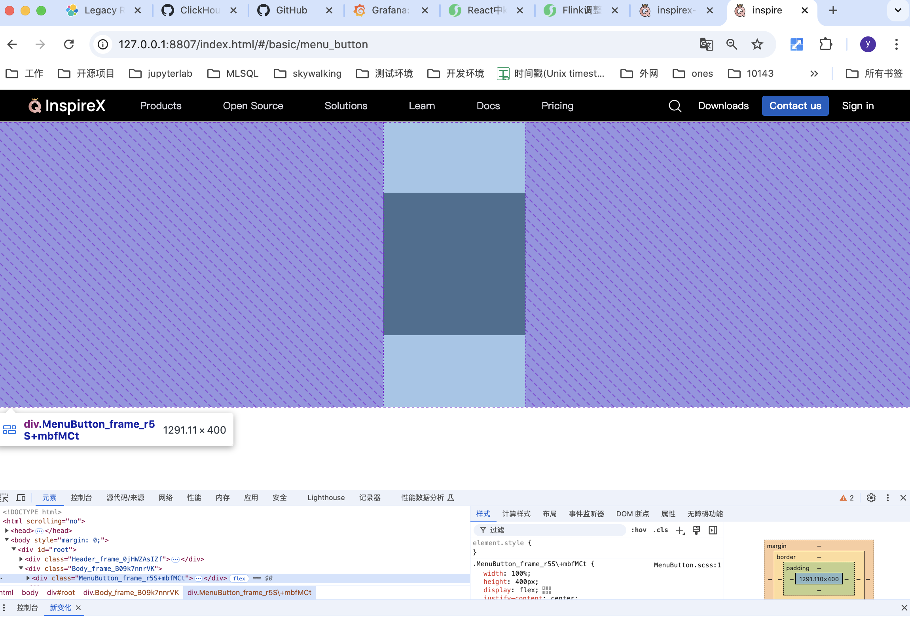
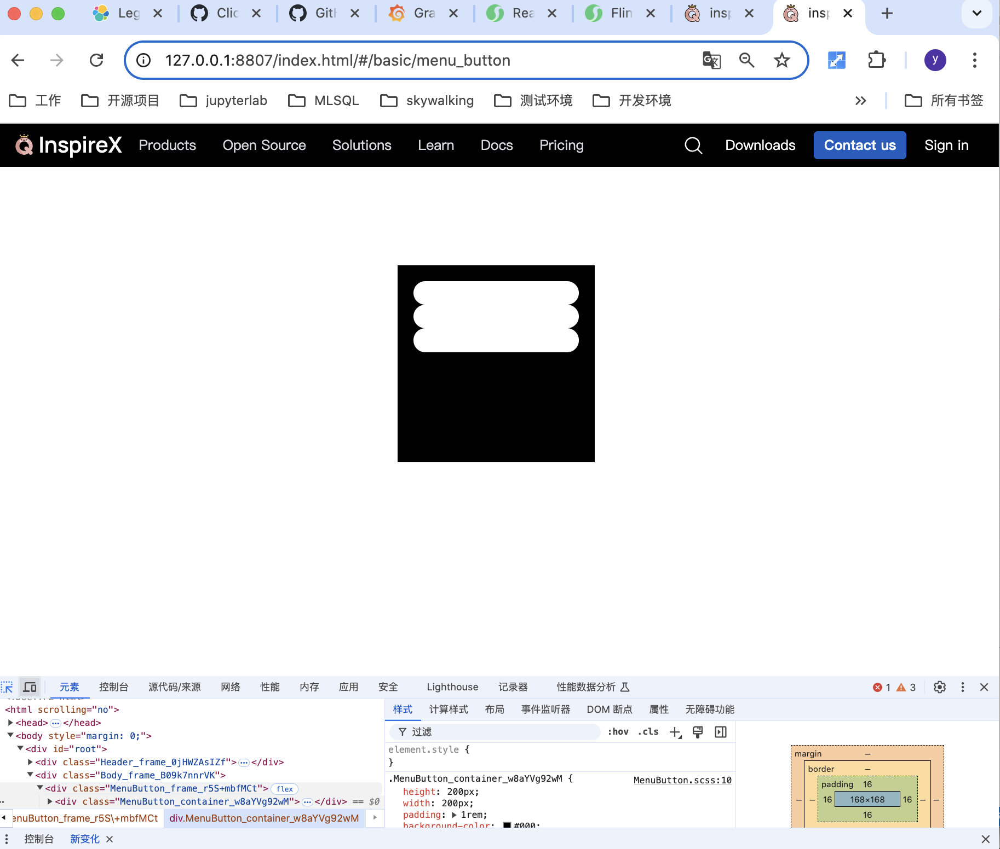
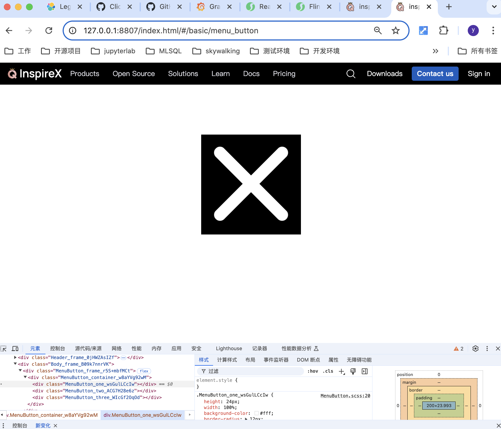

# 导航栏菜单 关闭/打开 动画按钮


新建 **src/component/basic/MenuButton.tsx** 
```tsx
import React from "react";

import ss from "./MenuButton.scss";

const MenuButton: React.FC = () => {
  console.log(1);

  return (
    <div></div>
  )
}

export default MenuButton;
```

新建 **src/component/basic/MenuButton.scss**
```scss

```

为了方便查看效果，我们给 MenuButton 添加一个路由

新建 **src/routes/basic.ts**
```ts
import React from "react";

export default {

  "basic/menu_button": {
    component: React.lazy(() => import( "@/component/basic/MenuButton")),
  },

};

```

在 总路由 **src/routes/routes.tsx** 中集成 basic.ts
```ts
import React  from "react";
import { RouteObject } from "react-router-dom";

import lession from "./lession";

import knowledge from "./knowledge";

import basic from "./basic";

interface RouteSource {
  component: React.LazyExoticComponent<React.ComponentType<any>>;
}
 

const getRouteData = (): [RouteObject[], { [key: string]: RouteObject }] => {
  const data: Record<string, RouteSource> = {
    "/": {
      component: React.lazy(() => import(/* webpackChunkName: "lession4" */ "@/component/lession/Lession49")),
    },
    ...lession,
    ...knowledge,
    ...basic,
    "helloworld": {
      component: React.lazy(() => import(/* webpackChunkName: "helloworld" */ "@/component/helloworld")),
    },
    "*": {
      component: React.lazy(() => Promise.resolve({ default: () => <div>404 Not Found</div> })),
    },
  };

  const routes = [];
  const routeMap = {} as { [key: string]: RouteObject };

  for (const [k, { component }] of Object.entries(data)) {
    const item: RouteObject = {
      path: k,
      element: React.createElement(component),
    };
    routes.push(item);
    routeMap[k] = item;
  }
  
  return [routes, routeMap];
};

export default getRouteData;

```


运行开发环境，查看效果


为了方便查看效果，我们先临时给按钮外层套一个 frame div，让按钮显示在屏幕中央

**src/component/basic/MenuButton.tsx** 
```tsx

import React from "react";

import ss from "./MenuButton.scss";

const MenuButton: React.FC = () => {
  console.log(1);

  return (
    <div className={ss.frame}>
      <div className={ss.container}></div>
    </div>
  )
}

export default MenuButton;
```

**src/component/basic/MenuButton.scss** 
```scss
.frame {
  width: 100%;
  height: 400px;

}

.container {
  height: 200px;
  width: 200px;

  background-color: #000;
}
```


接下来让按钮居中

**src/component/basic/MenuButton.scss** 
```scss
.frame {
  width: 100%;
  height: 400px;

  display: flex;
  justify-content: center;
  align-items: center;
}

.container {
  height: 200px;
  width: 200px;

  background-color: #000;
}
```



给 container 添加一个内层 padding，让外层和内容看起来更加协调

**src/component/basic/MenuButton.scss** 
```scss
.frame {
  width: 100%;
  height: 400px;

  display: flex;
  justify-content: center;
  align-items: center;
}

.container {
  height: 200px;
  width: 200px;

  padding: 1rem;

  background-color: #000;
}
```


在容器内添加 3 个 div，用于画 3 条横线

**src/component/basic/MenuButton.tsx** 
```
import React from "react";

import ss from "./MenuButton.scss";

const MenuButton: React.FC = () => {
  console.log(1);

  return (
    <div className={ss.frame}>
      <div className={ss.container}>
        <div className={ss.one}></div>
        <div className={ss.two}></div>
        <div className={ss.three}></div>
      </div>
    </div>
  )
}

export default MenuButton;

```




为了方便后续动画改变横线的位置，我们给他们设置为 position: absolute 定位

**src/component/basic/MenuButton.scss**
```scss

.one {
  height: 24px;
  width: 100%;
  background-color: #fff;
  border-radius: 12px;
  position: absolute;
}

.two {
  height: 24px;
  width: 100%;
  background-color: #fff;
  border-radius: 12px;
  position: absolute;
}

.three {
  height: 24px;
  width: 100%;
  background-color: #fff;
  border-radius: 12px;
  position: absolute;
}

```


发现 div 的宽度超过了 container 容器，变成和 html.body 一样的宽度


这是因为 container 的父容器中没有一个 position: absolute/relative 的，导致 container 的绝对定位是以 html.body 为基准

给 container 添加 position: relative

**src/component/basic/MenuButton.scss**
```scss
.container {
  height: 200px;
  width: 200px;

  padding: 1rem;
  position: relative;

  background-color: #000;
}
```


发现 横线的宽度还是溢出了 container 容器，这是因为 container 的 padding 是包含在宽度里的，横线 width: 100% 和 container 的宽度是一样的

可以修改 padding 为 margin，元素的宽度不包含 margin

**src/component/basic/MenuButton.scss**
```scss
.container {
  height: 200px;
  width: 200px;

  margin: 1rem;
  position: relative;

  background-color: #000;
}
```


调整 3 条横线的位置

**src/component/basic/MenuButton.scss**
```scss
.one {
  height: 24px;
  width: 100%;
  background-color: #fff;
  border-radius: 12px;
  position: absolute;

  transform: translateY(60%);
}

.two {
  height: 24px;
  width: 100%;
  background-color: #fff;
  border-radius: 12px;
  position: absolute;

  transform: translateY(360%);
}

.three {
  height: 24px;
  width: 100%;
  background-color: #fff;
  border-radius: 12px;
  position: absolute;

  transform: translateY(660%);
}
```

给 横线1 添加 关闭 -> 打开的动画

**src/component/basic/MenuButton.scss**
```scss
.one {
  height: 24px;
  width: 100%;
  background-color: #fff;
  border-radius: 12px;
  position: absolute;

  transform: translateY(60%);

  animation: one_open 0.6s ease-in-out forwards;
}

@keyframes one_open {
  0% {
    transform: rotate(0deg) translateY(60%);
  }
  50% {
    transform: rotate(0deg) translateY(360%);
  }
  100% {
    transform: rotate(135deg) translateY(360%);
  }
}
```

保存，刷新页面，查看横线1的动画效果，发现和我们想要的不太一样


这是因为 transform 的默认旋转的中心点是元素 左上角

通过数学计算，我们得到期望的旋转中心点应该是在 元素 (50%, 50% + 360%) 处

设置旋转中心点

**src/component/basic/MenuButton.scss**
```scss
.one {
  height: 24px;
  width: 100%;
  background-color: #fff;
  border-radius: 12px;
  position: absolute;

  transform: translateY(60%);
  transform-origin: 50% 410%;

  animation: one_open 0.6s ease-in-out forwards;
}

@keyframes one_open {
  0% {
    transform: rotate(0deg) translateY(60%);
  }
  50% {
    transform: rotate(0deg) translateY(360%);
  }
  100% {
    transform: rotate(135deg) translateY(360%);
  }
}
```

保存，发现达到预期


同理，设置 横线 2 和 3 的位置和动画

**src/component/basic/MenuButton.scss**
```scss

.one {
  height: 24px;
  width: 100%;
  background-color: #fff;
  border-radius: 12px;
  position: absolute;

  transform: translateY(60%);
  transform-origin: 50% 410%;

  animation: one_open 0.6s ease-in-out forwards;
}

.two {
  height: 24px;
  width: 100%;
  background-color: #fff;
  border-radius: 12px;
  position: absolute;

  transform: translateY(360%);
  transform-origin: 50% 410%;

  animation: two_open 0.6s ease-in-out forwards;
}

.three {
  height: 24px;
  width: 100%;
  background-color: #fff;
  border-radius: 12px;
  position: absolute;

  transform: translateY(660%);

  transform-origin: 50% 410%;

  animation: three_open 0.6s ease-in-out forwards;

}

@keyframes one_open {
  0% {
    transform: rotate(0deg) translateY(60%);
  }
  50% {
    transform: rotate(0deg) translateY(360%);
  }
  100% {
    transform: rotate(135deg) translateY(360%);
  }
}

@keyframes two_open {
  0% {
    transform: scale(1) translateY(360%);
  }
  50%,
  100% {
    transform: scale(0) translateY(360%);
  }
}

@keyframes three_open {
  0% {
    transform: rotate(0deg) translateY(660%);
  }
  50% {
    transform: rotate(0deg) translateY(360%);
  }
  100% {
    transform: rotate(-135deg) translateY(360%);
  }
}

```





接着我们先定义好关闭的动画

**src/component/basic/MenuButton.scss**
```scss
@keyframes one_close {
  0% {
    transform: rotate(135deg) translateY(350%);
  }
  50% {
    transform: rotate(0deg) translateY(350%);
  }
  100% {
    transform: rotate(0deg) translateY(50%);
  }
}

@keyframes two_close {
  0%,
  50% {
    transform: scale(0) translateY(350%);
  }
  100% {
    transform: scale(1) translateY(350%);
  }
}

@keyframes three_close {
  0% {
    transform: rotate(-135deg) translateY(350%);
  }
  50% {
    transform: rotate(0deg) translateY(350%);
  }
  100% {
    transform: rotate(0deg) translateY(650%);
  }
}
```

添加一个 checkbox input，通过勾选来控制开启/关闭状态

**src/component/basic/MenuButton.tsx** 
```tsx
import React, { useState } from "react";

import ss from "./MenuButton.scss";

const MenuButton: React.FC = () => {

  const [state, setState] = useState(false);

  return (
    <div className={ss.frame}>
      <div className={ss.container}>
        <input type="checkbox" id={ss.cb} checked={state} onChange={() => {setState(!state)}}></input>
        <div className={ss.one}></div>
        <div className={ss.two}></div>
        <div className={ss.three}></div>
      </div>
    </div>
  )
}

export default MenuButton;
```

在 css 中通过 不同的 checkbox 状态给 横线设置不同的动画

**src/component/basic/MenuButton.scss**
```scss
#cb:checked ~ .one {
  animation: one_open 0.6s ease-in-out forwards;
}

#cb:checked ~ .two {
  animation: two_open 0.6s ease-in-out forwards;
}

#cb:checked ~ .three {
  animation: three_open 0.6s ease-in-out forwards;
}


#cb:not(:checked) ~ .one {
  animation: one_close 0.6s ease-in-out;
}

#cb:not(:checked) ~ .two {
  animation: two_close 0.6s ease-in-out forwards;
}

#cb:not(:checked) ~ .three {
  animation: three_close 0.6s ease-in-out forwards;
}
```

保存，点击 checkbox，发现已经可以打开/关闭


但 checkbox 严重影响页面布局

我们利用一个 label 盲层来隐藏 checkbox 和 实现同步 checkbox 状态


**src/component/basic/MenuButton.tsx** 
```tsx
import React, { useState, MouseEvent } from "react";

import ss from "./MenuButton.scss";

const MenuButton: React.FC = () => {

  const [state, setState] = useState(false);

  const handlerCheckbox = (e: MouseEvent<HTMLLabelElement>) => {
    e.preventDefault();
    const newState = !state;
    setState(newState);
  };

  return (
    <div className={ss.frame}>
      <div className={ss.container}>
        <input type="checkbox" id={ss.cb} checked={state} onChange={() => {}}></input>
        {/* eslint-disable-next-line jsx-a11y/label-has-associated-control */}
        <label className={ss.bg} htmlFor={ss.cb} onClick={handlerCheckbox}></label>
        <div className={ss.one}></div>
        <div className={ss.two}></div>
        <div className={ss.three}></div>
      </div>
    </div>
  )
}

export default MenuButton;
```


**src/component/basic/MenuButton.scss**
```scss
#cb {
  display: none;
}

.bg {
  z-index: 10;
  top: 0;
  bottom: 0;
  left: 0;
  right: 0;
  position: absolute;
  cursor: pointer;
}
```


已经完成主要功能

接下来解决一些细节问题

刷新浏览器，发现页面初始化的时候按钮会运行一次动画，和我们预期不符

我们可以在页面初始化的时候禁用动画，第一次点击按钮的时候再启用动画

**src/component/basic/MenuButton.scss**
```scss

.noAnimation {
  animation: none !important;
}

```


**src/component/basic/MenuButton.tsx** 
```tsx
import React, { useState, MouseEvent } from "react";

import ss from "./MenuButton.scss";

const MenuButton: React.FC = () => {

  const [state, setState] = useState(false);

  const handlerCheckbox = (e: MouseEvent<HTMLLabelElement>) => {
    e.preventDefault();
    const newState = !state;
    setState(newState);
  };

  return (
    <div className={ss.frame}>
      <div className={ss.container}>
        <input type="checkbox" id={ss.cb} checked={state} onChange={() => {}}></input>
        {/* eslint-disable-next-line jsx-a11y/label-has-associated-control */}
        <label className={ss.bg} htmlFor={ss.cb} onClick={handlerCheckbox}></label>
        <div className={`${ss.one} ${ss.noAnimation}`}></div>
        <div className={`${ss.two} ${ss.noAnimation}`}></div>
        <div className={`${ss.three} ${ss.noAnimation}`}></div>
      </div>
    </div>
  )
}

export default MenuButton;
```

再次刷新页面，发现已经屏蔽了最开始的动画

但点击按钮，动画失效了，需要我们在点击事件里去掉 ss.noAnimation

**src/component/basic/MenuButton.tsx** 
```tsx
import React, { useState, MouseEvent, useRef } from "react";

import ss from "./MenuButton.scss";

const MenuButton: React.FC = () => {

  const [state, setState] = useState(false);

  const oneRef = useRef<HTMLDivElement>(null);
  const twoRef = useRef<HTMLDivElement>(null);
  const threeRef = useRef<HTMLDivElement>(null);

  const handlerCheckbox = (e: MouseEvent<HTMLLabelElement>) => {
    e.preventDefault();
    [oneRef, twoRef, threeRef].forEach((item) => item.current?.classList.remove(`${ss.noAnimation}`));
    const newState = !state;
    setState(newState);
  };

  return (
    <div className={ss.frame}>
      <div className={ss.container}>
        <input type="checkbox" id={ss.cb} checked={state} onChange={() => {}}></input>
        {/* eslint-disable-next-line jsx-a11y/label-has-associated-control */}
        <label className={ss.bg} htmlFor={ss.cb} onClick={handlerCheckbox}></label>
        <div ref={oneRef} className={`${ss.one} ${ss.noAnimation}`}></div>
        <div ref={twoRef} className={`${ss.two} ${ss.noAnimation}`}></div>
        <div ref={threeRef} className={`${ss.three} ${ss.noAnimation}`}></div>
      </div>
    </div>
  )
}

export default MenuButton;

```

**useRef** 是新知识点，可以先初步了解一下就行，等课上我再细讲

保存，刷新页面，发现功能正常


最后，我们在通过参数，对外暴露按钮的背景颜色 和 size

**src/component/basic/MenuButton.tsx** 
```tsx
import React, { useState, MouseEvent, useRef } from "react";

import ss from "./MenuButton.scss";

export interface MenuProps {
  size?: number;
  backgroundColor?: string;
}

const MenuButton: React.FC<MenuProps> = ({ backgroundColor, size}) => {

  const [state, setState] = useState(false);

  const oneRef = useRef<HTMLDivElement>(null);
  const twoRef = useRef<HTMLDivElement>(null);
  const threeRef = useRef<HTMLDivElement>(null);

  const handlerCheckbox = (e: MouseEvent<HTMLLabelElement>) => {
    e.preventDefault();
    [oneRef, twoRef, threeRef].forEach((item) => item.current?.classList.remove(`${ss.noAnimation}`));
    const newState = !state;
    setState(newState);
  };

  return (
    <div className={ss.frame}>
      <div className={ss.container}>
        <input type="checkbox" id={ss.cb} checked={state} onChange={() => {}}></input>
        {/* eslint-disable-next-line jsx-a11y/label-has-associated-control */}
        <label className={ss.bg} htmlFor={ss.cb} onClick={handlerCheckbox}></label>
        <div ref={oneRef} className={`${ss.one} ${ss.noAnimation}`}></div>
        <div ref={twoRef} className={`${ss.two} ${ss.noAnimation}`}></div>
        <div ref={threeRef} className={`${ss.three} ${ss.noAnimation}`}></div>
      </div>
    </div>
  )
}

export default MenuButton;
```

重要的 css 属性都通过 size 来计算

**src/component/basic/MenuButton.tsx** 
```tsx
import React, { useState, MouseEvent, useRef } from "react";

import ss from "./MenuButton.scss";

export interface MenuProps {
  size?: number;
  backgroundColor?: string;
}

const MenuButton: React.FC<MenuProps> = ({ backgroundColor, size}) => {

  const baseSize = size || 200;
  const bg = backgroundColor || "#000";
  
  const style = {
    "--base-size": `${baseSize}px`,
    "--bg": `${bg}`,
    "--line-height": `${(baseSize * 12) / 100}px`,
  } as React.CSSProperties;

  const [state, setState] = useState(false);

  const oneRef = useRef<HTMLDivElement>(null);
  const twoRef = useRef<HTMLDivElement>(null);
  const threeRef = useRef<HTMLDivElement>(null);

  const handlerCheckbox = (e: MouseEvent<HTMLLabelElement>) => {
    e.preventDefault();
    [oneRef, twoRef, threeRef].forEach((item) => item.current?.classList.remove(`${ss.noAnimation}`));
    const newState = !state;
    setState(newState);
  };

  return (
    <div className={ss.frame} style={style}>
      <div className={ss.container}>
        <input type="checkbox" id={ss.cb} checked={state} onChange={() => {}}></input>
        {/* eslint-disable-next-line jsx-a11y/label-has-associated-control */}
        <label className={ss.bg} htmlFor={ss.cb} onClick={handlerCheckbox}></label>
        <div ref={oneRef} className={`${ss.one} ${ss.noAnimation}`}></div>
        <div ref={twoRef} className={`${ss.two} ${ss.noAnimation}`}></div>
        <div ref={threeRef} className={`${ss.three} ${ss.noAnimation}`}></div>
      </div>
    </div>
  )
}

export default MenuButton;
```


**src/component/basic/MenuButton.scss**
```scss
.frame {
  width: 100%;
  height: 400px;

  display: flex;
  justify-content: center;
  align-items: center;
}

.container {
  width: var(--base-size);
  height: var(--base-size);
  background-color: var(--bg);

  margin: 1rem;
  position: relative;

}

.one {
  height: var(--line-height);
  width: 100%;
  background-color: #fff;
  border-radius: calc(var(--line-height) * 0.5);;
  position: absolute;

  transform: translateY(60%);
  transform-origin: 50% 410%;

  animation: one_open 0.6s ease-in-out forwards;
}

.two {
  height: var(--line-height);
  width: 100%;
  background-color: #fff;
  border-radius: calc(var(--line-height) * 0.5);;
  position: absolute;

  transform: translateY(360%);
  transform-origin: 50% 410%;

  animation: two_open 0.6s ease-in-out forwards;
}

.three {
  height: var(--line-height);
  width: 100%;
  background-color: #fff;
  border-radius: calc(var(--line-height) * 0.5);;
  position: absolute;

  transform: translateY(660%);

  transform-origin: 50% 410%;

  animation: three_open 0.6s ease-in-out forwards;

}

```

保存


完成！！！


