# 首页手机（当屏幕宽度低于 1250px 时)导航栏

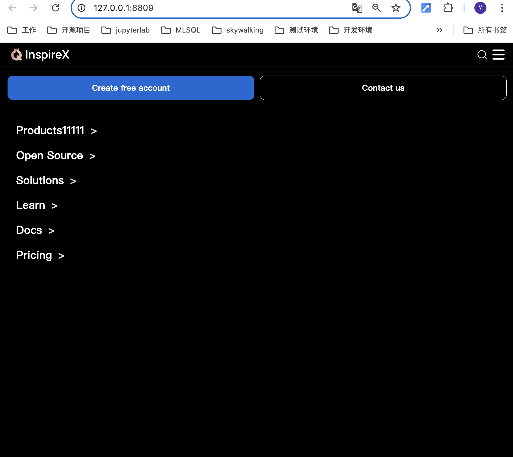

使用媒体查询，当浏览器窗口或设备屏幕的宽度小于或等于 1250 像素时，隐藏原先的菜单

现状，当屏幕宽度过低时，页面布局会出现杂乱

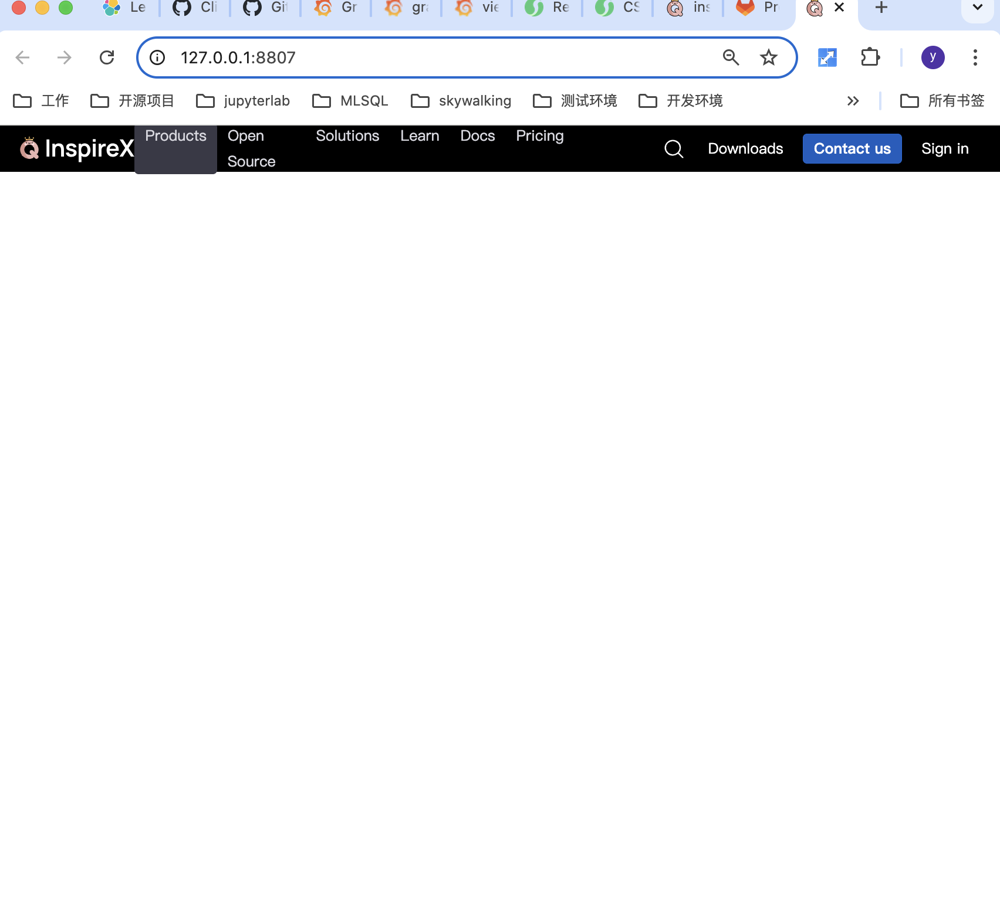

在 **src/component/layout/Header.scss** 中添加
```scss
@media (max-width: 1250px) {
  .primary,
  .secondary {
    display: none;
  }
}
```

查看效果

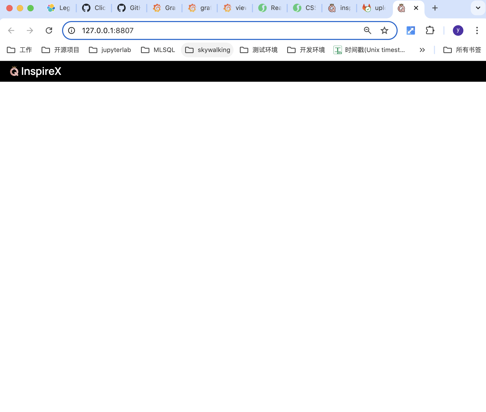

添加 手机搜索和菜单按钮 容器和 div

**src/component/layout/Header.tsx** 
```tsx
  console.log(1);
  return (
    <div className={ss.frame}>
      <div className={ss.wrap}>
        <div>
          <a className={ss.logo_a}>
            
            
          </a>
        </div>
        <div className={ss.primary}>
          <div className={ss.primary_item}>Products</div>
          <div className={ss.primary_item}>Open Source</div>
          <div className={ss.primary_item}>Solutions</div>
          <div className={ss.primary_item}>Learn</div>
          <div className={ss.primary_item}>Docs</div>
          <div className={ss.primary_item}>Pricing</div>
        </div>
        <div className={ss.secondary}>
          <div className={ss.search_container}>
            
          </div>
          <div className={ss.download}><span>Downloads</span></div>
          <div className={ss.contact_us}><span>Contact us</span></div>
          <div className={ss.download}><span>Sign in</span></div>
        </div>
        <div className={ss.mobile_container}>                  // 新增
          <div>搜索</div>                          
          <div>菜单</div>
        </div>
      </div>
    </div>
  );
};
```

保存，查看效果

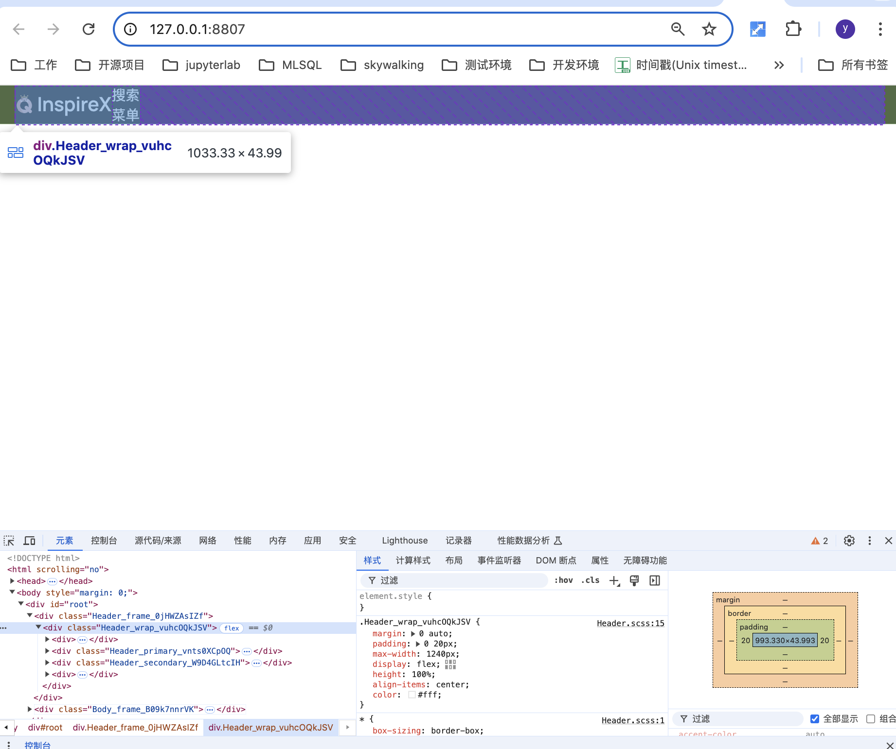

发现两个紧贴在一起，这是因为他们父容器的 flex 主轴布局为默认的 justify-content: flex-start;

修改为 justify-content: space-between;

**src/component/layout/Header.scss** 
```scss
.wrap {
  margin: 0 auto;
  padding: 0 20px;
  max-width: 1240px;
  display: flex;

  height: 100%;
  align-items: center;
  justify-content: space-between;    //新增


  color: #fff;
  
}
```

保存，查看效果

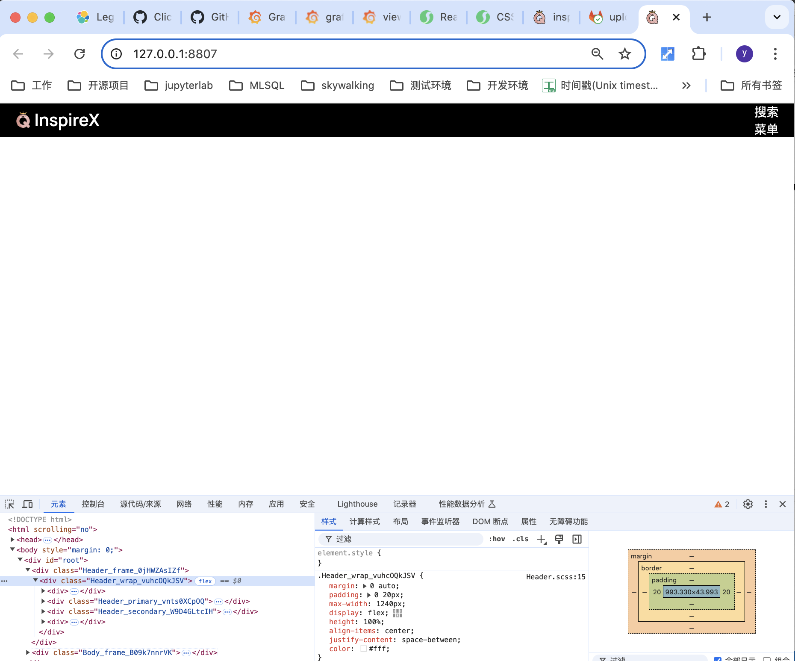

设置 搜索 和 按钮 横向布局，并居中


**src/component/layout/Header.scss** 
```scss
.mobile_container {              // 新增
  display: flex;
  justify-content: center;
  align-items: center;
  column-gap: 5px;
}
```

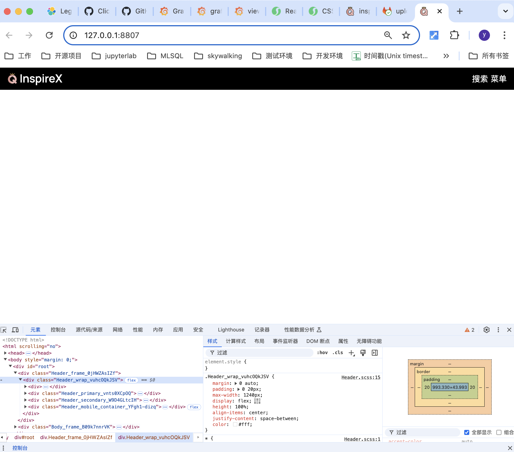

把页面拉宽

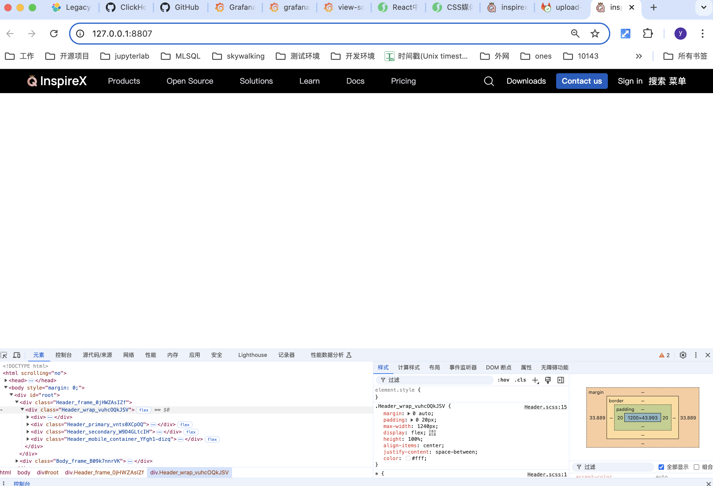

发现拉宽是手机菜单没隐藏，同理添加媒体查询

**src/component/layout/Header.scss** 
```scss
.mobile_container {
  display: flex;
  justify-content: center;
  align-items: center;
  column-gap: 5px;
}

@media (min-width: 1250px) {
  .mobile_container {
    display: none;
  }
}
```

注意 display: none 需要写到 mobile_container 后面，这样才能覆盖，或者使用 !important

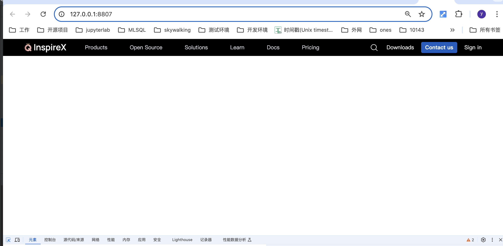

发现已经隐藏

从 secondary 里拷贝我们已经写过的搜索按钮

**src/component/layout/Header.tsx** 
```tsx
const Header: React.FC = () => {
  console.log(1);
  return (
    <div className={ss.frame}>
      <div className={ss.wrap}>
        <div>
          <a className={ss.logo_a}>
            
            
          </a>
        </div>
        <div className={ss.primary}>
          <div className={ss.primary_item}>Products</div>
          <div className={ss.primary_item}>Open Source</div>
          <div className={ss.primary_item}>Solutions</div>
          <div className={ss.primary_item}>Learn</div>
          <div className={ss.primary_item}>Docs</div>
          <div className={ss.primary_item}>Pricing</div>
        </div>
        <div className={ss.secondary}>
          <div className={ss.search_container}>
            
          </div>
          <div className={ss.download}><span>Downloads</span></div>
          <div className={ss.contact_us}><span>Contact us</span></div>
          <div className={ss.download}><span>Sign in</span></div>
        </div>
        <div className={ss.mobile_container}>
          <div className={ss.search_container}>                                // 修改
            
          </div>
          <MenuB size={22} backgroundColor="#000" />
        </div>
      </div>
    </div>
  );
};
```

保存，查看效果

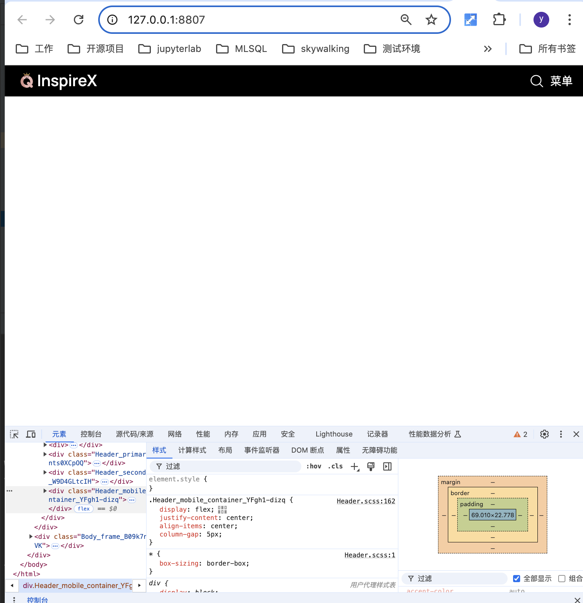

引入我们上节课开发好的菜单按钮

**src/component/layout/Header.tsx** 
```tsx
import MenuButton from "@/component/basic/MenuButton";     //新增

const Header: React.FC = () => {
  console.log(1);
  return (
    <div className={ss.frame}>
      <div className={ss.wrap}>
        <div>
          <a className={ss.logo_a}>
            
            
          </a>
        </div>
        <div className={ss.primary}>
          <div className={ss.primary_item}>Products</div>
          <div className={ss.primary_item}>Open Source</div>
          <div className={ss.primary_item}>Solutions</div>
          <div className={ss.primary_item}>Learn</div>
          <div className={ss.primary_item}>Docs</div>
          <div className={ss.primary_item}>Pricing</div>
        </div>
        <div className={ss.secondary}>
          <div className={ss.search_container}>
            
          </div>
          <div className={ss.download}><span>Downloads</span></div>
          <div className={ss.contact_us}><span>Contact us</span></div>
          <div className={ss.download}><span>Sign in</span></div>
        </div>
        <div className={ss.mobile_container}>
          <div className={ss.search_container}>
            
          </div>
          <MenuButton size={22} backgroundColor="#000" />               //修改
        </div>
      </div>
    </div>
  );
};
```

保存，查看效果

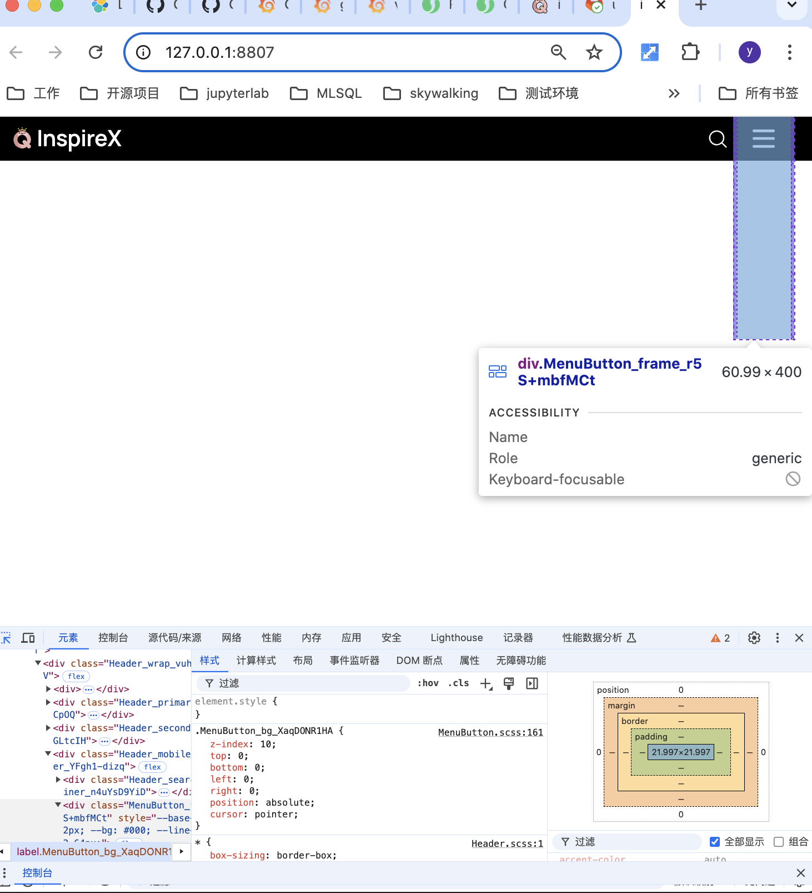

发现 按钮 宽高都有点不正常

这是因为上次我们开发按钮组件的时候，为了查看效果，给外围套了一个演示用的容器 div，去掉外层 div，并把 style 移到 container 上

**src/component/basic/MenuButton.tsx** 
```tsx
  return (
    <div className={ss.container} style={style}>
      <input type="checkbox" id={ss.cb} checked={state} onChange={() => {}}></input>
      {/* eslint-disable-next-line jsx-a11y/label-has-associated-control */}
      <label className={ss.bg} htmlFor={ss.cb} onClick={handlerCheckbox}></label>
      <div ref={oneRef} className={`${ss.one} ${ss.noAnimation}`}></div>
      <div ref={twoRef} className={`${ss.two} ${ss.noAnimation}`}></div>
      <div ref={threeRef} className={`${ss.three} ${ss.noAnimation}`}></div>
    </div>
  )
```

保存，查看效果

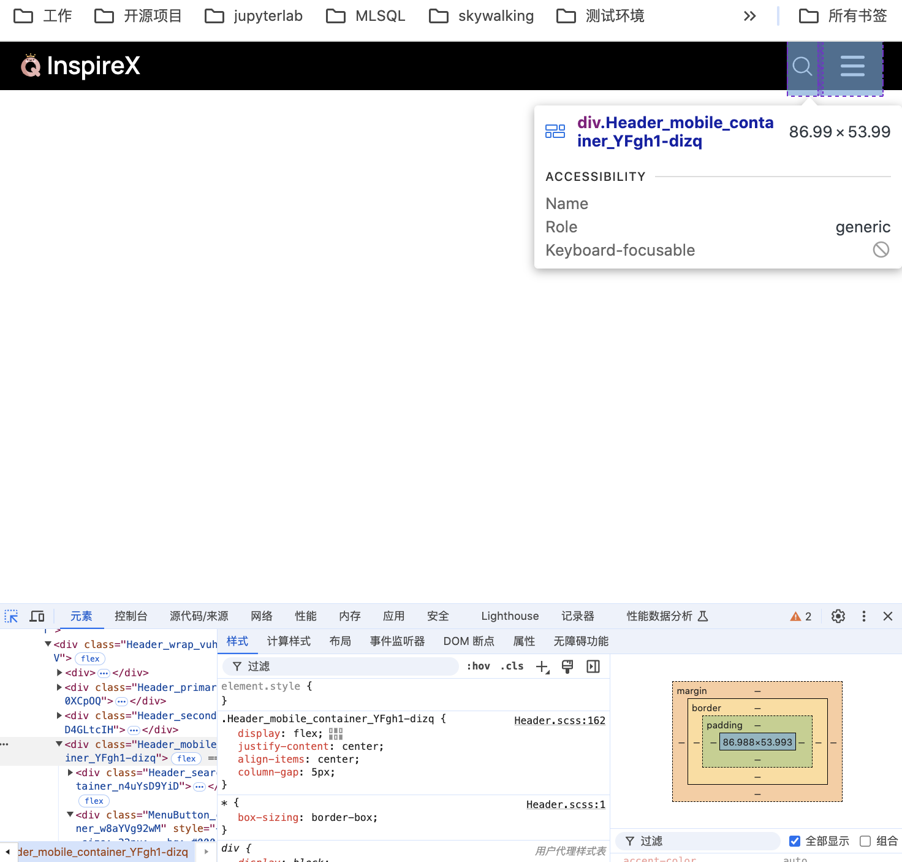

发现高度有点超过了 导航栏，这是因为 22px 加上外围的 2rem margin 高度超过了 导航栏的 44px

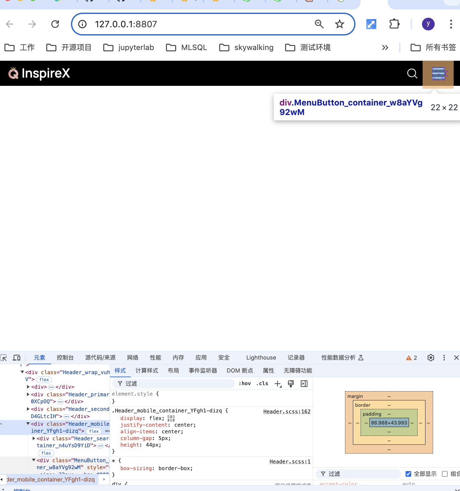

调节 按钮高度为 20 px

**src/component/layout/Header.tsx** 
```tsx
import MenuButton from "@/component/basic/MenuButton";     //新增

const Header: React.FC = () => {
  console.log(1);
  return (
    <div className={ss.frame}>
      <div className={ss.wrap}>
        <div>
          <a className={ss.logo_a}>
            
            
          </a>
        </div>
        <div className={ss.primary}>
          <div className={ss.primary_item}>Products</div>
          <div className={ss.primary_item}>Open Source</div>
          <div className={ss.primary_item}>Solutions</div>
          <div className={ss.primary_item}>Learn</div>
          <div className={ss.primary_item}>Docs</div>
          <div className={ss.primary_item}>Pricing</div>
        </div>
        <div className={ss.secondary}>
          <div className={ss.search_container}>
            
          </div>
          <div className={ss.download}><span>Downloads</span></div>
          <div className={ss.contact_us}><span>Contact us</span></div>
          <div className={ss.download}><span>Sign in</span></div>
        </div>
        <div className={ss.mobile_container}>
          <div className={ss.search_container}>
            
          </div>
          <MenuButton size={20} backgroundColor="#000" />               //修改
        </div>
      </div>
    </div>
  );
};
```

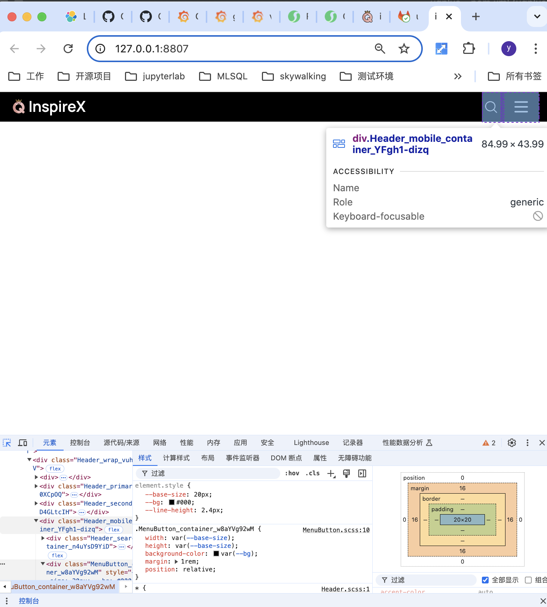

发现正常

