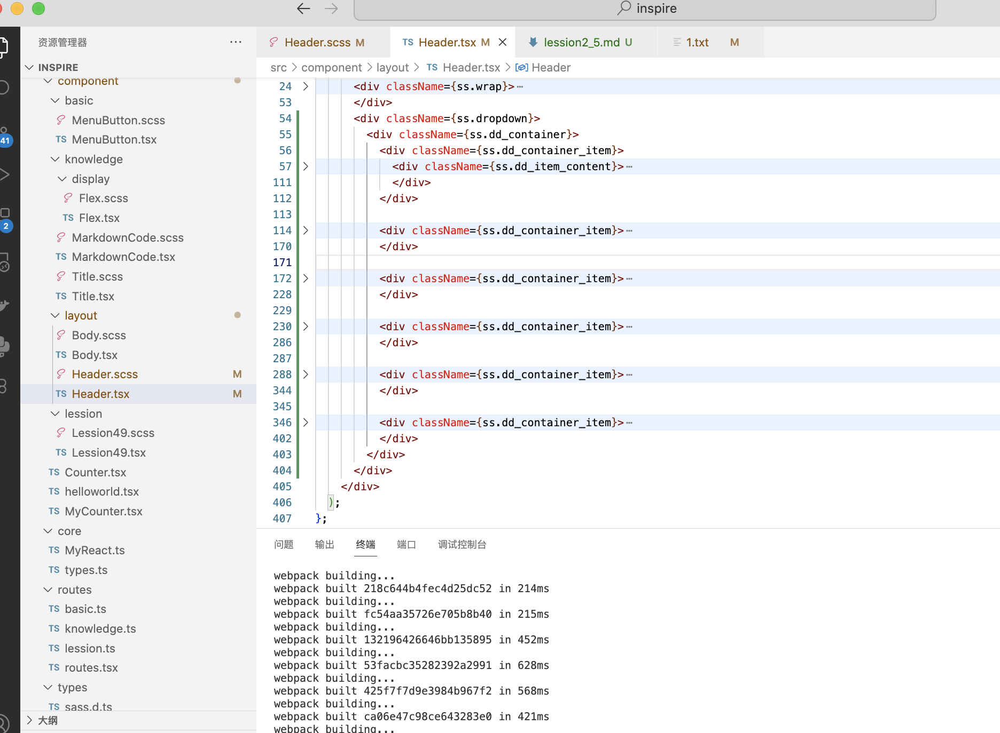
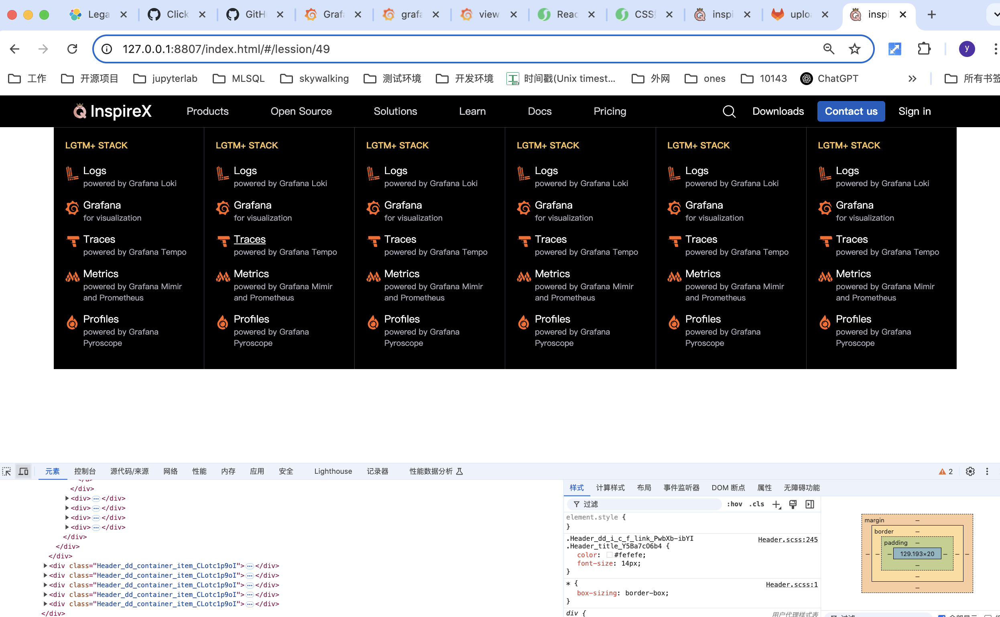

# 这节课我们来实现第一个下拉菜单


定义外层容器和内层内容区域

**src/component/layout/Header.tsx** 
```tsx
const Header: React.FC = () => {
  console.log(1);
  return (
    <div className={ss.frame}>
      <div className={ss.wrap}>
        <div>
          <a className={ss.logo_a}>
            
            
          </a>
        </div>
        <div className={ss.primary}>
          <div className={ss.primary_item}>Products</div>
          <div className={ss.primary_item}>Open Source</div>
          <div className={ss.primary_item}>Solutions</div>
          <div className={ss.primary_item}>Learn</div>
          <div className={ss.primary_item}>Docs</div>
          <div className={ss.primary_item}>Pricing</div>
        </div>
        <div className={ss.secondary}>
          <div className={ss.search_container}>
            
          </div>
          <div className={ss.download}><span>Downloads</span></div>
          <div className={ss.contact_us}><span>Contact us</span></div>
          <div className={ss.download}><span>Sign in</span></div>
        </div>
        <div className={ss.mobile_container}>
          <div className={ss.search_container}>
            
          </div>
          <MenuButton size={20} backgroundColor="#000" />
        </div>
      </div>
      <div>                                            // 新增
        <div>1</div>
      </div>
    </div>
  );
};
```

查看效果


设置 container 固定宽度并居中

**src/component/layout/Header.tsx** 
```tsx
      <div className={ss.dropdown}>
        <div className={ss.dd_container}>1</div>
      </div>
```

**src/component/layout/Header.scss** 
```scss
.dropdown {
  position: absolute;
  top: 44px;
  left: 0;
  right: 0;
}

.dd_container {
  width: 1250px;
  position: absolute;
  left: 50%;
  transform: translateX(-50%);
  background-color: #000;
}
```

查看效果


设置一个上边框更美观

**src/component/layout/Header.scss** 
```scss

.dd_container {
  width: 1250px;
  position: absolute;
  left: 50%;
  transform: translateX(-50%);
  background-color: #000;

    border-top: 1px solid #393946;
}
```

设置 dd_container 为 flex 布局，并先占位两个 div 看效果

**src/component/layout/Header.tsx** 
```tsx
      <div className={ss.dropdown}>
        <div className={ss.dd_container}>
          <div>1</div>
          <div>2</div>
        </div>
      </div>
```

**src/component/layout/Header.scss** 
```scss
.dd_container {
  width: 1250px;
  position: absolute;
  left: 50%;
  transform: translateX(-50%);
  background-color: #000;

  border-top: 1px solid #393946;

  color: #fff;
  display: flex;
}
```

保存，看效果


设置 flex item 子项，让每个子项等分占满 container

**src/component/layout/Header.tsx** 
```tsx
      <div className={ss.dropdown}>
        <div className={ss.dd_container}>
          <div className={ss.dd_container_item}>1</div>
          <div className={ss.dd_container_item}>2</div>
        </div>
      </div>
```

**src/component/layout/Header.scss** 
```scss
.dd_container_item {
  flex: 0 1 100%;
}
```

```css
flex: 0 1 100%;
```

### 简写规则
flex: <flex-grow> <flex-shrink> <flex-basis>;

所以，flex: 0 1 100%;等价于：

```code
​​flex-grow: 0​​ - 增长因子为 0
​​flex-shrink: 1​​ - 收缩因子为 1
​​flex-basis: 100%​​ - 010%意味着这个项目希望占据其 Flex 容器（Flex Container）​​宽度的 100%​​
```
即每个项目都期望占满父元素的100%（在父元素设置了宽度的情况下）
初始按照父元素100%来分配宽度，总宽度为 n * 100%，之后再按照规则 ​flex-shrink: 1 等比收缩
再加上默认的 flex-wrap: nowrap ，多个 item 之间即使超过宽度也不换行
即占满等分父元素空间


编写内容1区域

新建一个内容区域 div，给一个 1rem 的 padding

**src/component/layout/Header.tsx** 
```tsx
      <div className={ss.dropdown}>
        <div className={ss.dd_container}>
          <div className={ss.dd_container_item}>
            <div className={ss.dd_item_content}>1</div>
          </div>
          <div className={ss.dd_container_item}>2</div>
        </div>
      </div>
```


**src/component/layout/Header.scss** 
```scss
.dd_item_content {
  padding: 1rem;
}
```

编写 title 区域

**src/component/layout/Header.tsx** 
```tsx
      <div className={ss.dropdown}>
        <div className={ss.dd_container}>
          <div className={ss.dd_container_item}>
            <div className={ss.dd_item_content}>
              <div className={ss.dd_item_title}>LGTM+ Stack</div>
              <div>22</div>
            </div>
          </div>
          <div className={ss.dd_container_item}>2</div>
        </div>
      </div>
```


**src/component/layout/Header.scss** 
```scss
.dd_item_title {
  font-size: 12px;
  font-weight: 600;
  line-height: 17.4px;
  text-transform: uppercase;
  color: #fbc55a;
}
```


跟下面区域贴太紧，可以给一个 padding-bottom

**src/component/layout/Header.scss** 
```scss
.dd_item_title {
  font-size: 12px;
  font-weight: 600;
  line-height: 17.4px;
  text-transform: uppercase;
  color: #fbc55a;

  padding-bottom: 1rem;
}
```

**src/component/layout/Header.tsx** 
```tsx
      <div className={ss.dropdown}>
        <div className={ss.dd_container}>
          <div className={ss.dd_container_item}>
            <div className={ss.dd_item_content}>
              <div className={ss.dd_item_title}>LGTM+ Stack</div>
              <div className={ss.dd_item_content_flex}>
                <div>111</div>
                <div>222</div>
                <div>333</div>
              </div>
            </div>
          </div>
          <div className={ss.dd_container_item}>2</div>
        </div>
      </div>
```


**src/component/layout/Header.scss** 
```scss
.dd_item_content_flex {
  display: flex;
  flex-direction: column;
}
```

编写 icon 区域

为了方便跳转，我们把每个元素都包在一个 a 标签里

**src/component/layout/Header.tsx** 
```tsx
      <div className={ss.dropdown}>
        <div className={ss.dd_container}>
          <div className={ss.dd_container_item}>
            <div className={ss.dd_item_content}>
              <div className={ss.dd_item_title}>LGTM+ Stack</div>
              <div className={ss.dd_item_content_flex}>
                <div>
                  <a href="/"  className={ss.dd_i_c_f_link}>
                    <div>icon</div>
                    <div>word</div>
                  </a>
                </div>
                <div>222</div>
                <div>333</div>
              </div>
            </div>
          </div>
          <div className={ss.dd_container_item}>2</div>
        </div>
      </div>
```


**src/component/layout/Header.scss** 
```scss
.dd_i_c_f_link {

}
```


取消 a 标签默认的下划线，设置字体颜色

**src/component/layout/Header.scss** 
```scss
.dd_i_c_f_link {
  color: #fff;
  text-decoration: none;
}

设置为 flex 横向布局

**src/component/layout/Header.scss** 
```scss
.dd_i_c_f_link {
  color: #fff;
  text-decoration: none;

  display: flex;
  column-gap: 5px;
}
```


拷贝所有 icon 到目录 src/assets/product 下


替换 icon ，并主动设置一下 宽高，防止不同icon大小不一样导致布局乱掉

**src/component/layout/Header.tsx** 
```tsx
        <div className={ss.dd_container}>
          <div className={ss.dd_container_item}>
            <div className={ss.dd_item_content}>
              <div className={ss.dd_item_title}>LGTM+ Stack</div>
              <div className={ss.dd_item_content_flex}>
                <div>
                  <a href="/"  className={ss.dd_i_c_f_link}>
                    </img>
                    <div>word</div>
                  </a>
                </div>
                <div>222</div>
                <div>333</div>
              </div>
            </div>
          </div>
          <div className={ss.dd_container_item}>2</div>
        </div>
      </div>
```


**src/component/layout/Header.scss** 
```scss
.dd_i_c_f_link {
  color: #fff;
  text-decoration: none;

  display: flex;
  column-gap: 5px;

  .icon {
      width: 20px;
      height: 20px;
  }
}
```


编写 文字区域

**src/component/layout/Header.tsx** 
```tsx
      <div className={ss.dropdown}>
        <div className={ss.dd_container}>
          <div className={ss.dd_container_item}>
            <div className={ss.dd_item_content}>
              <div className={ss.dd_item_title}>LGTM+ Stack</div>
              <div className={ss.dd_item_content_flex}>
                <div>
                  <a href="/"  className={ss.dd_i_c_f_link}>
                    </img>
                    <div>
                      <div className={ss.title}>title</div>
                      <div className={ss.desc}>description</div>
                    </div>
                  </a>
                </div>
                <div>222</div>
                <div>333</div>
              </div>
            </div>
          </div>
          <div className={ss.dd_container_item}>2</div>
        </div>
      </div>
```


**src/component/layout/Header.scss** 
```scss
.dd_i_c_f_link {
  color: #fff;
  text-decoration: none;

  display: flex;
  column-gap: 5px;

  .icon {
      width: 20px;
      height: 20px;
  }

  .title {

  }

  .desc {
    
  }
}
```


设置 title 和 desc 字体颜色

**src/component/layout/Header.scss** 
```scss
.dd_i_c_f_link {
  color: #fff;
  text-decoration: none;

  display: flex;
  column-gap: 5px;

  .icon {
      width: 20px;
      height: 20px;
  }

  .title {
    color: #fefefe;
    font-size: 14px;
  }

  .desc {
    color: #aeaebc;
    font-size: 11px;
  }
}
```


发现图标看起来比文字高，这是因为文字块行高又顶部空余


调节图标位置，让图片和 title 视觉对齐

**src/component/layout/Header.scss** 
```scss
  .icon {
      width: 20px;
      height: 20px;
      margin-top: 0.25rem;
  }
```


发现和第二个区域贴的有点紧，可以给一个 padding-bottom

```scss
.dd_i_c_f_link {
  color: #fff;
  text-decoration: none;

  display: flex;
  column-gap: 5px;

  padding-bottom: 0.75rem;

  .icon {
      width: 20px;
      height: 20px;
      margin-top: 0.25rem;
  }

  .title {
    color: #fefefe;
    font-size: 14px;
  }

  .desc {
    color: #aeaebc;
    font-size: 11px;
  }
}
```


设置 a 标签 hover 事件，鼠标 hover 时 title 添加下划线

**src/component/layout/Header.scss** 
```scss
.dd_i_c_f_link {
  color: #fff;
  text-decoration: none;

  display: flex;
  column-gap: 5px;

  padding-bottom: 0.75rem;

  &:hover .title {
    text-decoration: underline;
  }

  .icon {
      width: 20px;
      height: 20px;
      margin-top: 0.25rem;
  }

  .title {
    color: #fefefe;
    font-size: 14px;
  }

  .desc {
    color: #aeaebc;
    font-size: 11px;
  }
}
```


复制粘贴把其他 icon 也添加上去

**src/component/layout/Header.tsx** 
```tsx
      <div className={ss.dropdown}>
        <div className={ss.dd_container}>
          <div className={ss.dd_container_item}>
            <div className={ss.dd_item_content}>
              <div className={ss.dd_item_title}>LGTM+ Stack</div>
              <div className={ss.dd_item_content_flex}>
                <div>
                  <a href="/"  className={ss.dd_i_c_f_link}>
                    </img>
                    <div>
                      <div className={ss.title}>Logs</div>
                      <div className={ss.desc}>powered by Grafana Loki</div>
                    </div>
                  </a>
                </div>

                <div>
                  <a href="/"  className={ss.dd_i_c_f_link}>
                    </img>
                    <div>
                      <div className={ss.title}>Grafana</div>
                      <div className={ss.desc}>for visualization</div>
                    </div>
                  </a>
                </div>

                <div>
                  <a href="/"  className={ss.dd_i_c_f_link}>
                    </img>
                    <div>
                      <div className={ss.title}>Traces</div>
                      <div className={ss.desc}>powered by Grafana Tempo</div>
                    </div>
                  </a>
                </div>

                <div>
                  <a href="/"  className={ss.dd_i_c_f_link}>
                    </img>
                    <div>
                      <div className={ss.title}>Metrics</div>
                      <div className={ss.desc}>powered by Grafana Mimir and Prometheus</div>
                    </div>
                  </a>
                </div>

                <div>
                  <a href="/"  className={ss.dd_i_c_f_link}>
                    </img>
                    <div>
                      <div className={ss.title}>Profiles</div>
                      <div className={ss.desc}>powered by Grafana Pyroscope</div>
                    </div>
                  </a>
                </div>

              </div>
            </div>
          </div>
          <div className={ss.dd_container_item}>2</div>
        </div>
      </div>
```


为了查看效果，我们再简单复制 5 个区块1



查看效果


最后在每个区块间添加一条分割线

**src/component/layout/Header.scss** 
```scss
.dd_container_item {
  flex: 0 1 100%;
}

.dd_container_item:not(:last-of-type) {    // 表示 同级的 dd_container_item，只要不是（not）最后一个（last-of-type）就添加 border-right
  border-right: 1px solid #393946;
}
```



完成！！

下节课我们通过数据驱动，自动生成菜单项，避免在代码里进行大面积的复制粘贴


