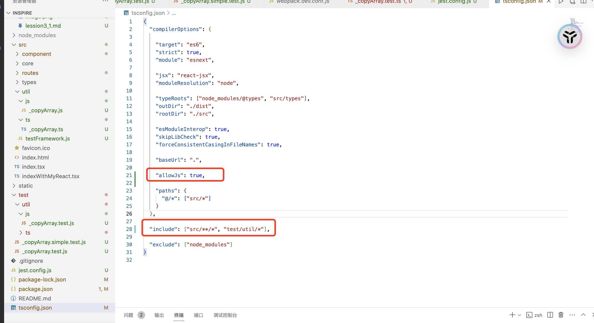
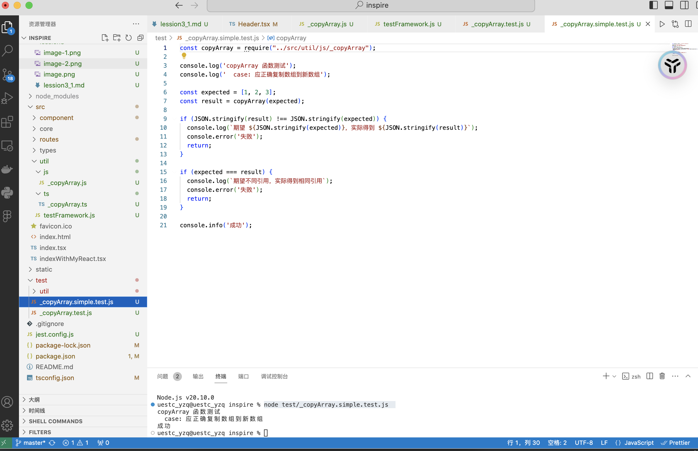
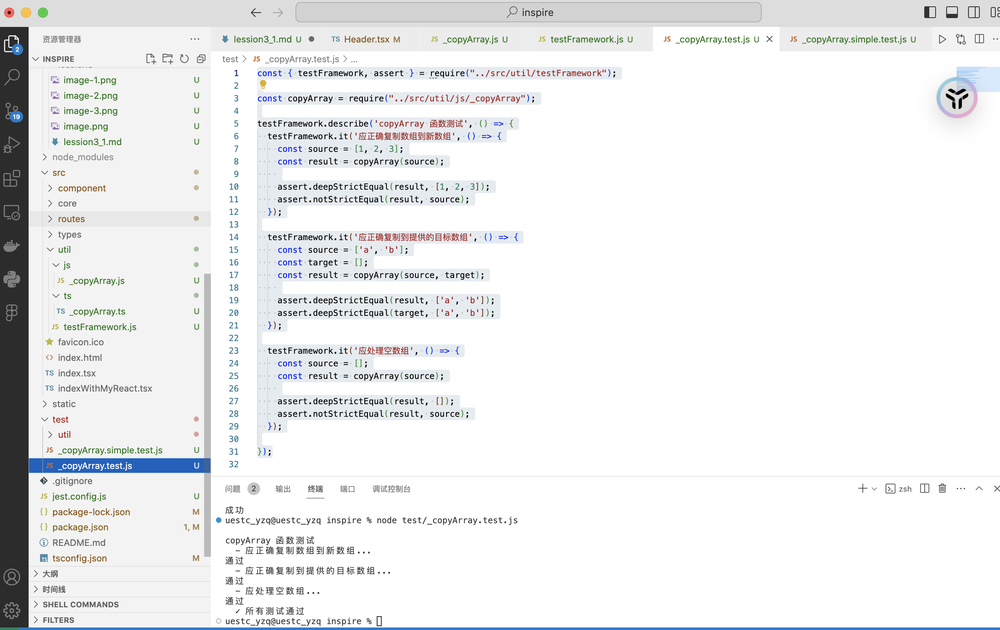
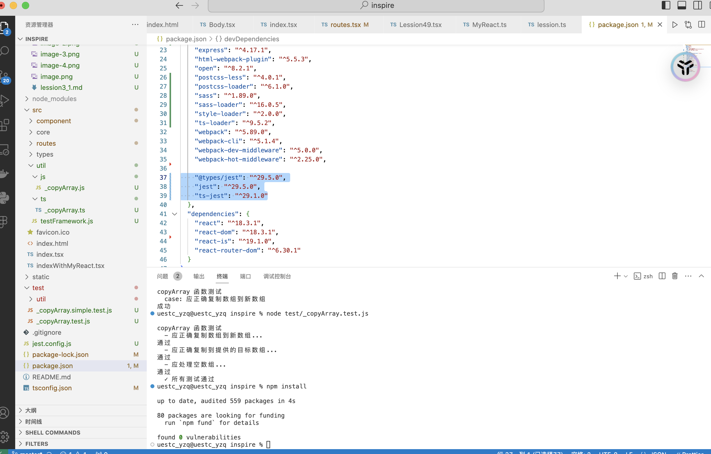
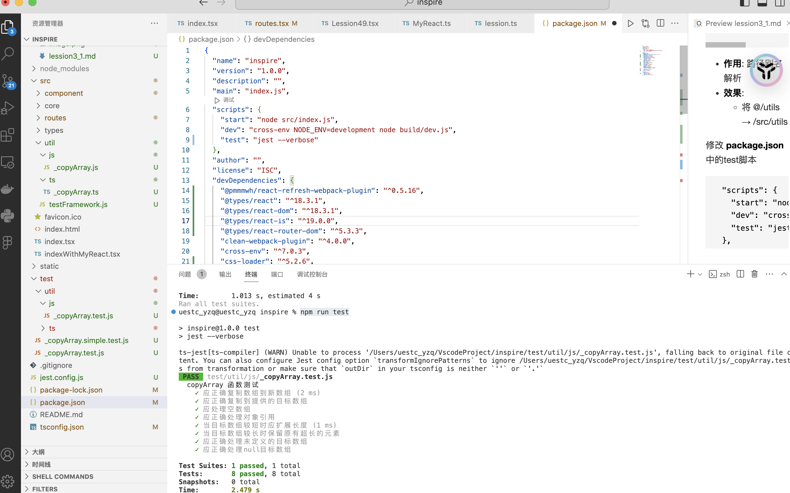
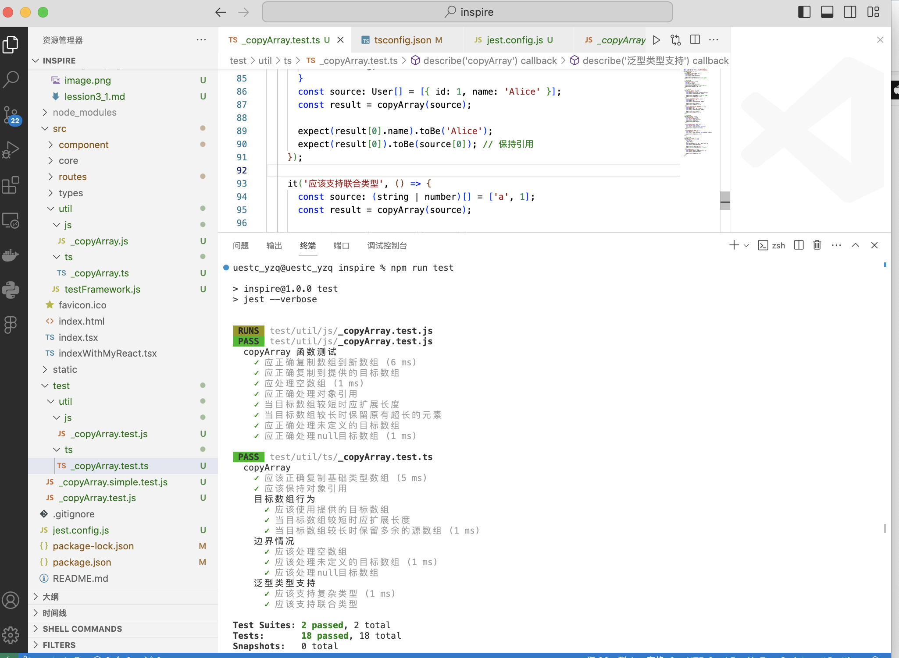

# 基础语法训练
我们会同时采用 js 和 ts 实现所有语法训练

新建 **src/util** 目录，用于存放后面的所有语法训练函数

新建 **test/util** 目录，用于存放后面的所有测试用例

在 **tsconfig.json** 中添加 js 语法支持
```json
{
  "compilerOptions": {

    "target": "es6",
    "strict": true,
    "module": "esnext",

    "jsx": "react-jsx",
    "moduleResolution": "node",

    "typeRoots": ["node_modules/@types", "src/types"],
    "outDir": "./dist",
    "rootDir": "./src",

    "esModuleInterop": true,
    "skipLibCheck": true,
    "forceConsistentCasingInFileNames": true,

    "baseUrl": ".",

    "allowJs": true,

    "paths": {
      "@/*": ["src/*"]
    }
  },

  "include": ["src/**/*", "test/util/*"],

  "exclude": ["node_modules"]
}
```



## 实现数组拷贝函数

**需求**
```js
/**
 * ​将 source 的值复制到 array 中。
 *
 * @private
 * @param {Array} source 要拷贝值的源数组.
 * @param {Array} [array=[]] 要拷贝值的目标数组（可选，默认为空数组）。
 * @returns {Array} 返回 array。
 */
function copyArray(source, array) {
  // ...
}
```

### **JS实现**
新建 **src/util/js/_copyArray.js** 文件
```js
/**
 * ​将 source 的值复制到 array 中。
 *
 * @private
 * @param {Array} source 要拷贝值的源数组.
 * @param {Array} [array=[]] 要拷贝值的目标数组（可选，默认为空数组）。
 * @returns {Array} 返回 array。
 */
function copyArray(source, array) {
  var index = -1,
      length = source.length;

  array || (array = Array(length));
  while (++index < length) {
    array[index] = source[index];
  }
  return array;
}

module.exports = copyArray;
```

考虑边界情况，当 array 为 null 时，初始化 array
```js
  // 我们可以用逻辑 || 或者 && 来替代一些简单的 if else 判断， 当 array 为 null 时，后面的代码才会执行
  array || (array = Array(length));
```

```js
  // 前缀++运算符，先把 index + 1 再执行 < 判定
  while (++index < length) 
```

导出 copyArray 函数，供给别人使用
```js
// 这里只需要导出一个方法，可以直接导出，不需要再用 {} 包一层
module.exports = copyArray;
```

## 编写测试代码

### 实现一个简单的测试方法
新建 **test/util/_copyArray.simple.test.js**
```js
const copyArray = require("../src/util/js/_copyArray");

console.log('copyArray 函数测试');
console.log('  case: 应正确复制数组到新数组');

const expected = [1, 2, 3];
const result = copyArray(expected);

if (JSON.stringify(result) !== JSON.stringify(expected)) {
  console.log(`期望 ${JSON.stringify(expected)}，实际得到 ${JSON.stringify(result)}`);
  console.error('失败');
  return;
}

if (expected === result) {
  console.log(`期望不同引用，实际得到相同引用`);
  console.error('失败');
  return;
}

console.info('成功');
```

```js
// 把一个对象转换成 json 字符串，通过对比两个字符串是否一样来判定两个数组是否相等
JSON.stringify(result)

// 也可以手写一个 equals 方法，依次判定两个数组的长度，元素是否一一对应相等
```

运行测试用例

```
node test/_copyArray.simple.test.js 
```


测试通过


**从上面的例子可以看到，手写起来相当繁琐，接下来我们把一些通用的逻辑提取出来，写一个简单的测试框架**

新建 **/src/util/testFrameWork.js**
```js
// 手写简易测试框架
const testFramework = {

  describe(description, testSuite) {
    console.log(`\n${description}`);
    try {
      testSuite();
      console.log('  ✓ 所有测试通过');
    } catch (error) {
      console.error(`  ✘ 测试失败: ${error.message}`);
    }
  },
  
  it(testName, testCase) {
    console.log(`  - ${testName}... `);
    try {
      testCase();
      console.log('通过');
    } catch (error) {
      console.log('失败');
      throw error;
    }
  }
};

// 手写 assert 断言库
const assert = {

  
  deepStrictEqual(actual, expected) {
    if (JSON.stringify(actual) !== JSON.stringify(expected)) {
      throw new Error(`期望 ${JSON.stringify(expected)}，实际得到 ${JSON.stringify(actual)}`);
    }
  },
  
  notStrictEqual(actual, expected) {
    if (actual === expected) {
      throw new Error(`期望不同引用，实际得到相同引用`);
    }
  }
};

module.exports = {
  testFramework,
  assert
}

```

新建 **/src/util/_copyArray.test.js** 测试用例，这次我们可以多写几个 case
```js
const { testFramework, assert } = require("../src/util/testFramework");

const copyArray = require("../src/util/js/_copyArray");

testFramework.describe('copyArray 函数测试', () => {
  testFramework.it('应正确复制数组到新数组', () => {
    const source = [1, 2, 3];
    const result = copyArray(source);
    
    assert.deepStrictEqual(result, [1, 2, 3]);
    assert.notStrictEqual(result, source);
  });

  testFramework.it('应正确复制到提供的目标数组', () => {
    const source = ['a', 'b'];
    const target = [];
    const result = copyArray(source, target);
    
    assert.deepStrictEqual(result, ['a', 'b']);
    assert.deepStrictEqual(target, ['a', 'b']);
  });

  testFramework.it('应处理空数组', () => {
    const source = [];
    const result = copyArray(source);
    
    assert.deepStrictEqual(result, []);
    assert.notStrictEqual(result, source);
  });

});
```

再次运行测试用例
```
node test/_copyArray.test.js
```


运行成功


## 使用专业的开源测试框架**Jest**

在 package.json devDependencies 中引入依赖
```json
  "devDependencies": {
    //...

    "@types/jest": "^29.5.0",
    "jest": "^29.5.0",
    "ts-jest": "^29.1.0"

  },
```

安装
```
npm install
```


新建 **test/util/js/_copyArray.test.js** 测试用例文件
```js
const assert = require('assert');
const copyArray = require('@/util/js/_copyArray.js');

describe('copyArray 函数测试', () => {


  it('应正确复制数组到新数组', () => {
    const source = [1, 2, 3];
    const result = copyArray(source);
    
    assert.deepStrictEqual(result, [1, 2, 3]);
    assert.notStrictEqual(result, source); // 验证不是同一个引用
  });


  it('应正确复制到提供的目标数组', () => {
    const source = ['a', 'b', 'c'];
    const target = [];
    const result = copyArray(source, target);
    
    assert.deepStrictEqual(result, ['a', 'b', 'c']);
    assert.strictEqual(result, target); // 验证是同一个引用
  });


  it('应处理空数组', () => {
    const source = [];
    const result = copyArray(source);
    
    assert.deepStrictEqual(result, []);
    assert.strictEqual(result.length, 0);
  });


  it('应正确处理对象引用', () => {
    const obj = { id: 1 };
    const source = [obj];
    const result = copyArray(source);
    
    assert.deepStrictEqual(result, [{ id: 1 }]);
    assert.strictEqual(result[0], obj); // 验证对象引用相同
  });


  it('当目标数组较短时应扩展长度', () => {
    const source = [1, 2, 3];
    const target = [0]; // 长度不足
    const result = copyArray(source, target);
    
    assert.deepStrictEqual(result, [1, 2, 3]);
    assert.strictEqual(result.length, 3);
  });


  it('当目标数组较长时保留原有超长的元素', () => {
    const source = [1];
    const target = [0, 0, 0]; // 长度过长
    const result = copyArray(source, target);
    
    assert.deepStrictEqual(result, [1, 0, 0]);
    assert.strictEqual(result.length, 3);
  });


  it('应正确处理未定义的目标数组', () => {
    const source = [true, false];
    const result = copyArray(source, undefined);
    
    assert.deepStrictEqual(result, [true, false]);
  });


  it('应正确处理null目标数组', () => {
    const source = ['x', 'y'];
    const result = copyArray(source, null);
    
    assert.deepStrictEqual(result, ['x', 'y']);
  });


});
```

新建 **jest.config.js** Jest配置文件
```js
module.exports = {
  preset: 'ts-jest',
  testEnvironment: 'node',
  transform: {
    '^.+\\.(ts|js)x?$': 'ts-jest',
  },
  moduleFileExtensions: ['ts', 'js', 'json', 'node'],
  testMatch: [
    '<rootDir>/test/util/**/*.test.ts',
    '<rootDir>/test/util/**/*.test.js'
  ],
  modulePathIgnorePatterns: ['<rootDir>/dist/'],
  moduleNameMapper: {
    '^@/(.*)$': '<rootDir>/src/$1'
  },
};
```

```
preset: 'ts-jest'
```
  - **作用**: 使用 ts-jest 预设配置
  - **​效果​​**: 
    - ​自动配置 TypeScript 支持
    - ​​内置 source map 处理

---


```
testEnvironment: 'node'
```
  - **作用**: 指定测试运行在 Node.js 环境

---


```
  transform: {
    '^.+\\.(ts|js)x?$': 'ts-jest',
  }
```
  - **作用**: 同时处理 TS 和 JS 文件（需配合 allowJs）
  - **​效果​​**: 
    - 匹配 .ts 或 .js 扩展名,使用 ts-jest 处理器统一处理


---


```
  moduleFileExtensions: ['ts', 'js', 'json', 'node']
```
  - **作用**: 指定模块查找时尝试填充的后缀名

---


```
  testMatch: [
    '<rootDir>/test/util/**/*.test.ts',
    '<rootDir>/test/util/**/*.test.js'
  ]
```
  - **作用**: 测试文件匹配
  - **​说明​​**: 
    - **\<rootDir>**：Jest内置的变量，项目根目录

---

```
  moduleNameMapper: {
    '^@/(.*)$': '<rootDir>/src/$1'
  }
```
  - **作用**: ​​路径别名解析​​
  - **​效果​​**: 
    - 将 @/utils → <rootDir>/src/utils


修改 **package.json** 中的test脚本
```
  "scripts": {
    "start": "node src/index.js",
    "dev": "cross-env NODE_ENV=development node build/dev.js",
    "test": "jest --verbose"
  },
```

运行 test 脚本
```
npm run test
```



### **TS实现**
新建 **src/util/ts/_copyArray.ts**, 改用 ts 实现 copyArray
```ts
function copyArray<T>(source: T[], array?: T[]): T[] {
  let index = -1;
  const length = source.length;

  array || (array = new Array(length));
  while (++index < length) {
    array[index] = source[index];
  }
  return array;
}

export default copyArray;
```

新建 **test/util/ts/_copyArray.test.ts** 测试用例
```ts
import { describe, it, expect } from '@jest/globals';
import copyArray from '../../../src/util/ts/_copyArray';

describe('copyArray', () => {
  // 基础功能测试
  it('应该正确复制基础类型数组', () => {
    const source = [1, 2, 3];
    const result = copyArray(source);
    
    expect(result).toEqual([1, 2, 3]);
    expect(result).not.toBe(source); // 验证是新数组
  });

  // 对象引用测试
  it('应该保持对象引用', () => {
    const obj = { id: 1 };
    const source = [obj];
    const result = copyArray(source);
    
    expect(result[0]).toBe(obj); // 验证对象引用相同
    expect(result).toEqual([{ id: 1 }]);
  });

  // 目标数组测试
  describe('目标数组行为', () => {
    it('应该使用提供的目标数组', () => {
      const source = ['a', 'b'];
      const target: Array<string> = new Array<string>();
      const result = copyArray(source, target);
      
      expect(result).toBe(target); // 验证是同一个数组
      expect(result).toEqual(['a', 'b']);
    });

    it('当目标数组较短时应扩展长度', () => {
      const source = [1, 2, 3];
      const target = [0]; 
      const result = copyArray(source, target);
      
      expect(result.length).toBe(3);
      expect(result).toEqual([1, 2, 3]);
    });

    it('当目标数组较长时保留多余的源数组', () => {
      const source = [1];
      const target = [0, 0, 0]; // 长度过长
      const result = copyArray(source, target);
      
      expect(result.length).toBe(3);
      expect(result).toEqual([1, 0, 0]);
    });
  });

  // 边界情况测试
  describe('边界情况', () => {
    it('应该处理空数组', () => {
      const source: number[] = [];
      const result = copyArray(source);
      
      expect(result).toEqual([]);
      expect(result.length).toBe(0);
    });

    it('应该处理未定义的目标数组', () => {
      const source = [true, false];
      const result = copyArray(source, undefined);
      
      expect(result).toEqual([true, false]);
    });

    it('应该处理null目标数组', () => {
      const source = ['x', 'y'];
      const result = copyArray(source, null as unknown as any[]);
      
      expect(result).toEqual(['x', 'y']);
    });
  });

  // 泛型类型测试
  describe('泛型类型支持', () => {
    it('应该支持复杂类型', () => {
      interface User {
        id: number;
        name: string;
      }
      const source: User[] = [{ id: 1, name: 'Alice' }];
      const result = copyArray(source);
      
      expect(result[0].name).toBe('Alice');
      expect(result[0]).toBe(source[0]); // 保持引用
    });

    it('应该支持联合类型', () => {
      const source: (string | number)[] = ['a', 1];
      const result = copyArray(source);
      
      expect(result).toEqual(['a', 1]);
    });
  });
});
```

再次运行 test 脚本

```
npm run test
```



可以看到测试通过