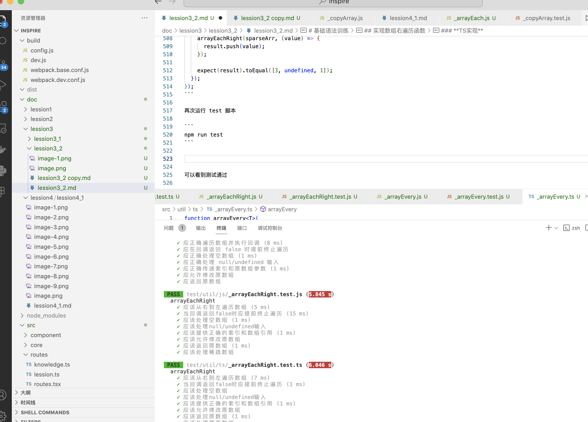

# 基础语法训练

## 实现数组遍历函数

**需求**
```js
/**
 * arrayEach 函数用于遍历数组，并对每个元素执行一个给定的函数（iteratee）。如果在执行过程中，iteratee 返回 false，遍历会提前终止。
 *
 * @param {Array} [array] The array to iterate over.
 * @param {Function} iteratee The function invoked per iteration.
 * @returns {Array} Returns `array`.
 */
function arrayEach(array, iteratee) {
  // ...
}
```

### **JS实现**
新建 **src/util/js/_arrayEach.js** 文件
```js
function arrayEach(array, iteratee) {
  var index = -1,
      length = array == null ? 0 : array.length;

  while (++index < length) {
    if (iteratee(array[index], index, array) === false) {
      break;
    }
  }
  return array;
}

module.exports = arrayEach;
```


新建 **test/util/js/_arrayEach.test.js** 测试用例文件
```js
const assert = require('assert');
const arrayEach = require('@/util/js/_arrayEach.js');

describe('arrayEach 函数测试', () => {
  it('应正确遍历数组并执行回调', () => {
    const arr = [1, 2, 3];
    const result = [];
    arrayEach(arr, (value) => {
      result.push(value * 2);
    });

    assert.deepStrictEqual(result, [2, 4, 6]);
  });

  it('应在回调返回 false 时提前终止遍历', () => {
    const arr = ['a', 'b', 'c', 'd'];
    const result = [];
    arrayEach(arr, (value, index) => {
      result.push(value);
      if (index === 1) return false;
    });

    assert.deepStrictEqual(result, ['a', 'b']);
  });

  it('应正确处理空数组', () => {
    const emptyArr = [];
    let called = false;
    arrayEach(emptyArr, () => {
      called = true; // 不应执行
    });

    assert.strictEqual(called, false);
  });

  it('应正确处理 null/undefined 输入', () => {
    let called = false;
    arrayEach(null, () => {
      called = true; // 不应执行
    });
    assert.strictEqual(called, false);

    called = false;
    arrayEach(undefined, () => {
      called = true; // 不应执行
    });
    assert.strictEqual(called, false);
  });

  it('应正确传递索引和原数组参数', () => {
    const arr = [10, 20, 30];
    arrayEach(arr, (value, index, array) => {
      assert.strictEqual(array, arr);
      assert.strictEqual(value, arr[index]);
    });
  });

  it('应允许修改原数组', () => {
    const arr = [1, 2, 3];
    arrayEach(arr, (value, index, array) => {
      array[index] = value * 10;
    });

    assert.deepStrictEqual(arr, [10, 20, 30]);
  });

  it('应返回原数组', () => {
    const arr = [5, 6, 7];
    const returned = arrayEach(arr, () => {});

    assert.strictEqual(returned, arr);
  });
});
```


### **TS实现**
新建 **src/util/ts/_arrayEach.ts**, 改用 ts 实现 _arrayEach
```ts
function arrayEach<T>(
  array: T[] | null | undefined,
  iteratee: (value: T, index: number, array: T[]) => boolean | void
): T[] | null | undefined {
  
  if (!array) {
    return array;
  }

  let index = -1;
  const length = array.length;

  while (++index < length) {
    if (iteratee(array[index], index, array) === false) {
      break;
    }
  }
  return array;
}

export default arrayEach;
```

新建 **test/util/ts/_arrayEach.test.ts** 测试用例
```ts
import { describe, it, expect } from '@jest/globals';
import arrayEach from '../../../src/util/ts/_arrayEach';

describe('arrayEach 数组遍历函数测试', () => {
  // 测试1: 基本遍历功能
  it('应该正确遍历数字数组并执行回调', () => {
    const arr = [1, 2, 3];
    const result: number[] = [];
    
    arrayEach(arr, (value) => {
      result.push(value * 2);
    });

    expect(result).toEqual([2, 4, 6]);
  });

  // 测试2: 提前终止功能
  it('当回调返回false时应提前终止遍历', () => {
    const arr = ['苹果', '香蕉', '橙子', '西瓜'];
    const result: string[] = [];
    
    arrayEach(arr, (value, index) => {
      result.push(value);
      if (value === '香蕉') return false;
    });

    expect(result).toEqual(['苹果', '香蕉']);
  });

  // 测试3: 空数组处理
  it('应该正确处理空数组', () => {
    const emptyArr: number[] = [];
    let 调用次数 = 0;
    
    arrayEach(emptyArr, () => {
      调用次数++;
    });

    expect(调用次数).toBe(0);
  });

  // 测试4: null/undefined 输入处理
  it('应该正确处理null/undefined输入并返回空数组', () => {
    const null结果 = arrayEach(null, () => {});
    const undefined结果 = arrayEach(undefined, () => {});
    
    expect(null结果).toEqual(null);
    expect(undefined结果).toEqual(undefined);
  });

  // 测试5: 参数验证
  it('应该提供正确的索引和数组引用', () => {
    const arr = [10, 20, 30];
    
    arrayEach(arr, (值, 索引, 当前数组) => {
      expect(当前数组).toBe(arr);
      expect(值).toBe(arr[索引]);
    });
  });

  // 测试6: 修改原数组功能
  it('应该允许修改原始数组', () => {
    const arr = [1, 2, 3];
    
    arrayEach(arr, (值, 索引, 当前数组) => {
      当前数组[索引] = 值 * 10;
    });

    expect(arr).toEqual([10, 20, 30]);
  });

  // 测试7: 返回值验证
  it('对于非空输入应该返回原数组', () => {
    const arr = ['A', 'B', 'C'];
    const 返回值 = arrayEach(arr, () => {});
    
    expect(返回值).toBe(arr);
  });

  // 测试8: 复杂对象类型处理
  it('应该正确处理复杂对象类型', () => {
    interface 用户 {
      id: number;
      name: string;
      年龄: number;
    }
    
    const 用户列表: 用户[] = [
      { id: 1, name: '张三', 年龄: 25 },
      { id: 2, name: '李四', 年龄: 30 }
    ];
    
    const 名称列表: string[] = [];
    arrayEach(用户列表, (用户) => {
      名称列表.push(用户.name);
    });

    expect(名称列表).toEqual(['张三', '李四']);
  });

  // 测试9: 稀疏数组处理
  it('应该正确处理稀疏数组', () => {
    const 稀疏数组 = [1, , 3]; // 注意中间是空位
    const 结果: any[] = [];
    
    arrayEach(稀疏数组, (值) => {
      结果.push(值);
    });

    expect(结果).toEqual([1, undefined, 3]);
  });
});
```

再次运行 test 脚本

```
npm run test
```


可以看到测试通过


## 实现数组右遍历函数

**需求**
```js
/**
 * arrayEachRight 函数用于遍历数组，从数组结尾开始，
 * 并对每个元素执行一个给定的函数（iteratee）。如果在执行过程中，iteratee 返回 false，遍历会提前终止。
 *
 * @param {Array} [array] The array to iterate over.
 * @param {Function} iteratee The function invoked per iteration.
 * @returns {Array} Returns `array`.
 */
function arrayEachRight(array, iteratee) {
  // ...
}
```

### **JS实现**
新建 **src/util/js/_arrayEachRight.js** 文件
```js
function arrayEachRight(array, iteratee) {
  var length = array == null ? 0 : array.length;

  while (length--) {
    if (iteratee(array[length], length, array) === false) {
      break;
    }
  }
  return array;
}

module.exports = arrayEachRight;
```


新建 **test/util/js/_arrayEachRight.test.js** 测试用例文件
```js
const assert = require('assert');
const arrayEachRight = require('@/util/js/_arrayEachRight.js');


describe('arrayEachRight', function() {
  it('应该从右到左遍历数组', function() {
    const arr = [1, 2, 3];
    const result = [];
    
    arrayEachRight(arr, function(value) {
      result.push(value);
    });

    assert.deepStrictEqual(result, [3, 2, 1]);
  });

  it('当回调返回false时应提前终止遍历', function() {
    const arr = ['a', 'b', 'c', 'd'];
    const result = [];
    
    arrayEachRight(arr, function(value, index) {
      result.push(value);
      if (index === 2) return false; // 遍历到 'b' 时终止
    });

    assert.deepStrictEqual(result, ['d', 'c']);
  });

  it('应该处理空数组', function() {
    const emptyArr = [];
    var callCount = 0;
    
    arrayEachRight(emptyArr, function() {
      callCount++;
    });

    assert.strictEqual(callCount, 0);
  });

  it('应该处理null/undefined输入', function() {
    var callCount = 0;
    arrayEachRight(null, function() {
      callCount++;
    });
    assert.strictEqual(callCount, 0);

    callCount = 0;
    arrayEachRight(undefined, function() {
      callCount++;
    });
    assert.strictEqual(callCount, 0);
  });

  it('应该提供正确的索引和数组引用', function() {
    const arr = [10, 20, 30];
    
    arrayEachRight(arr, function(value, index, array) {
      assert.strictEqual(array, arr);
      assert.strictEqual(value, arr[index]);
    });
  });

  it('应该允许修改原数组', function() {
    const arr = [1, 2, 3];
    
    arrayEachRight(arr, function(value, index, array) {
      array[index] = value * 10;
    });

    assert.deepStrictEqual(arr, [10, 20, 30]);
  });

  it('应该返回原数组', function() {
    const arr = [5, 6, 7];
    const returned = arrayEachRight(arr, function() {});
    
    assert.strictEqual(returned, arr);
  });

  it('应该处理稀疏数组', function() {
    const sparseArr = [1, , 3]; // 注意: 中间是空位
    const result = [];
    
    arrayEachRight(sparseArr, function(value) {
      result.push(value);
    });

    assert.deepStrictEqual(result, [3, undefined, 1]);
  });
});
```


### **TS实现**
新建 **src/util/ts/_arrayEachRight.ts**, 改用 ts 实现 arrayEachRight
```ts
function arrayEachRight<T>(
  array: T[] | null | undefined,
  iteratee: (value: T, index: number, array: T[]) => boolean | void
): T[] | null | undefined {

  if (!array) {
    return array;
  }
  let length = array.length;

  while (length--) {
    if (iteratee(array[length], length, array) === false) {
      break;
    }
  }
  return array;
}

export default arrayEachRight;
```

新建 **test/util/ts/_arrayEachRight.test.ts** 测试用例
```ts
import { describe, it, expect } from '@jest/globals';
import arrayEachRight from '../../../src/util/ts/_arrayEachRight';

describe('arrayEachRight', () => {
  it('应该从右到左遍历数组', () => {
    const arr = [1, 2, 3];
    const result: number[] = [];
    
    arrayEachRight(arr, (value) => {
      result.push(value);
    });

    expect(result).toEqual([3, 2, 1]);
  });

  it('当回调返回false时应提前终止遍历', () => {
    const arr = ['a', 'b', 'c', 'd'];
    const result: string[] = [];
    
    arrayEachRight(arr, (value, index) => {
      result.push(value);
      if (index === 2) return false; // 遍历到 'b' 时终止
    });

    expect(result).toEqual(['d', 'c']);
  });

  it('应该处理空数组', () => {
    const emptyArr: number[] = [];
    let callCount = 0;
    
    arrayEachRight(emptyArr, () => {
      callCount++;
    });

    expect(callCount).toBe(0);
  });

  it('应该处理null/undefined输入', () => {
    let callCount = 0;
    arrayEachRight(null, () => {
      callCount++;
    });
    expect(callCount).toBe(0);

    callCount = 0;
    arrayEachRight(undefined, () => {
      callCount++;
    });
    expect(callCount).toBe(0);
  });

  it('应该提供正确的索引和数组引用', () => {
    const arr = [10, 20, 30];
    
    arrayEachRight(arr, (value, index, array) => {
      expect(array).toBe(arr);
      expect(value).toBe(arr[index]);
    });
  });

  it('应该允许修改原数组', () => {
    const arr = [1, 2, 3];
    
    arrayEachRight(arr, (value, index, array) => {
      array[index] = value * 10;
    });

    expect(arr).toEqual([10, 20, 30]);
  });

  it('应该返回原数组', () => {
    const arr = [5, 6, 7];
    const returned = arrayEachRight(arr, () => {});
    
    expect(returned).toBe(arr);
  });

  it('应该处理稀疏数组', () => {
    const sparseArr = [1, , 3]; // 注意: 中间是空位
    const result: any[] = [];
    
    arrayEachRight(sparseArr, (value) => {
      result.push(value);
    });

    expect(result).toEqual([3, undefined, 1]);
  });
});
```

再次运行 test 脚本

```
npm run test
```



可以看到测试通过


## 实现数组every函数

**需求**
```js
/**
 * arrayEvery 函数用于检查数组中的所有元素是否都满足给定的条件（通过 predicate 函数判断）。
 * 如果所有元素都满足条件则返回 true，否则返回 false。
 *
 * @private
 * @param {Array} [array] The array to iterate over.
 * @param {Function} predicate The function invoked per iteration.
 * @returns {boolean} Returns `true` if all elements pass the predicate check,
 *  else `false`.
 */
function arrayEvery(array, predicate) {
  // ...
}
```

### **JS实现**
新建 **src/util/js/_arrayEvery.js** 文件
```js
function arrayEvery(array, predicate) {
  var index = -1,
      length = array == null ? 0 : array.length;

  while (++index < length) {
    if (!predicate(array[index], index, array)) {
      return false;
    }
  }
  return true;
}

module.exports = arrayEvery;
```


新建 **test/util/js/_arrayEvery.test.js** 测试用例文件
```js
const assert = require('assert');
const arrayEvery = require('@/util/js/_arrayEvery.js');

describe('arrayEvery', function() {
  it('当所有元素满足条件时应返回true', function() {
    const result = arrayEvery([1, 2, 3], function(num) {
      return num > 0;
    });
    assert.strictEqual(result, true);
  });

  it('当有元素不满足条件时应返回false', function() {
    const result = arrayEvery([1, 2, 3, 0], function(num) {
      return num > 0;
    });
    assert.strictEqual(result, false);
  });

  it('对于空数组应返回true', function() {
    const result = arrayEvery([], function() {
      return false;
    });
    assert.strictEqual(result, true);
  });

  it('应正确处理null/undefined输入', function() {
    const nullResult = arrayEvery(null, function() {
      return false;
    });
    assert.strictEqual(nullResult, true);

    const undefinedResult = arrayEvery(undefined, function() {
      return false;
    });
    assert.strictEqual(undefinedResult, true);
  });

  it('应传递正确的参数给predicate函数', function() {
    const arr = ['a', 'b', 'c'];
    arrayEvery(arr, function(value, index, array) {
      assert.strictEqual(value, arr[index]);
      assert.strictEqual(array, arr);
      return true;
    });
  });

  it('应在第一个不满足条件的元素处停止检查', function() {
    const arr = [1, 0, 2, 3];
    let callCount = 0;
    
    arrayEvery(arr, function(num) {
      callCount++;
      return num > 0;
    });

    assert.strictEqual(callCount, 2); // 应该在第二个元素(0)处停止
  });

  it('应处理各种类型的值', function() {
    const objArr = [{ valid: true }, { valid: true }];
    const objResult = arrayEvery(objArr, function(obj) {
      return obj.valid;
    });
    assert.strictEqual(objResult, true);

    const mixedArr = [true, 1, 'yes'];
    const mixedResult = arrayEvery(mixedArr, function(item) {
      return Boolean(item);
    });
    assert.strictEqual(mixedResult, true);
  });
});
```


### **TS实现**
新建 **src/util/ts/_arrayEvery.ts**, 改用 ts 实现 arrayEvery
```ts
function arrayEvery<T>(
  array: T[] | null | undefined,
  predicate: (value: T, index: number, array: T[]) => boolean
): boolean {
  if (!array) {
    return true;
  }
  let index = -1;
  const length = array.length;

  while (++index < length) {
    if (!predicate(array[index], index, array)) {
      return false;
    }
  }
  return true;
}

export default arrayEvery;
```

新建 **test/util/ts/_arrayEvery.test.ts** 测试用例
```ts
import { describe, it, expect } from '@jest/globals';
import arrayEvery from '../../../src/util/ts/_arrayEvery';

describe('arrayEvery', () => {
  it('当所有元素满足条件时应返回true', () => {
    const result = arrayEvery([1, 2, 3], (num) => num > 0);
    expect(result).toBe(true);
  });

  it('当有元素不满足条件时应返回false', () => {
    const result = arrayEvery([1, 2, 3, 0], (num) => num > 0);
    expect(result).toBe(false);
  });

  it('对于空数组应返回true', () => {
    const result = arrayEvery([], () => false);
    expect(result).toBe(true);
  });

  it('应正确处理null/undefined输入', () => {
    expect(arrayEvery(null, () => false)).toBe(true);
    expect(arrayEvery(undefined, () => false)).toBe(true);
  });

  it('应传递正确的参数给predicate函数', () => {
    const arr = ['a', 'b', 'c'];
    arrayEvery(arr, (value, index, array) => {
      expect(value).toBe(arr[index]);
      expect(array).toBe(arr);
      return true;
    });
  });

  it('应在第一个不满足条件的元素处停止检查', () => {
    const arr = [1, 0, 2, 3];
    let callCount = 0;
    
    arrayEvery(arr, (num) => {
      callCount++;
      return num > 0;
    });

    expect(callCount).toBe(2); // 应该在第二个元素(0)处停止
  });

  it('应处理各种类型的值', () => {
    interface TestObj {
      valid: boolean;
    }
    
    const objArr: TestObj[] = [{ valid: true }, { valid: true }];
    const objResult = arrayEvery(objArr, (obj) => obj.valid);
    expect(objResult).toBe(true);

    const mixedArr = [true, 1, 'yes'];
    const mixedResult = arrayEvery(mixedArr, (item) => Boolean(item));
    expect(mixedResult).toBe(true);
  });

  it('应正确处理复杂对象类型', () => {
    interface User {
      id: number;
      name: string;
      active: boolean;
    }
    
    const users: User[] = [
      { id: 1, name: 'Alice', active: true },
      { id: 2, name: 'Bob', active: true }
    ];
    
    const allActive = arrayEvery(users, (user) => user.active);
    expect(allActive).toBe(true);
  });
});

```

再次运行 test 脚本

```
npm run test
```


可以看到测试通过

