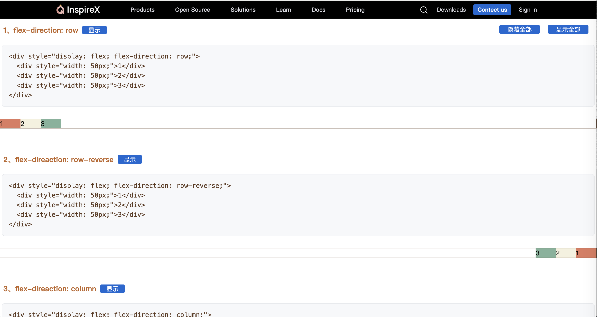
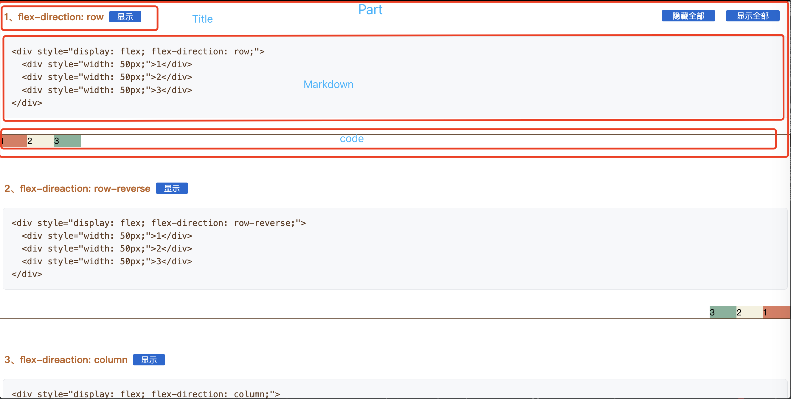
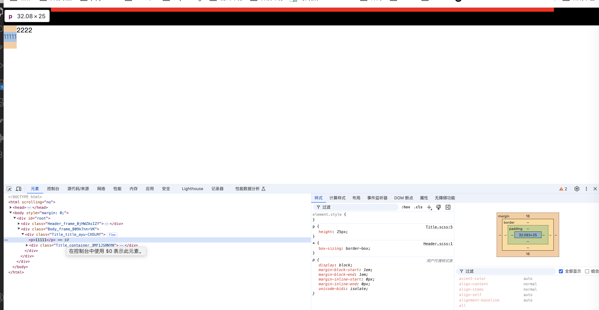
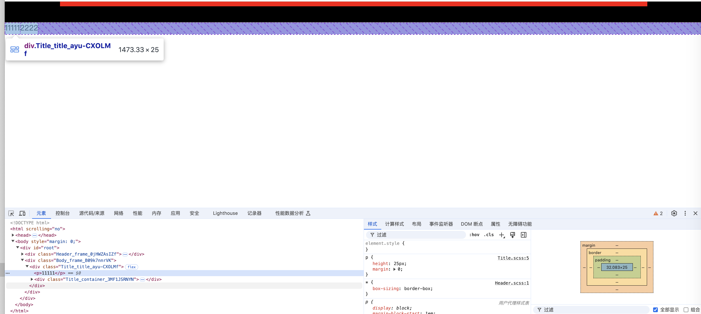
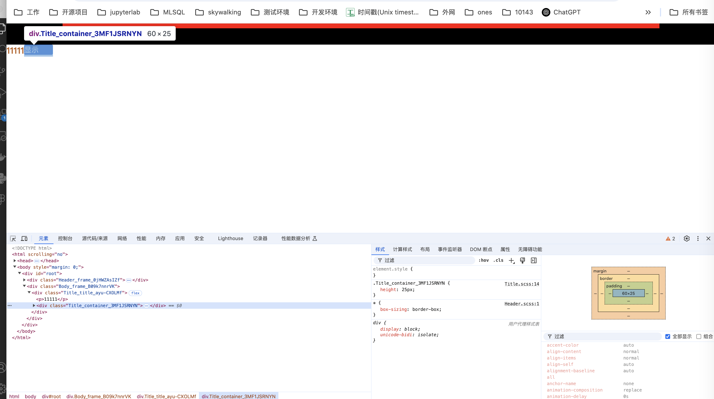
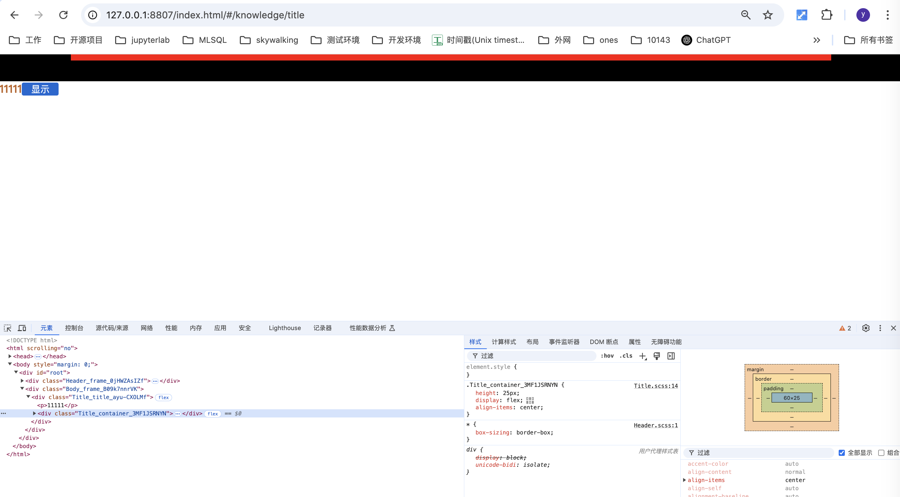
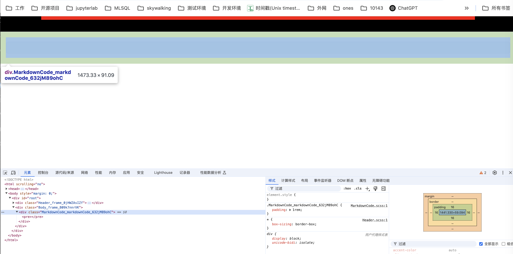
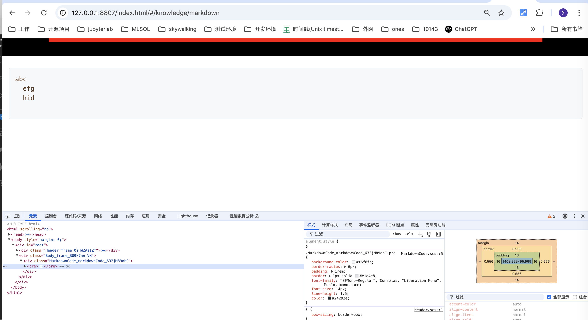
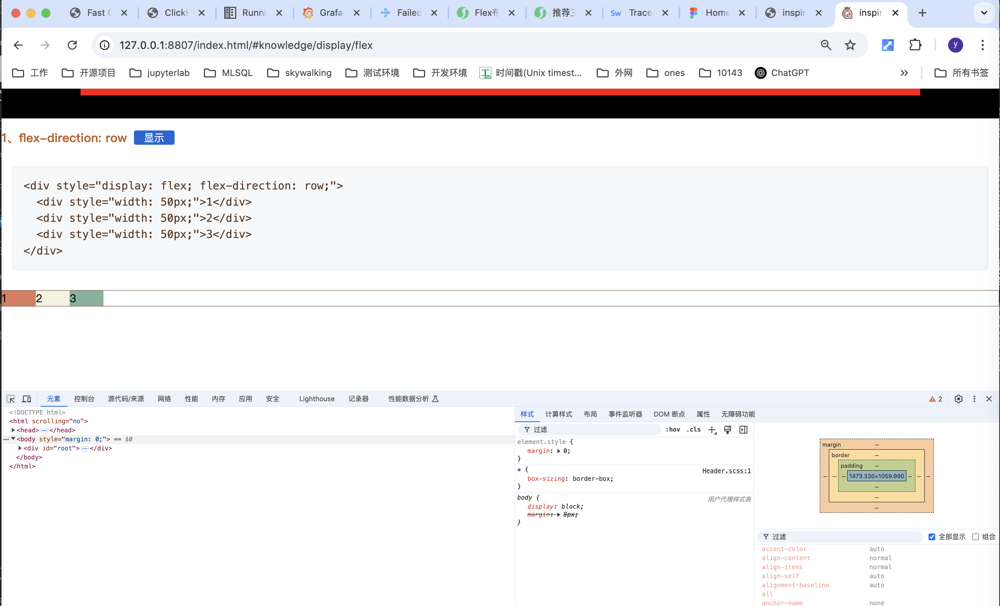

# display: flex 训练

**目标**



**简单进行盒子拆分**




### 实现 Title

新建 **src/component/knowledge** 文件夹

新建 **src/component/knowledge/Title.scss** 样式文件
```scss
.title {
  display: flex;
}

p {
  height: 25px;
}

.container {
  height: 25px;
}
```

新建 **src/component/knowledge/Title.tsx** 组件
```tsx
import React from "react";

import ss from "./Title.scss";

export interface Props {
  title?: string;
}

const Title: React.FC<Props> = ({ title }) => {
  console.log(1);
  return (
    <div className={ss.title}>
      <p>11111</p>
      <div className={ss.container}>
      </div>
    </div>
  );
};

export default Title;
```

为了方便查看效果，我们先给 Title 配置一个路由

新建 **src/routes/knowledge.ts** 文件
```ts
import React from "react";

export default {

  "knowledge/title": {
    component: React.lazy(() => import( "@/component/knowledge/Title")),
  },

};
```

在 **src/routes.tsx** 中添加 knowledge 路由列表
```
import React  from "react";
import { RouteObject } from "react-router-dom";

import lession from "./lession";

import knowledge from "./knowledge";

// ...

const getRouteData = (): [RouteObject[], { [key: string]: RouteObject }] => {
  const data: Record<string, RouteSource> = {
    "/": {
      component: React.lazy(() => import(/* webpackChunkName: "lession4" */ "@/component/lession/Lession49")),
    },
    ...lession,
    ...knowledge,
    "helloworld": {
      component: React.lazy(() => import(/* webpackChunkName: "helloworld" */ "@/component/helloworld")),
    },
    "*": {
      component: React.lazy(() => Promise.resolve({ default: () => <div>404 Not Found</div> })),
    },
  };

  // ...  
};

export default getRouteData;

```

启动 dev 开发服务脚本
```
npm run dev
```

查看页面



发现 p标签 和 按钮容器并没有对其，这是因为 p 标签有默认的 margin-top 和 margin-bottom

去除 margin
```
.title {
  display: flex;
}

p {
  height: 25px;
  margin: 0;
}

.container {
  height: 25px;
}
```

发现已经对齐



给 title p 文字添加颜色，font-size，font-weight 等

```
.title {
  display: flex;
}

p {
  height: 25px;
  margin: 0;
  
  font-size: 18px;
  font-weight: 900;
  color: #bd6424;
}

.container {
  height: 25px;
}
```

在 container 容器内添加 按钮div
```tsx
import React from "react";

import ss from "./Title.scss";

export interface Props {
  title?: string;
}

const Title: React.FC<Props> = ({ title }) => {
  console.log(1);
  return (
    <div className={ss.title}>
      <p>11111</p>
      <div className={ss.container}>
        <div className={ss.button}>显示</div>
      </div>
    </div>
  );
};

export default Title;
```
在 **Title.scss** 中添加按钮样式
```scss
.title {
  display: flex;
}

p {
  height: 25px;
  margin: 0;

  font-size: 18px;
  font-weight: 900;
  color: #bd6424;
}

.container {
  height: 25px;
}

.button {
  width: 60px;
  background-color: #1766d3;
  color: #fff;
  font-size: 15px;
  border-radius: 3px;
}
```

保存，发现 **文字没水平居中**， p 标签文本和 按钮没有 **视觉对齐**




在 **Title.scss** 中
添加 .container 为 flex 布局，交叉轴居中
添加 .button 文本居中
```scss
.container {
  height: 25px;

  display: flex;
  align-items: center;
}

.button {
  width: 60px;
  background-color: #1766d3;
  color: #fff;
  font-size: 15px;
  border-radius: 3px;

  text-align: center;
}
```



p 标签 和 按钮之间挨得太紧，通过 column-grap 调大间距
```scss
.title {
  display: flex;
  column-gap: 10px;
}
```

在 .button 中添加 cursor 样式，鼠标滑过时提示用户可以点击
```scss
.button {
  width: 60px;
  background-color: #1766d3;
  color: #fff;
  font-size: 15px;
  border-radius: 3px;

  text-align: center;

  cursor: pointer;
}
```

完善 **Title.tsx** 的入参 和 点击事件
```tsx
import React from "react";

import ss from "./Title.scss";

export interface Props {
  title: string;
  index: number;
  click: (index: number) => void
}

const Title: React.FC<Props> = ({ title, index, click }) => {
  console.log(1);
  return (
    <div className={ss.title}>
      <p>{title}</p>
      <div className={ss.container}>
        <div className={ss.button} onClick={() => click(index)}>显示</div>
      </div>
    </div>
  );
};

export default Title;

```

### 实现MarkDown

新建 **src/component/knowledge/MarkdownCode.scss** 样式文件
```scss
.markdownCode {
  padding: 1rem;
}
```

新建 **src/component/knowledge/MarkdownCode.tsx** 组件
```tsx
import React from "react";

import ss from "./MarkdownCode.scss";

export interface Props {
  children?: string;
}

const Block: React.FC<Props> = ({ children }) => {
  console.log(1);
  return (
    <div className={ss.markdownCode}>

    </div>
  );
};

export default Block;
```


添加内容区域

**MarkdownCode.tsx**
```tsx
import React from "react";

import ss from "./MarkdownCode.scss";

export interface Props {
  children?: string;
}

const Block: React.FC<Props> = ({ children }) => {
  console.log(1);
  return (
    <div className={ss.markdownCode}>
      <pre></pre>
    </div>
  );
};

export default Block;

```

**MarkdownCode.scss**
```scss
.markdownCode {
  padding: 1rem;
}

.markdownCode pre {
  background-color: #f6f8fa;
  border-radius: 6px;
  padding: 1rem;
  border: 1px solid #e1e4e8;
}
```



添加 Code 样式、 字体，行高

**MarkdownCode.scss**
```scss
.markdownCode {
  padding: 1rem;
}

.markdownCode pre {
  background-color: #f6f8fa;
  border-radius: 6px;
  padding: 1rem;
  border: 1px solid #e1e4e8;

  font-family: "SFMono-Regular", Consolas, "Liberation Mono", Menlo, monospace;
  font-size: 14px;
  line-height: 1.5;
  color: #24292e;
}

.markdownCode code {
  font-family: inherit;
  white-space: pre;

  font-size: 16px;
  font-weight: 500;
  color: #5c3a21;
}
```

**MarkdownCode.tsx**
```tsx
import React from "react";

import ss from "./MarkdownCode.scss";

export interface Props {
  children?: string;
}

const Block: React.FC<Props> = ({ children }) => {
  console.log(1);
  const msg = `abc
  efg
  hid
  `
  return (
    <div className={ss.markdownCode}>
      <pre><code>{msg}</code></pre>
    </div>
  );
};

export default Block;
```



替换内容为变量

**MarkdownCode.tsx**
```tsx
import React from "react";

import ss from "./MarkdownCode.scss";

export interface Props {
  children?: string;
}

const Block: React.FC<Props> = ({ children }) => {
  console.log(1);
  return (
    <div className={ss.markdownCode}>
      <pre><code>{children}</code></pre>
    </div>
  );
};

export default Block;
```


### 实现 Flex

新建 **src/component/display/Flex.scss** 文件
```
.part {
  margin: 1rem 0 4rem 0 ;
}

.hidden {
  visibility: hidden;
}

```


新建 **src/component/display/Flex.tsx** 文件
```tsx
import React, { useState } from "react";

import ss from "./Flex.scss";

import MarkDown from "../MarkdownCode";
import Title from "../Title";

const case1 = `<div style="display: flex; flex-direction: row;">
  <div style="width: 50px;">1</div>
  <div style="width: 50px;">2</div>
  <div style="width: 50px;">3</div>
</div>
`;

const Block: React.FC = () => {
  const [states, setStates] = useState(new Array<boolean>(46).fill(false));

  const isHidden = (index: number) => (states[index] ? "" : ss.hidden);

  const changeState = (index: number) => {
    const newStates = [...states];
    newStates[index] = !newStates[index];
    setStates(newStates);
  };

  return (
    <>
      <div>
        <div className={ss.part}>
          <Title title="1、flex-direction: row" click={changeState} index={1} />
          <MarkDown>{case1}</MarkDown>
          <div style={{ display: "flex", flexDirection: "row", border: "1px solid #5C3A21" }} className={isHidden(1)}>
            <div style={{ width: "50px", background: "#E07A5F" }}>1</div>
            <div style={{ width: "50px", background: "#F4F1DE" }}>2</div>
            <div style={{ width: "50px", background: "#81B29A" }}>3</div>
          </div>
        </div>
      </div>
    </>
  );
};

export default Block;

```

在 **knowledge.ts** 中添加路由
```ts
import React from "react";

export default {

  "knowledge/title": {
    component: React.lazy(() => import( "@/component/knowledge/Title")),
  },

  "knowledge/markdown": {
    component: React.lazy(() => import( "@/component/knowledge/MarkdownCode")),
  },

  "knowledge/display/flex": {
    component: React.lazy(() => import( "@/component/knowledge/display/Flex")),
  },
};

```

保存，更新浏览器 url



